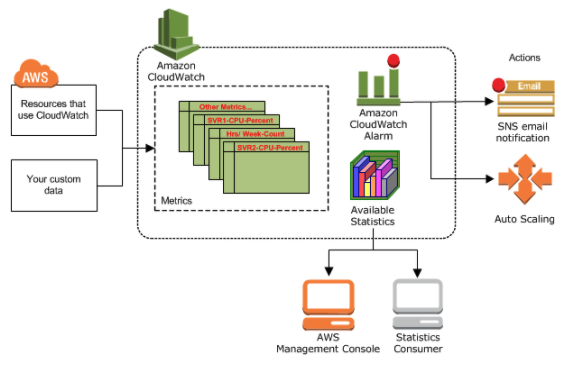

# `AWS CloudWatch`

## `What is CloudWatch`

- `CloudWatch is the monitoring service of AWS.` It enables you to monitor metrics of resources and applications that run on AWS as well as on-premise servers. It also lets you get logs, set alarms, trigger events and analyze utilization

## `How does CloudWatch work`

- CloudWatch `collects metrics and logs from AWS resources, applications and services running on AWS and on-premises servers.`

- You can visualize applications and infrastructure using `Dashboards; correlate logs and metrics side by side to troubleshoot and set Alarms`

- It also enables you to automate response to operational changes with `Events and Auto-Scaling.`

- You can leverage metrics (up to 1 second), extended data retention (15 months) and real-time analysis with `Metric Math.`

## `Basic Components of CloudWatch`

- `Metrics:` 

- Metrics are the measurable data about your resources, apps or services like EC2 instance CPU utilization or the number of objects in an S3 bucket.

- `Dashboards:`

- Dashboards enable you to create graphs and visualize your cloud resources and applications according to your needs. You can leverage dashboards as customizable home pages in the CloudWatch console to view metrics, logs and alarms.

- `Alarms:`

- Alarms enables you to monitor CloudWatch metrics and to receive notifications `if the metrics fall outside of the thresholds (higher or lower) that you set.`

- `Logs:`

- `Logs let you monitor, store, and access your log files from AWS or other resources.` It also allows you to centralize these logs for querying and analyzing.

- `Events:`

- `An event indicates changes in your AWS environment. AWS resources can generate events when their state changes, or you can create rules that self-trigger on an automated schedule.` For example, you can receive an email via SNS if one of your EC2 instances goes to the "stop" state.

## `Accessing and Pricing`

- `Accessing:`
- You can access CloudWatch using any of the following methods:

	- Amazon CloudWatch console – https://console.aws.amazon.com/cloudwatch/
	- AWS CLI
	- CloudWatch API – For more information, see the Amazon CloudWatch API Reference.
	- AWS SDKs – For more information, see Tools for Amazon Web Services.

- `Pricing:`

- `CloudWatch doesn't require any up-front commitment or minimum fee.`

- As many other Amazon Web Services, `you simply pay for what you use and will be charged at the end of the month for your usage.` Pricing varies by region.

