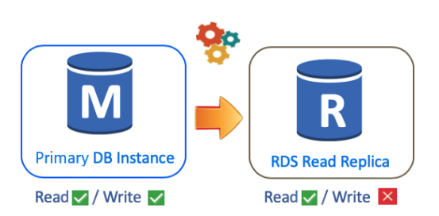
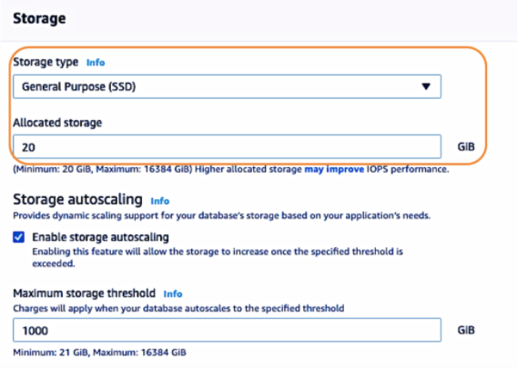

# `What is Database?`
- The existing information and stores this information in disks.
- The structured data is called a database.
- The database is an organized collection of data in which we can fetch the information based on the desired format and queries.

## `Type of Database`


- There are two leading types of Database storage
	- Relational Database - SQL
	- Non-Relational Database - NoSQL

- SQL stands for ` Structured Query Language`
- We usually prefer to call `Relational Database as SQL`
- `Non-Relational Database as NoSQL`

```
Note:
Databases make the information meaningful and useful
Database is an organized collection of data
```
## `What is SQL`
` Relational Databases`


- Oldest and currently most widely used database type.
- RD store data as `rows and columns` like Excel
- We called relational database because it concludes by using separate tables like `excel`
- These procesesses are called `Join`

## `Disadvantages`
- We need to update/add data into the database according to a determined scheme.
- It requires strict coordination with database developers.

## `What is NoSQL`


- NoSQL database is not based on SQL.
- The Non-relational database is a new database model is getting popular in recent years.

- It is designed to solve the problems
- The Non-Relational database keeps data as key data mappings in documents rather than tables.
- The documents are called `Collections` that store data in `JSON`

`Tip= Microsoft Excel is SQL -- Microsoft Word is NoSQL`

## `Advantages of NoSQL`
- NoSQL eliminates the need to coordinate with the Database developer when writing database programs.
- We don't need to know `SQL language`

** We can't use the `Join` process and lose the oppurtunity.

` Note= Difference between SQL and NoSQL is the JOIN process`

`Note= SQL is used to query complex data, NoSQL is desgined for simpler databases`


## `SQL vs. NoSQL`


## `Database Options in AWS`


- AWS supports both SQL and NoSQL database types.
- AWS provides solution with `AWS RDS` service.
- AWS offers different types of relational database engines:

```
Oracle
Microsoft SQL Server
MySQL
```

`Note= Amazon Aurora is open-source MySQL and PostgreSQL and AWS's database engine, under the Amazon RDS service.`

`Normally you can install these databases to EC2, but Amazon RDS service has taken the management from customers and made this service SaaS (Software as a Service).`

` AWS offers only its DynamoDB option in the NoSQL field.`

------

# `Amazon RDS`

- Amazon RDS is the SQL database service managed by AWS
- RDS enables to use of popular database engines like Oracle,Microsoft SQL Server, MySQL, PostgreSQL and MariaDB.
- RDS offers also own relational database product `Amazon Aurura`
----

## `Components of Amazon RDS`


 `Amazon RDS consists of 3 main components:`

- 1 `Database Engines` like MySQL, PostgreSQL, MariaDB, etc
- 2 `DB instance` which database software we choose will run.
- 3 `Storage Disk` which will be connected to the DB instance

`Note= As we can see , we can say Amazon RDS is similiar to EC2`

-----
## `Relational Database Engines on Amazon RDS`


- There are `6 Relational database engines with Amazon RDS`.

- `1 Amazon Aurora`
- Aurora is compatible with `MySQL and PostgreSQL`

- Aurora provides up to `five times` better performance than `MySQL` with the security, availability, and reliability.

- Commercial database at `one-tenth the cost`

- `2 Oracle`
- Oracle in minutes with cost-efficient and re-sizable hardware capacity.
- You can use existing `Oracle license or pay for license usage by hour`

- `3 Microsoft SQL Server`

- SQL Server makes it easy to set up, operate and scale SQL Server in the cloud.

- You can deploy multiple editions of SQL like `Express`, `Web`, `Standard`, and `Enterprise`

- `4 MySQL`
- is open source `rdbms`
- The code, applications, and tools you already use today with your existing databases can be used with Amazon RDS without any changes.

- `5 PostgreSQL`
- is a powerful open source `object-relational` database
- Runs and stored many programming languages like Java, Perl, Python, Ruby, Tcl, C/C++, and its own PL/pgSQL, which is similar to Oracle's PL/SQL.

- `6 MariaDB`
- You can deploy scalable MariaDB databases in minutes with cost-efficient and resizable hardware capacity
----
## `Relational Database Instance`


- DB instance as a database environment in the cloud with the compute and storage resources you specify.

- We select a DB Instance considering the CPU and RAM power in the RDS environment.

- RDS offers `On-Demand` and `Reserved Instance` options

- `Start` and `Stop` status are available just like EC2.
- We can `Stop` and run it again.
- `Amazon RDS` can only remain `Stop` status for 7 days. If the machine is not operation after 7th day, the machine is automatically started.

- RDS also allows the DB instance to be transferred to a more advanced and powerful machine without any interruption.

- You can run one or more DB instances, and each DB instance can support one or more databases or database schemas, depending on the engine type.
---
## `Amazon RDS DB Instance Storage`


- There are 3 types of Storage disks in Amazon RDS:

- `1 General Purpose (SSD) Storage`
- cost-effective storage
- RDS offers the General Purpose (SSD) Storage option, which has a storage capacity of `20 GB to 64 TB` as part of the disk infrastructure and gives a value of `3 IOPS per GB,` provided that it has an upper limit of up to 3000 IOPS in total.

- `2 Provisioned IOPs (SSD) Storage`
- For production application `fast and consistent I/O performance`
- Amazon RDS offers the `Provisioned IOPs (SSD) Storage` option, with `1000 to 80000 IOPs` and a storage capacity of `20GB to 64 TB`

- `3 Magnetic Storage`
- For backward compatibility
-  `Magnetic storage doesn't allow you to scale storage when using the SQL Server database engine`
- It is limited to a maximum size of `3 TB and 1,000 IOPS.`
- It doesn't support elastic volumes.

----

## `Automated Backups`

- Amazon RDS provides two different methods for backing up your instance

- `1 Automated Backups`
- `2 Database Snapshots`

- `Automated Backups`
- RDS performs the necessary updates and maintenance of the database at the time intervals we will choose
- We can choose a backup window while creating a DB.

- `Database Snapshots`
- Amazon RDS allows taking `Snapshot` of RDS DB instance any time.
- `DB Snapshots` are user-initiated and enable you to back up your DB instance any time you wish.

`Note= When the RDS DB instance is deleted, an Automated Backups are deleted along with it. However, DB Snapshots remain on AWS even if the RDS DB instance is deleted.`

- `Amazon RDS DB` snapshots and automated backups are stored in `S3`

---
## `RDS Multi-AZ Deployment`


- RDS creates a replica of the `primary database` for multiple Availability Zones within the same region.
- We call second replica database as `standby database`
- `Amazon RDS automatically provisions and maintains a synchronous standby replica.`
- Each information recordes in the `primary database` is sync to `standby database` located in other AZ

- `Note= If the primary database fault occurs, the standby database is automatically activated.`

`Note= Multi-AZ deployment doesn't provide increase of performace, they ensure the continuity of the data flow`

----
## `Amazon Read Replicas`



`Note= Read Replica improves database performance`

[Amazon RDS](https://www.youtube.com/watch?v=eMzCI7S1P9M&t=113s&ab_channel=AmazonWebServices)

---

# `Creating Database`


- Go to `RDS Service`
- Select `Database`
- Click `Create Database`


- Choose your `Engine Types`


- If you need `fats and high availability choose Production`
- `Dev/Test` for Developer


- 3 diferent instance class

- `1 Standard Classes (m-classes)`
- `2 Memory Optimized Classes (r and x classes)`
- `3 Burstable Classes(t classes)`




- RDS can authenticate just using database passwords
- Second option is RDS authenticates using the user credentials through AWS IAM users and roles.


- `Backup Window:` We can select the period we want automated backups of the database to be conducted by Amazon RDS or you may not determine any specific time interval


- `Log Exports:` We can select the log types to publish to Amazon CloudWatch Logs


`Note= The maintenance window and the backup window for the DB instance cannot overlap`

---
# ` MySQL Workbench`


- The information inside the database is arranged to `SQL` , we are not able to reach the data.
- You need a tool for SSH connection, modify or configure it. We use `MySQL Workbench`
- `MySQL WorkBench` is a graphical tool.

[Download MySQL Workbench](https://www.mysql.com/products/workbench/)

---

## `Connecting and Modifying Database via MySQL Workbench`

- Select `Database` from menu and click the newly created `database-1`


- Copy the `Endpoint`


- Open `MySQL Workbench` in your laptop and click `+`


- `We setup a new connection:`

- 1 Connection Name= `connection database-1`
- 2 Host Name= Paste the `endpoint` from aws and the port is 3306
- 3 Username= Enter `database username` like `admin`
- 4 Password= Click the `Store in Keychain` and enter the password.
- 5 Test connection= Before you connect the DB, test the connection click `Test Connection`


- After successfull connection click the `ok`


---

## `Modifying Database with MySQL Workbench`

- There are currently three schemas in our database
	- InnoDB
	- Sys
	- awsdevopsteam (we created while lauching database)


- `Add a Table:`
- Click the `awsdevopsteam`
- `Right-click` the `Table` option
- Select `Create Table`


- `Configure Table:`
- Let's name our table `Personal_Info`
- We want to store `ID_number,Name,Surname and Gender`
- First Row= `ID_number` 
- Second Row= `Name`
- Third Row= `Surname`
- Fourth Row= `Gender`
- Click `apply`


- `Insert Data into Database`
- Add some information.
- His name is `James Bond` his `ID_number is 007`
- In SQL, to add data into the database, we use `Insert into` command

```
INSERT INTO Personel_Info
(ID_number,Name,Surname,Gender)
VALUES
('007','James','Bond','Male');
```


- After type the script, select the script via mouse and press the `action tab.` 

- Type the command of `SELECT * FROM` to see all data located in this table.
```
SELECT * FROM awsdevopsteam.Personel_Info;
```


