# `DynamoDB`

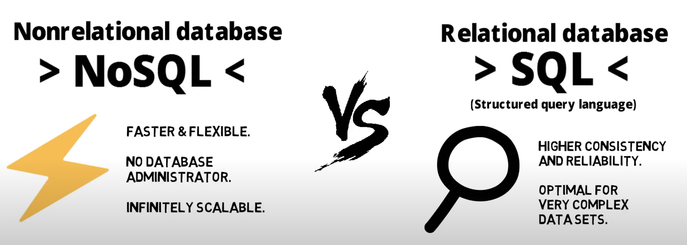

- `DynamoDB` is the `Non-Relational (NoSQL)`

- DynamoDB is a `NoSQL database` service that supports `key-value` and `document` data models

- DynamoDB uses `flexible tables`

- Database tables that can store and retrieve any amount of data and serve any level of request traffic.

- DynamoDB automatically scales tables to adjust for capacity and maintains performance with `zero administration.`

- `Note= DynamoDB is designed to run high-performance, internet-scale applications that would overburden traditional relational databases like mobile, web, gaming, ad-tech, IOT, and many other applications.`

---
## `Features of DynamoDB`

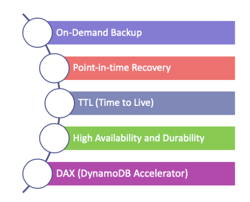

==> `On-Demand Backup`

- DynamoDB provides on-demand backup capability. It allows you to create full backups of your tables for long-term retention.

==> `Point-in-time Recovery`

- After creating on-demand backups, you can enable point-in-time recovery for your Amazon DynamoDB tables.

- You can restore that table to any point in time during the last `35 days`.

==> `TTL(Time to Live)`

- DynamoDB has also `TTL` function.

- DynamoDB TTL allows you to delete expired items from tables automatically.

- You can reduce storage usage and the cost of storing data that is no longer relevant.

==> `High Availability and Durability`

- DynamoDB stored on `solid-state disks (SSDs)`

- Automatically replicated across `multiple Availability Zones` in AWS Region.

- Also, you can use `Global Tables` to keep DynamoDB tables in `multiple AWS Regions`

==> `DAX (DynamDB Accelerator)`

- DynamoDB Accelerator (DAX) delivers fast response times like `microseconds`

---
## `Tables, Items and Attributes`

- DynamoDB `tables, items, and attributes` are the key components.

==> `Tables`

- A table is a collection of data.
- DynamoDB stores data in tables.

==> `Items`

- Each table contains items.
- `Each item represents a person`
- Each item can't exceed `400 KB`

==> `Attributes`

- Each item is composed of one or more attributes.
- An attribute is a `key data element`

---

## `Primary Key`


- DynamoDB uses `Primary Keys` to `uniquely identify each item` in a table.

- When you create a table, in addition to the table name, you must specify the `primary key of the table`

- The primary key uniquely identifies each item in the table, `no two items can have the same key.`

- There are two different kinds of Primary Keys; `Primary key` and `Partition Key&Sort Key`

## `Partition Key and Sort Key`

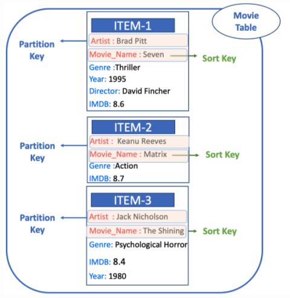

==> `Partition Key`

- This key composed of `two attributes` like `Partition Key` and `Sort Key`

- `Sort Key` is an optional, but if there are 2 items that have the same partition key, thanks to the sort key you can distinguish these two items from each other.

---
==> `Secondary Indexes`

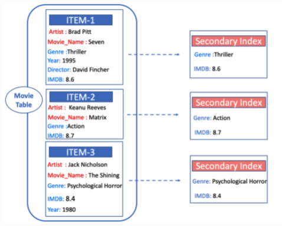

- Secondary Indexes are a way to create an `alternative query option` with current attributes of the item

- You can query data items by Artist (partition key) or by Artist and Movie_Name (partition key and sort key). But, what if you also wanted to query the data by `Genre and IMDB Rate?`

- You can create a Secondary Index on Genre and IMDB, and then you can read data from the index in much the same way as you do from the Movie table.

- DynamoDB supports two kinds of indexes

- `Global secondary index` – An index with a partition key and sort key that can be different from those on the table.

- `Local secondary index` – An index that has the same partition key as the table, but a different sort key

`Note= Each table in DynamoDB has a limit of 20 global secondary indexes (default limit) and 5 local secondary indexes per table.`

----

## `DyanamoDB Streams`

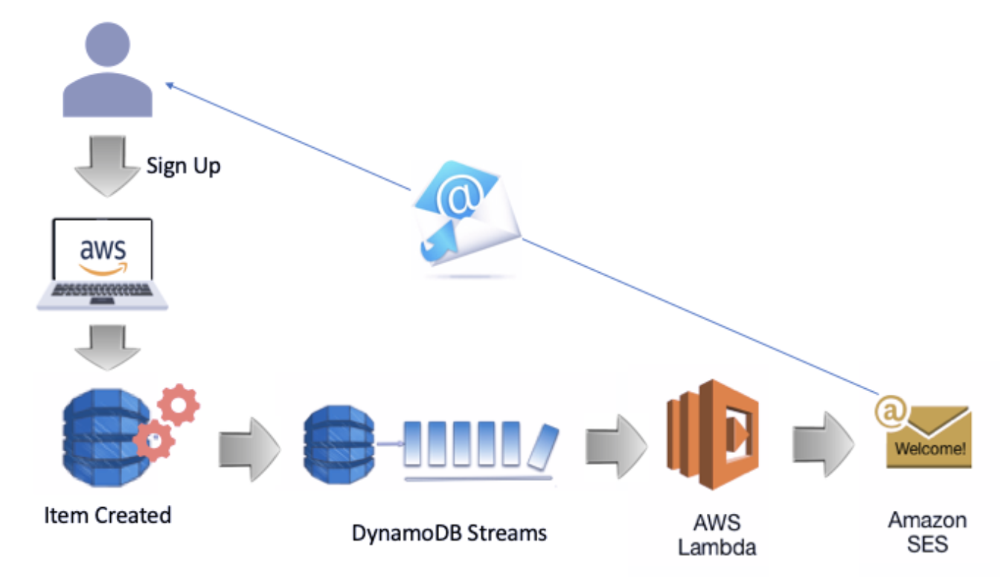

- DynamoDB Streams is an optional feature that `captures data modification events` in DynamoDB tables. It is a kind of transaction record.
- DynamoDB writes a stream record whenever events such as `adding, updating or deleting an item` occurs in the table.
- Stream records have a lifetime of `24 hours;` after that, they are automatically removed from the stream.

- `Why do we need streams`
- `First,` you can use DynamoDB Streams `together with AWS Lambda to create a trigger`
- Thanks to the stream whenever a new customer is added to the customer table, DynamoDB Streams creates a Stream Record,
- Since we associate the stream with a Lambda function, the Lambda function will trigger Amazon Simple Email Service (Amazon SES)
- Then Amazon Simple Email Service (Amazon SES) will send a welcome email to the customer.

## `Creating DynamoDB Table`

## ` Dashboard`
- Go to the `DynamoDB sevice`
- Click `Create Table`

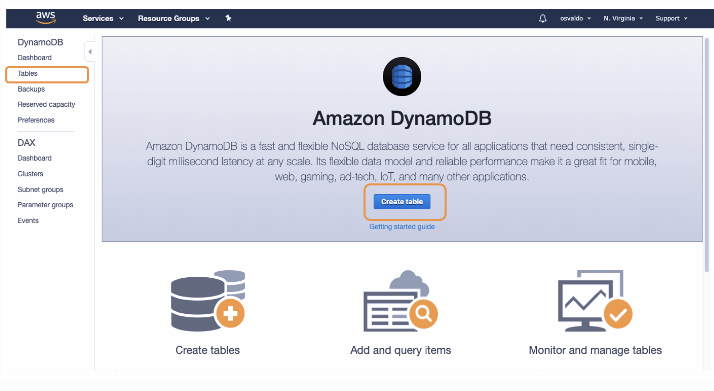

## `Create DynamoDB Table`

- `Table Name=` Give a table name like `Employee`
- `Primary Key=` We choose `Sort Key` together with `Partition Key` as Primary Key. We prefer to choose both of them for now.
	- `Partition Key=` We determine `ID_Number`as Partition Key
	- `Add Sort Key=` First check the `Add sort Key box.` Then enter `Name` as Sort Key. Choose the `String` from the `Type Box` near the Sort Key.

- `Table Settings=` Use default settings
- `Secondary Indexes=` We don't need to use this option now.

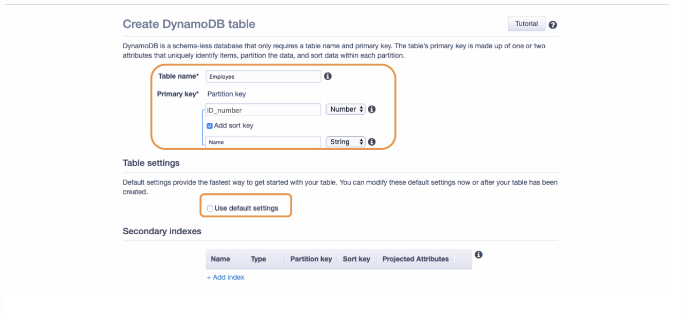

## `Read/Write Capacity Mode`

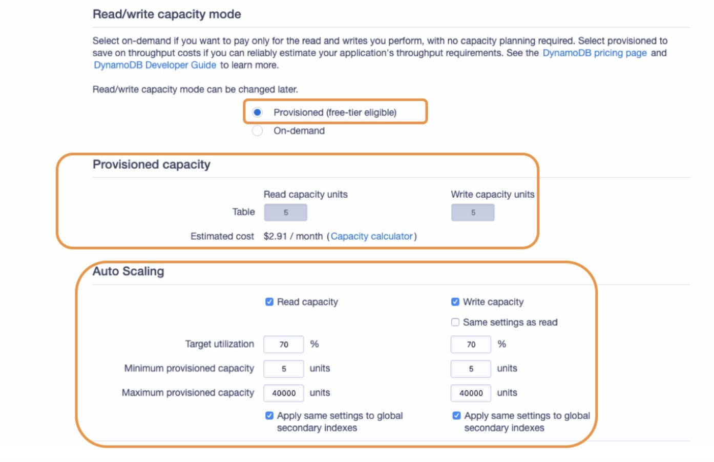

- `Read/Write Capacity Mode=`

- You will be charged for `reading, writing, and storing data` in your DynamoDB tables

- DynamoDB has two options capacity `On-Demand` and `Provisioned`

- `Provisioned Capacity Mode`
	- You `specify the number of reads and writes per second` that you expect your application to require.
	- if you have `predictable application traffic` this capacity mode best.

- `On-Demand Capacity Mode`

	- It might be best if you create new tables with `unknown workloads` and you have `unpredictable` application traffic.

- `Provisioned Capacity:` Capacity of 5 read and write per second is enough for now.
- `Auto-Scaling` Auto-Scaling automatically adjust our table’s capacity from 5 to 40000 read/write per second based on the specified utilization rate (default %70).

## `IAM Role&Encryption`

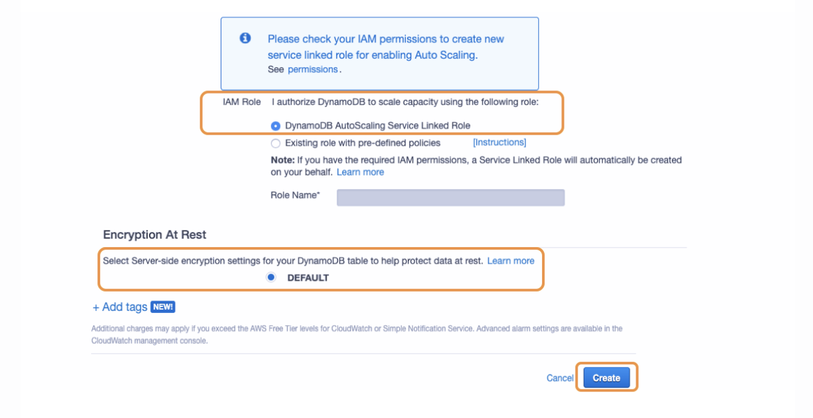

- `IAM Role:` 
- We need to assign the IAM role to DynamoDB to use Auto-scaling for adjusting the capacity.
- We select `DynamoDB AutoScaling Service Linked Role` option and AWS automatically assigns a role for us.

- `Encrpytion=` Leave it as default
- `Add Tags=` Add tag
- Click `Create`

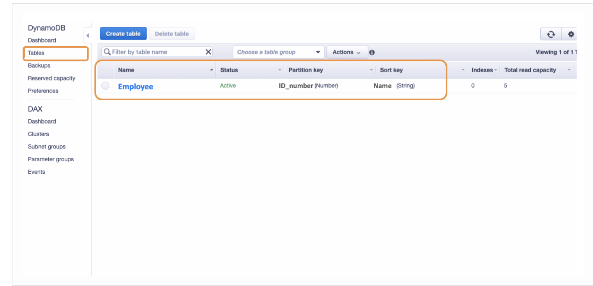

----

# `Elastic Cache`

## `In-Memory Cache`

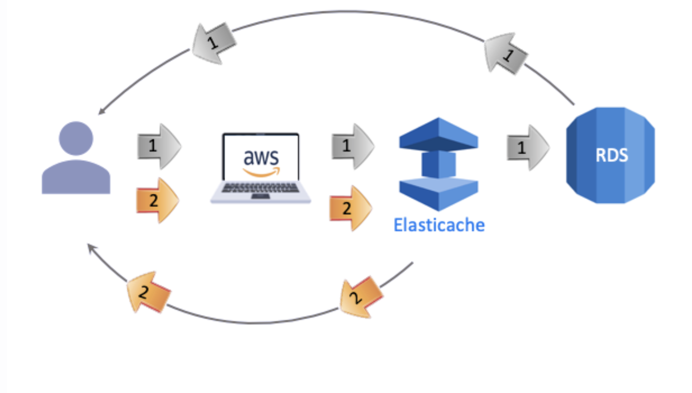

- `In-Memory Cache` is a `temporary and fast` storage component. 
- The components are used for reduce the workload. 

- `Example= As you know that, RAM responds faster than HDD. In-Memory Cache responds faster than database system like SSD or HDD. If you take a look a picture above, you will understand.`

- In the first quey of client `Database responds` the quaery, but `In-Memory Cache` memorize this query.
- In the second query `In-Memory Cache` reponds the query. Decrease the workload.

## `AWS Elasticache`

- AWS in in-memory cache service is `Amazon Elasticache`
- It easy to setup, manage, and scale.
- It provides a high-performance, scalable and cost effective.

## `Future of AWS Elasticache`

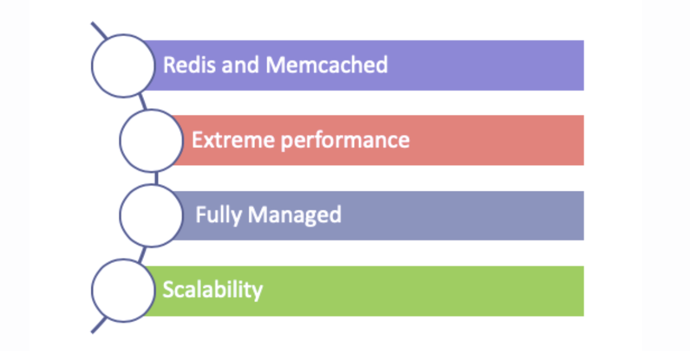

- `Redis and Memcached`
- Amazon Elasticache offers two kinds of `in-memory cache` options. `Redis` and `Memcached` 
- These are popular, open-source, in-memory data stores.

- `Extreme performance`
- Elasticache works in-memory data store and support most demanding applications `sub-milisecond response times`
- Provides secure, blazing-fast performance.

- `Fully Managed`
- You don't need to perform management tasks such as hardware provisioning, software patching, setup, configuration, monitoring, failure recovery, and backups

- `Scalability`
-  Write and memory scaling, Elasticache provides a read scaling via Replicas.

## `Redis vs. Memcached`

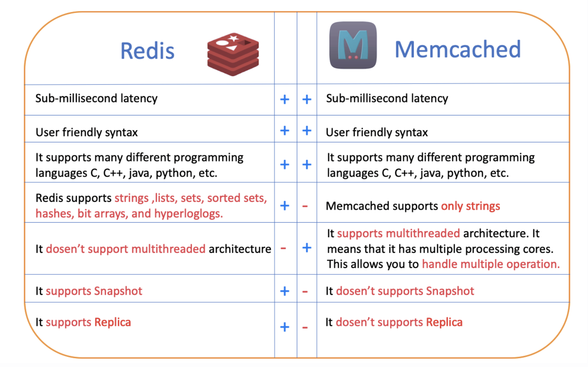

- `Tips= Memcached is built for simplicity, while Redis provides a rich set of features that render it useful for a wide variety of applications.`

```

==> What are the different database types in AWS

AWS supports both SQL and NoSQL database types.
AWS provides a relational database solution with Amazon RDS service. Amazon RDS offers different types of relational database engines such as Oracle, Microsoft SQL Server, MySQL, MariaDB and Amazon Aurora which are widely used in the world.
As for NoSQL, the service offered by AWS is Amazon DynamoDB.

==> What is Redshift? Why do we need to use Redshift instead of RDS?

Amazon Redshift is a fully managed, cloud-based, petabyte-scale data warehouse service by Amazon Web Services (AWS).
There are two categories of data processing, OLTP(Online Transaction Processing) and OLAP(Online Analytical Processing). While Conventional databases like RDS are in the OLTP category, Data Warehouses like Redshift are in the OLAP Catagory.
In fact, it's possible to make an analysis on the OLTP database (like RDS) but processing of both storing and analyzing at the same time increases the workload of the database. So, your queries start taking a lot of time and the size of data becomes unmanageable on conventional databases.
Thus, we prefer data warehousing which is in OLAP class and can make data easily accessible for reporting and analytics.
```
