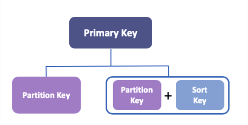

# `DynamoDB`

- `DynamoDB` is the `Non-Relational (NoSQL)`

- DynamoDB is a `NoSQL database` service that supports `key-value` and `document` data models

- DynamoDB uses `flexible tables`

- Database tables that can store and retrieve any amount of data and serve any level of request traffic.

- DynamoDB automatically scales tables to adjust for capacity and maintains performance with `zero administration.`

- `Note= DynamoDB is designed to run high-performance, internet-scale applications that would overburden traditional relational databases like mobile, web, gaming, ad-tech, IOT, and many other applications.`

---
## `Features of DynamoDB`

==> `On-Demand Backup`

- DynamoDB provides on-demand backup capability. It allows you to create full backups of your tables for long-term retention.

==> `Point-in-time Recovery`

- After creating on-demand backups, you can enable point-in-time recovery for your Amazon DynamoDB tables.

- You can restore that table to any point in time during the last `35 days`.

==> `TTL(Time to Live)`

- DynamoDB has also `TTL` function.

- DynamoDB TTL allows you to delete expired items from tables automatically.

- You can reduce storage usage and the cost of storing data that is no longer relevant.

==> `High Availability and Durability`

- DynamoDB stored on `solid-state disks (SSDs)`

- Automatically replicated across `multiple Availability Zones` in AWS Region.

- Also, you can use `Global Tables` to keep DynamoDB tables in `multiple AWS Regions`

==> `DAX (DynamDB Accelerator)`

- DynamoDB Accelerator (DAX) delivers fast response times like `microseconds`

---
## `Tables, Items and Attributes`

- DynamoDB `tables, items, and attributes` are the key components.

==> `Tables`

- A table is a collection of data.
- DynamoDB stores data in tables.

==> `Items`

- Each table contains items.
- `Each item represents a person`
- Each item can't exceed `400 KB`

==> `Attributes`

- Each item is composed of one or more attributes.
- An attribute is a `key data element`

---

## `Primary Key`

- DynamoDB uses `Primary Keys` to `uniquely identify each item` in a table.

- When you create a table, in addition to the table name, you must specify the `primary key of the table`

- The primary key uniquely identifies each item in the table, `no two items can have the same key.`

- There are two different kinds of Primary Keys; `Primary key` and `Partition Key&Sort Key`

