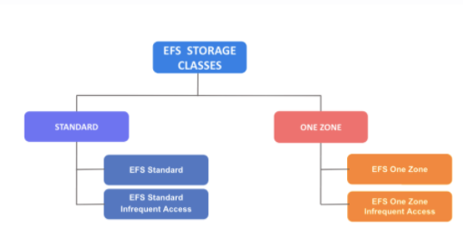
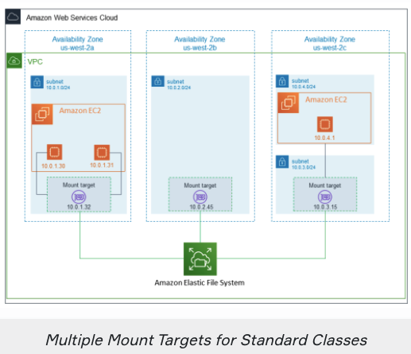
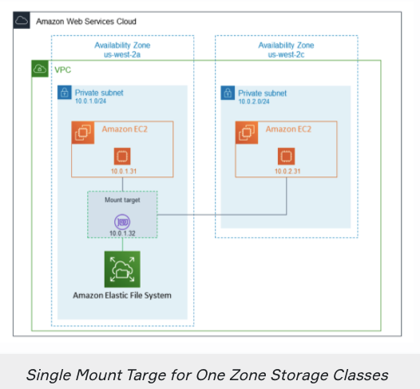
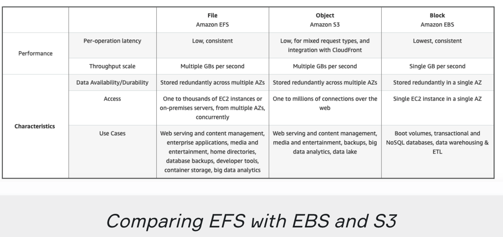

# `Elastic File System`

- Amazon Elastic File System (Amazon EFS) is a serverless and set-and-forget elastic file system. `It can be used with AWS Cloud services and on-premises resources.`

- Amazon EFS is designed to `increase and decrease the storage capacity automatically as you add or remove files. So, it is a flexible-capacity storage solution.`

- You can easily establish file systems and `avoid the difficulties of deploying, patching, and maintaining complex file system configurations.`

## `Features of EFS`

- Amazon EFS file systems can `automatically scale from gigabytes to petabytes of data without needing to provision storage.`

- Compute services including `Amazon EC2, Amazon ECS, Amazon Elastic Kubernetes Service (EKS), AWS Fargate, and AWS Lambda can be used compatible with the Amazon EFS file system.`

- Multiple compute instances (even thousands of) can access an Amazon EFS file system at the same time.

- There is no minimum fee or setup cost and `you pay only for the storage used by your file system.`

- Amazon EFS is compatible with all Linux-based AMIs for Amazon EC2. It is not supported on Windows instances.

## `EFS Storage Classes`

- Amazon EFS offers you the choice of creating file systems using two main types of storage classes.

	- `Standard`

	- `One Zone`

- `EFS Standard:`

- A regional storage class for `frequently accessed data.` `It offers the highest levels of availability and durability by storing file system data redundantly across multiple Availability Zones in an AWS Region.`

- `EFS Standard-Infrequent Aceess (IA):`

- A regional storage class for `infrequently accessed data.` It offers the highest levels of availability and durability by `storing file system data redundantly across multiple Availability Zones in an AWS Region.`

- `EFS One Zone:`

- For frequently accessed files stored redundantly within a single Availability Zone in an AWS Region.

- `EFS One Zone-IA:`

- `A lower-cost storage class` for infrequently accessed files stored redundantly within a single Availability Zone in an AWS Region.

## `Mount Target`

- To access your Amazon EFS file system in a VPC, you create one or more mount targets in the VPC.

- You can create `multiple mount targets` in each availability Zone in the AWS Region for the file systems using `Standard` storage classes.

- As for file systems using ` One Zone` storage classes, you can create only a `single mount target` that is in the same AZ as file system.

## `Comparing EFS with EBS and S3`

- `EFS vs. Amazon S3`

- Amazon EFS provides a traditional file-sharing permissions model, `file-based storage,` via the NFSv4 protocol.

- Amazon S3 is an `object-based storage` platform that uses a simple API for storing and accessing data.

- `EFS vs. Amazon EBS`

- Amazon EFS provides shared file storage for use with `compute instances both in the AWS Cloud and On-premises servers.` But EBS is designed for cloud purposes.

- `While EFS can be mounted multiple EC2 instances,` `EBS can only be mounted single Amazon EC2 instance*.`

- `*Exception:`

- Multiple EC2 Nitro System Based Instances can be mounted single EBS.