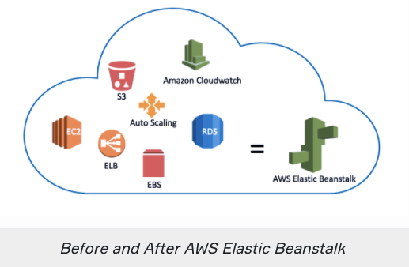
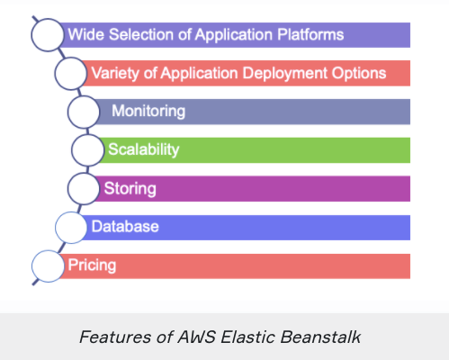
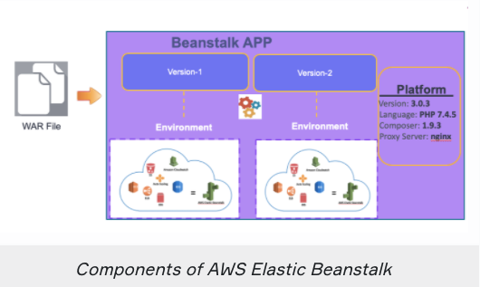

# `AWS Elastic Beanstalk`

## `What is Elastic Beanstalk`

- `AWS Elastic Beanstalk is an easy-to-use service for deploying and scaling web applications and services developed with Java, .NET, PHP, Node.js, Python, Ruby, Go, and Docker on familiar servers such as Apache, Nginx, Passenger, and IIS`

- AWS Elastic Beanstalk is an `orchestration service offered by Amazon Web Services used to set up your application architecture.`

- AWS Elastic Beanstalk makes it even `easier for developers to quickly deploy and manage applications in the AWS Cloud.`

- Developers simply upload their application, and `Elastic Beanstalk automatically handles the deployment details of capacity provisioning, load balancing, auto-scaling, and application health monitoring.`

## `Why AWS Elastic Beanstalk`

- Thanks to the AWS Elastic Beanstalk, `you can create your custom application architecture.`

- In this environment, you can locate a number of EC2 instances, S3, Simple Notification Service (SNS), CloudWatch, Autoscaling, Elastic Load Balancers, and Databases.

- Then you can deploy and manage your applications within minutes in the AWS Cloud

- `It manages these items for you and also provides you to update your software running on it.`

## `Features of AWS Elastic Beanstalk`

- `Application Platforms:`

- Elastic Beanstalk offers a wide selection of application platforms.

- `Java,.NET, Node.js, PHP, Mysql, Python, Go, and Docker to build the web application.`

- `Application Deployment Options:`

- AWS Elastic Beanstalk allows you to deploy your code through the `AWS Management Console, Elastic Beanstalk Command Line Interface, Visual Studio, and Eclipse.`

- `Monitoring:`

- AWS Elastic Beanstalk provides a useful user interface for tracking and controlling the performance of the applications. `Elastic Beanstalk gathers more than 40 main metrics and characteristics to assess the quality of the application.`

- `Management and Updates:`

- You can choose to have AWS Elastic Beanstalk `automatically update to the latest version of your Elastic Beanstalk environment using Managed Platform Updates.`

- `Scaling:`

- AWS Elastic Beanstalk uses `Elastic Load Balancing and Auto-Scaling to dynamically scale the device in and out depending on the particular needs of your device.`

- `Storing:`

- AWS Elastic Beanstalk stores your application files and, optionally, server log files in Amazon S3.

- If you delete the Elastic Beanstalk so delete files and log in the S3 as well.

- `Database:`

- You can choose to use `Amazon Relational Database Service (Amazon RDS) or Amazon DynamoDB, or use Microsoft SQL Server, Oracle, or other relational databases running on Amazon EC2.`

- `Pricing:`

- AWS Elastic Beanstalk service is free to use. There is no additional charge for AWS Elastic Beanstalk– `you pay only for the AWS resources actually used to store and run your application.`

## `Components of AWS Elastic Beanstalk`

- `Supported platform versions:`
	- Docker

	- Multicontainer Docker

	- Preconfigured Docker

	- Go

	- Java SE

	- Tomcat

	- .NET Core on Linux

	- .NET on Windows Server

	- Node.js

	- PHP

	- Python

	- Ruby	