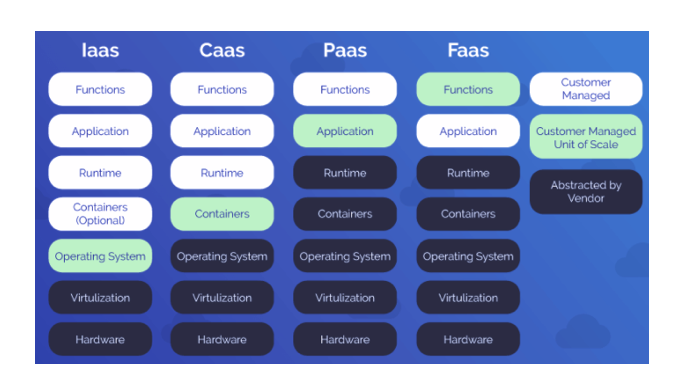
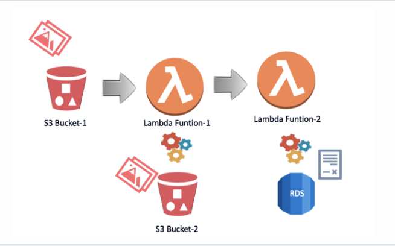
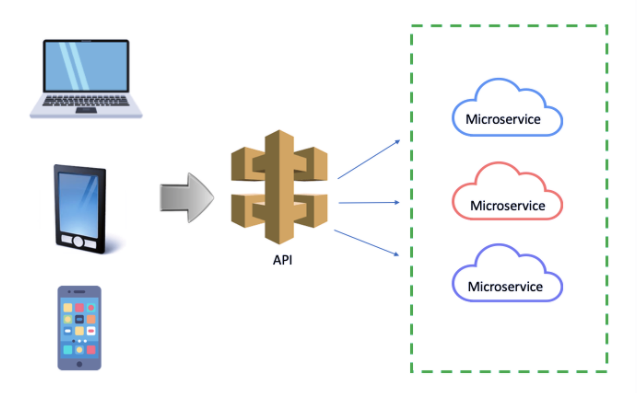

# `AWS Lambda`

- Cloud providers have `improved the PaaS` service and `developed the FaaS` service, which `allows only customers' code to run as a function.` `FaaS is also called Serverless.`
- It is a category of cloud computing services that provides a platform allowing customers to develop, run, and manage application functionalities.

- `AWS Lambda is the first FaaS offering by a global public cloud provider.`

## `What is Lambda`

- `AWS Lambda is a serverless compute service that runs your code` in response to events and automatically manages the underlying computing resources for you.

- `Instead of launching an EC2 instance to run your code on it, you can just deploy your code in Lambda services and you can get the same result.` AWS Lambda lets you run code without provisioning or managing servers.

- But, what makes lambda valuable is the trigger function. Thanks to the `trigger function, Lambda automatically operates the code you deploy in it.`

- After you upload your code to AWS Lambda, you can associate your function with specific AWS resources (e.g. a particular Amazon S3 bucket or Amazon SNS notification).

- In the Lambda service, you will be `charged only the functions that you deployed are run.` You pay only for the compute time you consume. When you prefer to run your code in `EC2 instance` you will be charged as long as your instance is running even if your code runs or not.

- Lambda also natively supports `Java, Go, PowerShell, Node.js, C#, Python, and Ruby code, and provides a Runtime API which allows you to use any additional programming languages to author your functions.`

## `How Does Lambda work`

- First, the user uploads a file to S3 Bucket-1,

- This event causes a trigger for Lambda Function-1.

- Then the Lambda-1 function starts to run. This function provides to send a copy of the uploaded file to the S3 Bucket-2

- When the copied file sends to S3 Bucket-2 it triggers Lambda Function-2.

- Lambda Function-2 starts to run. Lambda Function-2 provides to write the log record to the RDS Database.

# `API Gateway`

- `API stands for Application Program Interface.` Basically, the API defines how device components can communicate with each other.

- The API Gateway is responsible for `routing, design, and interface transfer requests.`

- All application requests first go through the API gateway.

- It then sends a message to the correct microservice. The API Gateway can also process a request by invoking several microservices and aggregating the output.

## `API Gateway in AWS`

- Amazon API Gateway is an AWS service for creating, publishing, maintaining, monitoring, and securing REST, HTTP, and WebSocket APIs at any scale.

- `APIs act as the "front door" for applications to access data, business logic, or functionality from your backend services.` Using API Gateway, you can create RESTful APIs and WebSocket APIs that enable real-time two-way communication applications.

- Amazon API Gateway offers 3 options

- `HTTP API:` HTTP APIs are optimized for building APIs that proxy to AWS Lambda functions or HTTP backends, making them ideal for serverless workloads. They do not currently offer API management functionality.

- `REST API:` REST APIs offer API proxy functionality and API management features in a single solution. REST APIs offer API management features such as usage plans, API keys, publishing, and monetizing APIs.

- `WebSocket API:` WebSocket APIs maintain a persistent connection between connected clients to enable real-time message communication such as chat apps and streaming dashboards.