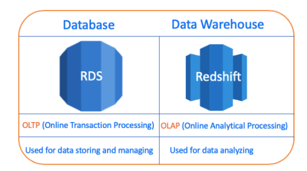
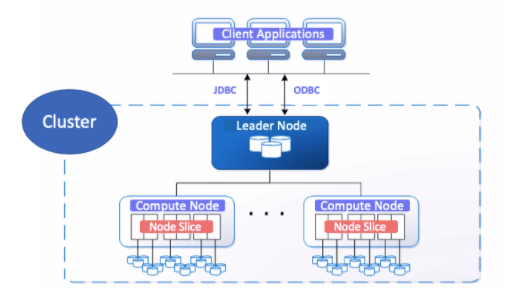

## `Redshift`

- Redshift is fully managed, cloud based `data warehouse` sevice by AWS

- Efficient solution to `collect and store` all data to `analyze`
- Amazon Redshift also includes `Amazon Redshift Spectrum, `allowing you to directly run `SQL queries in Amazon S3 data lakes`

---

## `Why Amazon Redshift - RDS vs Redshift`

- We use a database such as RDS to store our data and analyze them with SQL queries. So what is the reason to use `Redshift?`

- There are two categories of data processing:

- ` OLTP(Online Transaction Protocol)`
- ` OLAP(Online Analytical Processing)`

- `RDS is OLTP`
- `Redshit is OLAP`

==> `Note= it's possible to make an analysis on the OLTP database (like RDS) but processing of both storing and analyzing at the same time increases the workload of the database.`

==> `Note= We prefer data warehousing which is in OLAP class and can make data easily accessible for reporting and analytics.`

==> `Tips= OLAP data warehouse is designed for work together with SQL query and business intelligence (BI) tools like Microsoft Power BI`

---

## `Redshift System Architecture and Components`

==> `Client Applications=` Amazon Redshift integrates with various data loadin like `ETL(extract,transform and load)` and `Business intelligence (BI)`

- `Business Intelligence` is to support better business decision making.

==> `Connections=` Amazon Redshift communicates with client applications by using industry-standard JDBC and ODBC drivers for PostgreSQL.

==> `Clusters=` The `core infrastructure component` of an Amazon Redshift data warehouse is a cluster.

- A cluster is `composed of one or more compute nodes.`

- Your client application interacts directly only with the `leader node` in the cluster.

- Each cluster runs an `Amazon Redshift engine and contains` one or more databases.

==> `Leader Node=` The leader node `manages communications with client programs` and all `communication with compute nodes.`

==> `Compute Nodes=` The compute nodes execute the compiled code and send intermediate results back to the leader node for final aggregation.

==> `Node Slices=` A compute node is partitioned into slices

- The number of slices per node is determined by the node size of the `cluster`

[Amazon Redshift](https://www.youtube.com/watch?v=_qKm6o1zK3U&t=91s&ab_channel=AmazonWebServices)