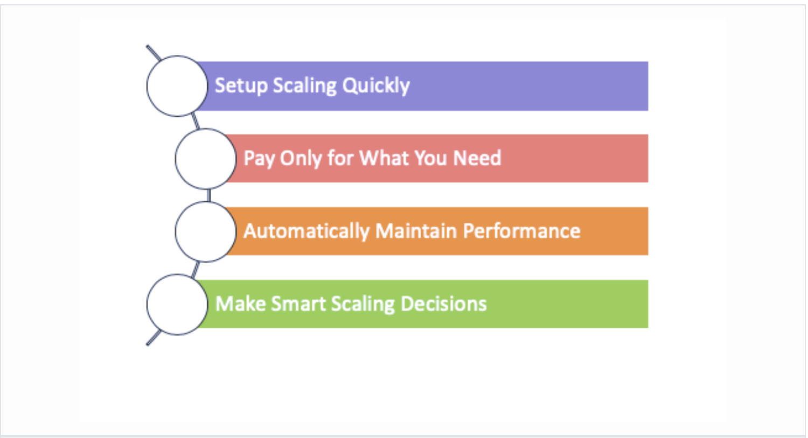
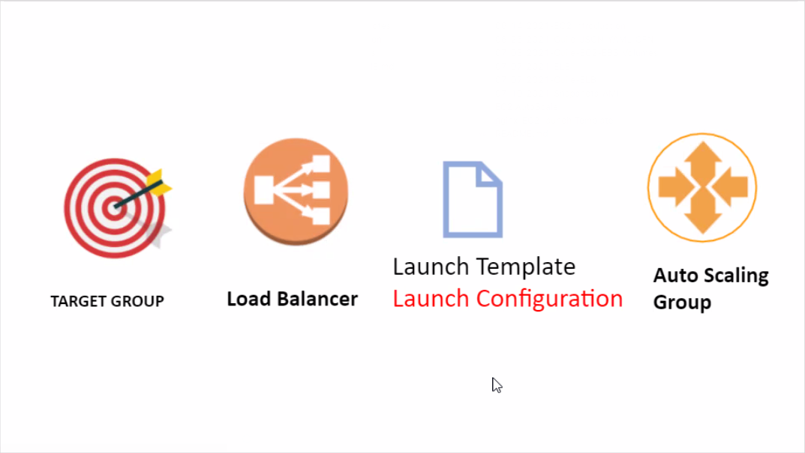
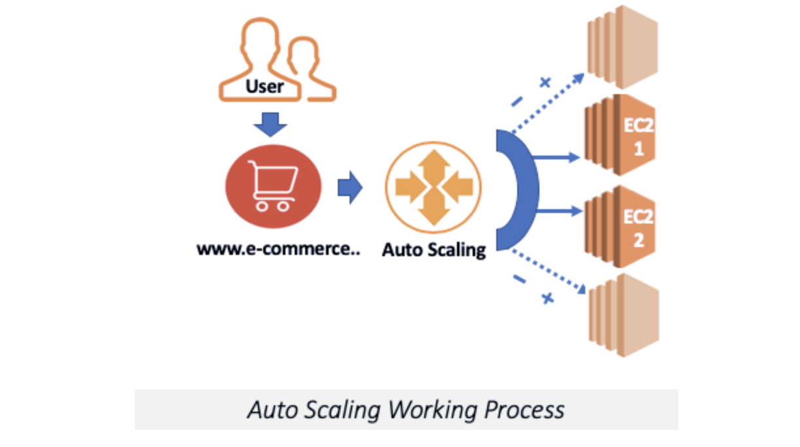

# Auto Scaling
- Amazon EC2 Auto Scaling is a component that helps you ensure that you have the correct number of Amazon EC2 instances available to handle the load for your application
- Thanks to Auto Scaling, we can add or remove a new virtual machine when it is necessary
- Expand your system to respond to that demand according to the size of the request you receive, and automatically collapse when the demand decreases
- `We can set some rule with Auto Scaling;`
	- If the virtual machines use more than 90% CPU resources for 5 minutes, add a new virtual machine
	- Keep running until the CPU usage of other machines decreases to 30%
	- If the CPU usage drops below 30%, delete this virtual machine

## Benefits of Auto Scaling


## Creating Auto Scaling


## Creating an Auto Scaling group using a launch configuration
- Open the Amazon EC2 Auto Scaling console
- On the navigation bar at the top of the screen, choose the same Region that you used when you created the launch template
- Choose Create an `Auto Scaling group.`
- On the `Choose launch template or configuration` page, for `Auto Scaling group name,` enter a name for your Auto Scaling group.
- To choose a launch configuration, do the following:
	- For `Launch Template,` choose `Switch to launch configuration.`
	- For `Launch configuration,` choose an existing launch configuration.
	- Verify that your launch configuration supports all of the options that you are planning to use, and then choose `Next.`
- On the `Configure settings` page, under `Network, for VPC,` choose the VPC for the security groups that you specified in your launch configuration. Launching instances using a combination of instance types and purchase options is not supported in EC2-Classic.
- For `Subnet,` choose one or more subnets in the specified VPC. Use subnets in multiple Availability Zones for high availability. For more information about high availability with Amazon EC2 Auto Scaling, 
- Choose `Next`
- (Optional) On the `Configure advanced options` page, configure the following options, and then choose `Next:`
	- To register your Amazon EC2 instances with a load balancer, choose an existing load balancer or create a new one. For more information, see `Elastic Load Balancing and Amazon EC2 Auto Scaling.` To create a new load balancer, follow the procedure in `Configure an Application Load Balancer or Network Load Balancer using the Amazon EC2 Auto Scaling console.`
	- To enable your Elastic Load Balancing (ELB) health checks, for `Health checks,` choose `ELB` under `Health check type.` These health checks are optional when you enable load balancing.
	- Under `Health check grace period,` enter the amount of time until Amazon EC2 Auto Scaling checks the health of instances after they are put into service. The intention of this setting is to prevent Amazon EC2 Auto Scaling from marking instances as unhealthy and terminating them before they have time to come up. The default is 300 seconds.
- (Optional) On the `Configure group size and scaling policies` page, configure the following options, and then choose `Next:`
	- For `Desired capacity,` enter the initial number of instances to launch. When you change this number to a value outside of the minimum or maximum capacity limits, you must update the values of `Minimum capacity or Maximum capacity.` For more information, see Setting capacity limits for your Auto Scaling group.
	- To automatically scale the size of the Auto Scaling group, choose `Target tracking scaling policy` and follow the directions. For more information, see Target Tracking Scaling Policies.
	- Under `Instance scale-in protection,` choose whether to enable instance scale-in protection.
- (Optional) To receive notifications, for `Add notification,` configure the notification, and then choose `Next.`
- (Optional) To add tags, choose `Add tag,` provide a tag key and value for each tag, and then choose `Next.`
- On the `Review` page, choose `Create Auto Scaling group.`


## Auto Scaling Working Process


## `Note = AWS Auto Scaling is free to use.`

## Installing Strees Tool
- Connect to EC2 inctance via terminal
- Get root privileges
```
- sudo su
```
- Install and run strees application with the following commands and increase CPU usage.
```
- yum install https://dl.fedoraproject.org/pub/epel/epel-release-latest-7.noarch.rpm
- yum install stress
- stress --cpu 80 --timeout 2000
 ```
 `or`
 ```
- sudo amazon-linux-extras install epel -y
- sudo yum install -y stress
- stress --cpu 80 --timeout 20000
```
- Stress tool will start to increase the CPU usage of the instance.

- Do the same process for the other running instances if needed. The CPU utilization will gradually increase.

- Wait for a while to see the results.