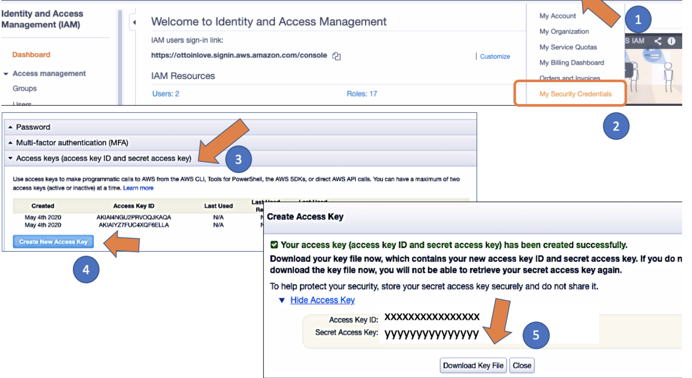

# AWS Command Line Interface

- Open Source tool

## AWS CLI Versions

- There are available two versions (version1 and version2)
- Version 2 is most recent major version of AWS CLI.
  - Supports all features

## AWS CLI Installation

- Windows: Download and run the 64-bit Windows installer.
- MacOS: Download and run the MacOS PKG installer.
- Linux: Download, unzip, and then run the Linux installer.

 [Installing the AWS CLI version 2](https://docs.aws.amazon.com/cli/latest/userguide/install-cliv2.html)

- After the installation of CLI, setup AWS configuration
- Open your terminal
- Type `aws` and hit `ENTER`
- Verify the setup by `aws help`
- For current version `aws --version`

## AWS CLI Configuration

- It requires to enter your `Access Key ID and Secret Access Key`
- You can also reach Acess Key ID from `My Security Credentials`
- If you can't see your credential you should create a new one like `Create New Access Key`



- Click the download key file
- Then go to your terminatl(local) tyepe `aws configure`
  - Enter your `Access Key and Secret Access Key`
  - Choose your `Region`
  - Choose your data `output format`

## AWS CLI - Command Structure

- CLI allows us to do everything we do via the management console

```
aws <command> <subcommand> [options and parameters]
```

- The base call to the `aws` program.
- The top-level `commands` , which typically corresponds to an AWS service supported by the AWS CLI.
- The `subcommands` subcommand that specifies which operation to perform.
- General CLI `options or parameters` required by the operation. You can specify these in any order as long as they follow the first three parts. If an exclusive parameter is specified multiple times, only the last value applies.


# IAM CLI 

- Lets create IAM user with CLI
- Each command should start with `aws`
```
aws iam create-user --user-name MyUser
```
```
- Listing IAM user
- aws iam list-users
```
```
- Creating new user
- $ aws iam create-user --user-name Ali
```
## AWS CLI - Creating IAM Group

```
$ aws iam create-group --group-name MyIamGroup
```
## AWS CLI - Adding Users to IAM Groups

```
$ aws iam add-user-to-group --user-name Ali --group-name Testcli
```

## List Buckets & Objects

- `ls` command can be executed

```
- list your buckets
- $ aws s3 ls s3://
- $ aws s3 ls(same output)
```

## Listing Bucket Objects

```
- This command list contents inside of bucket
- $ aws s3 ls s3://bucket-name 
```
## Recursive & Summarize Options

```
- See all the contents of a bucket recursively
-$ aws s3 ls s3://bucket-name --recursive
```
```
- Total number of objects in the S3 and total size of those objects.
- aws s3 ls s3://bucket-name --recursive --summarize
```
## Create S3 bucket

- The `mb` stads for `make bucket`
```
aws s3 mb s3://bucket-name
```
- List the current buckets in S3
```
aws s3 ls
```
- `Note = The bucket name must be uniqe, we can't use same bucket name of new buck name`

- Lets create a bucket in `different region`
```
aws s3 mb s3://cli-test-test --region us-east-2 make_bucket: cli-test-test
```

## Delete S3 Bucket

- The `rb` stands for `remove bucket`
```
aws s3 rb s3://bucket-name
```
- Delete a bucket along with all its objects `--force`
```
aws s3 rb s3://bucket-name --force
```

## Delete Object(s) in S3 Bucket

- For specifics file delete from S3 use `rm`
```
aws s3 rm s3://bucket-name/file-name
```

- For delete all object from S3 `--recursive`
```
aws s3 rm s3://bucket-name --recursive
```
## Upload file to S3
- The `cp` stands for `copy`

```
aws s3 cp file-name s3://bucket-name/file-name /path/to/directory/new-file-name
```
- File rename
```
 aws s3 cp file-name s3://bucket-name/new-file-name
 ```
 ## Upload Folder to S3

- Copy a folder from local to s3 bucket
```
$ aws s3 cp folder-name s3://bucket-name/folder-name --recursive
```

## Download File/Folder from S3

- `Downloading file from S3`
```
$ aws s3 cp s3://bucket-name/file-name new-file-name
```
- If you want to save same name from S3 use the `dot`
```
$ aws s3 cp s3://bucket-name/file-name .
```

- `Downloading folder from S3`

- Bucket to the `current directory on the local computer`
```
aws s3 cp s3://bucket-name/folder-name . --recursive
```
- New folder name can also be defined
```
aws s3 cp s3://bucket-name/folder-name  /path/to/directory/new-folder-name --recursive
```

## Move File/Folder

- Moving a file from local to S3
```
$ aws s3 mv file-name s3://bucket-name
```

- Moving a file from S3 to local
```
$ aws s3 mv s3://bucket-name/file-name /path/to/directory/new-file-name
```

- Moving a folder with all the contents from local to S3
```
$ aws s3 mv folder-name s3://bucket-name/new/folder-name --recursive
```
- Moving a folder with all the contents from S3 to local
```
$ aws s3 mv s3://bucket-name/folder-name /path/to/directory/new-folder-name --recursive
```
## Move/Copy Between Buckets

- `Copying a file between S3 buckets`


```
aws s3 cp s3://source-bucket-name/file-name s3://destination-bucket-name
```

- `Copying a folder between S3 buckets`

```
aws s3 cp s3://source-bucket-name/folder-name s3://destination-bucket-name
```

- `Moving a file between S3 buckets`

```
aws s3 mv s3://source-bucket-name/file-name s3://destination-bucket-name
```

- `Moving a folder between S3 buckets`

```
aws s3 mv s3://source-bucket-name/folder-name s3://destination-bucket-name
```

- `Copying all objects between S3 buckets`

```
aws s3 cp s3://source-bucket-name s3://destination-bucket-name
```

- `Moving all objects between S3 buckets`

```
aws s3 mv s3://source-bucket-name s3://destination-bucket-name
```
## S3 Synchronization - Sync

- If you use `sync` command it only copies the new or updated files

- Syncing local current directory to a bucket

```
aws s3 sync . s3://bucket-name
```

- `Syncing a bucket to local current directory`

```
aws s3 sync s3://bucket-name .
```

- `Syncing buckets`

```
aws s3 sync s3://source-bucket-name s3://destination-bucket-name
```

- `Syncing buckets in different regions`

```
aws s3 sync s3://source-bucket-name s3://destination-bucket-name --source-region us-east-1 --region us-east-2
```

- `Excluding files when syncing`
```
aws s3 sync . s3://bucket-name --exclude "file-name"
aws s3 sync . s3://bucket-name --exclude "*.jpg"
```

- `Deleting files when syncing`

- When  `--delete` option is used with sync command, any files existing under the source but not existing in the destination will be deleted.
- The following `sync` command syncs objects under a specified prefix and bucket to files in a local directory by uploading the local files to s3.
- Because the `--delete` option is used, any files existing under the specified bucket but not existing in the local directory will be deleted.

```
aws s3 sync . s3://bucket-name --delete 
```

