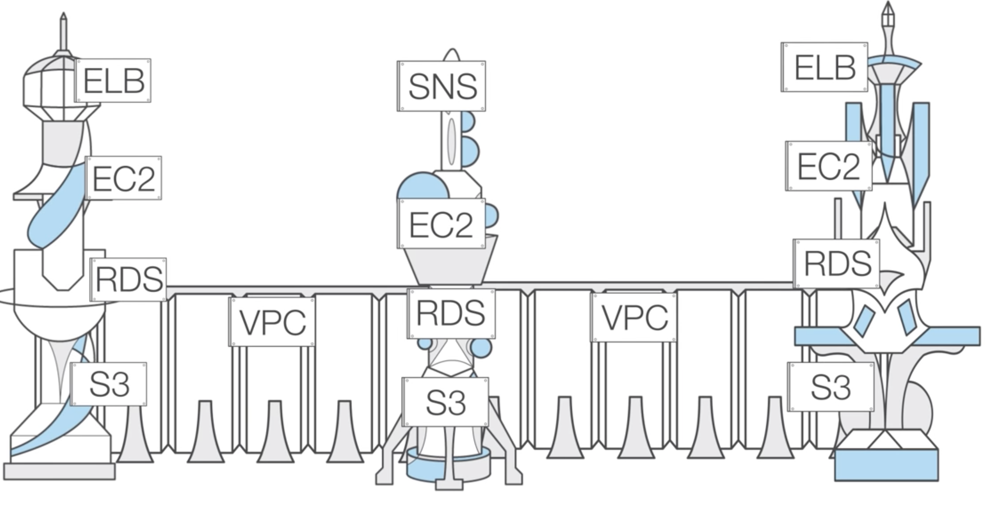
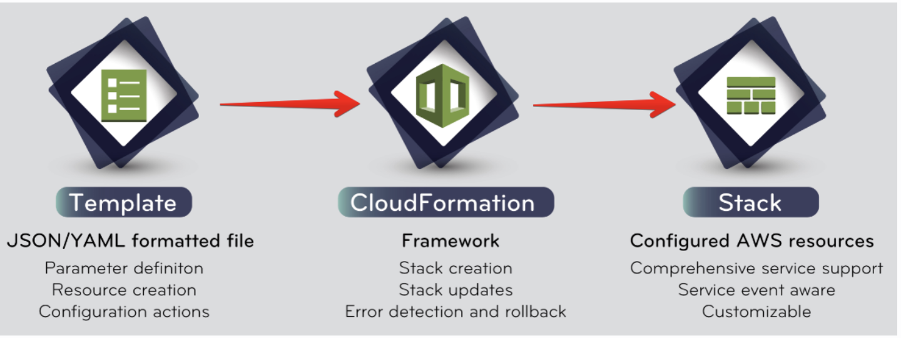
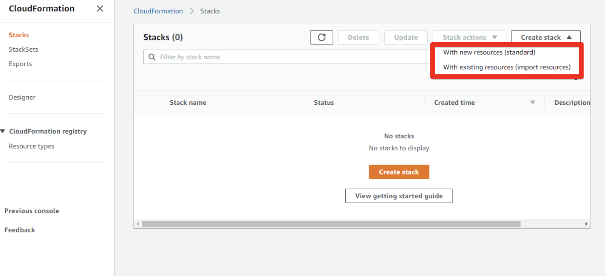
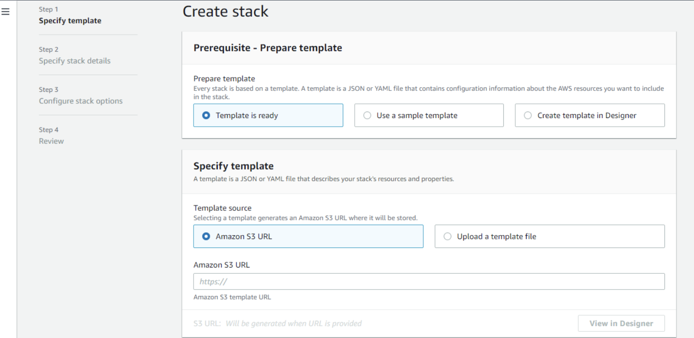

# Cloud Formation & Boto3

- CloudFormation is an AWS service which enables you to create, manage, configure, replicate and delete AWS resources easily and rapidly using templates



## `Stacks and Templates`



- `Stacks and templates` are the main components of AWS CloudFormation
- Template is `JSON or YAML` formatted
- Templates extensions should be `.json, .yaml, .template or .txt`
- A `Stack` can be single EC2 instance or a more complex VPC configuration including hundreds of resources.

```
- Example JSON
{
  "AWSTemplateFormatVersion" : "2010-09-09",
  "Description" : "A simple EC2 instance",
  "Resources" : {
    "MyEC2Instance" : {
      "Type" : "AWS::EC2::Instance",
      "Properties" : {
        "ImageId" : "ami-0ff8a91507f77f867",
        "InstanceType" : "t1.micro"
      }
    }
  }
}
```
```
- Example YAML
AWSTemplateFormatVersion: '2010-09-09'
Description: A simple EC2 instance
Resources:
  MyEC2Instance:
    Type: AWS::EC2::Instance
    Properties:
      ImageId: ami-0ff8a91507f77f867
      InstanceType: t1.micro
```

## ` CloudFormation's Working Process`


## `Accessing and Pricing`

- AWS Management Console
- AWS Command Line Interface
- CloudFormation API


- Aws doesn't require any additional fee for Cloudformation, but you can pay only resources your use.

## `Creating Stack`



## `Specifying Template`



- `Template is ready:` Select this option, if you have already created your template.
- `Use a sample template:` AWS provides a collection of sample templates for users to build their stacks easily.
- `Create template in Designer:` AWS CloudFormation Designer is a graphical user interface which enables you to build your templates using a drag and drop menu

## `Template Selection`
- 
```
https://s3-us-west-2.amazonaws.com/cloudformation-templates-us-west-2/VPC_AutoScaling_and_ElasticLoadBalancer.template

- I attached this template below
```


## `Specifying Stack Details`


``` 
Template; 
{
  "AWSTemplateFormatVersion" : "2010-09-09",

  "Description" : "AWS CloudFormation Sample Template VPC_AutoScaling_and_ElasticLoadBalancer: Create a load balanced, Auto Scaled sample website in an existing Virtual Private Cloud (VPC). This example creates an Auto Scaling group behind a load balancer with a simple health check using a basic getting start AMI that has a simple Apache Web Server-based PHP page. The web site is available on port 80, however, the instances can be configured to listen on any port (8888 by default). **WARNING** This template creates one or more Amazon EC2 instances and an Application Load Balancer. You will be billed for the AWS resources used if you create a stack from this template.",

  "Parameters" : {

    "VpcId" : {
      "Type" : "AWS::EC2::VPC::Id",
      "Description" : "VpcId of your existing Virtual Private Cloud (VPC)",
      "ConstraintDescription" : "must be the VPC Id of an existing Virtual Private Cloud."
    },

    "Subnets" : {
      "Type" : "List<AWS::EC2::Subnet::Id>",
      "Description" : "The list of SubnetIds in your Virtual Private Cloud (VPC)",
      "ConstraintDescription" : "must be a list of at least two existing subnets associated with at least two different availability zones. They should be residing in the selected Virtual Private Cloud."
    },

    "KeyName" : {
      "Description" : "Name of an existing EC2 KeyPair to enable SSH access to the instances",
      "Type" : "AWS::EC2::KeyPair::KeyName",
      "ConstraintDescription" : "must be the name of an existing EC2 KeyPair."
    },

    "SSHLocation" : {
      "Description" : "Lockdown SSH access to the bastion host (default can be accessed from anywhere)",
      "Type" : "String",
      "MinLength": "9",
      "MaxLength": "18",
      "Default" : "0.0.0.0/0",
      "AllowedPattern" : "(\\d{1,3})\\.(\\d{1,3})\\.(\\d{1,3})\\.(\\d{1,3})/(\\d{1,2})",
      "ConstraintDescription" : "must be a valid CIDR range of the form x.x.x.x/x."
    },

    "InstanceType" : {
      "Description" : "WebServer EC2 instance type",
      "Type" : "String",
      "Default" : "t2.small",
      "AllowedValues" : [ "t1.micro", "t2.nano", "t2.micro", "t2.small", "t2.medium", "t2.large", "m1.small", "m1.medium", "m1.large", "m1.xlarge", "m2.xlarge", "m2.2xlarge", "m2.4xlarge", "m3.medium", "m3.large", "m3.xlarge", "m3.2xlarge", "m4.large", "m4.xlarge", "m4.2xlarge", "m4.4xlarge", "m4.10xlarge", "c1.medium", "c1.xlarge", "c3.large", "c3.xlarge", "c3.2xlarge", "c3.4xlarge", "c3.8xlarge", "c4.large", "c4.xlarge", "c4.2xlarge", "c4.4xlarge", "c4.8xlarge", "g2.2xlarge", "g2.8xlarge", "r3.large", "r3.xlarge", "r3.2xlarge", "r3.4xlarge", "r3.8xlarge", "i2.xlarge", "i2.2xlarge", "i2.4xlarge", "i2.8xlarge", "d2.xlarge", "d2.2xlarge", "d2.4xlarge", "d2.8xlarge", "hi1.4xlarge", "hs1.8xlarge", "cr1.8xlarge", "cc2.8xlarge", "cg1.4xlarge"]
,
      "ConstraintDescription" : "must be a valid EC2 instance type."
    },

    "InstanceCount" : {
      "Description" : "Number of EC2 instances to launch",
      "Type" : "Number",
      "Default" : "1"
    }
  },

  "Mappings" : {
    "Region2Examples" : {
      "ap-east-1"      : { "Examples" : "https://s3-ap-east-1.amazonaws.com/cloudformation-examples-ap-east-1" },
      "ap-northeast-1" : { "Examples" : "https://s3-ap-northeast-1.amazonaws.com/cloudformation-examples-ap-northeast-1" },
      "ap-northeast-2" : { "Examples" : "https://s3-ap-northeast-2.amazonaws.com/cloudformation-examples-ap-northeast-2" },
      "ap-northeast-3" : { "Examples" : "https://s3-ap-northeast-3.amazonaws.com/cloudformation-examples-ap-northeast-3" },
      "ap-south-1"     : { "Examples" : "https://s3-ap-south-1.amazonaws.com/cloudformation-examples-ap-south-1" },
      "ap-southeast-1" : { "Examples" : "https://s3-ap-southeast-1.amazonaws.com/cloudformation-examples-ap-southeast-1" },
      "ap-southeast-2" : { "Examples" : "https://s3-ap-southeast-2.amazonaws.com/cloudformation-examples-ap-southeast-2" },
      "ca-central-1"   : { "Examples" : "https://s3-ca-central-1.amazonaws.com/cloudformation-examples-ca-central-1" },
      "cn-north-1"     : { "Examples" : "https://s3.cn-north-1.amazonaws.com.cn/cloudformation-examples-cn-north-1" },
      "cn-northwest-1" : { "Examples" : "https://s3.cn-northwest-1.amazonaws.com.cn/cloudformation-examples-cn-northwest-1" },
      "eu-central-1"   : { "Examples" : "https://s3-eu-central-1.amazonaws.com/cloudformation-examples-eu-central-1" },
      "eu-north-1"     : { "Examples" : "https://s3-eu-north-1.amazonaws.com/cloudformation-examples-eu-north-1" },
      "eu-west-1"      : { "Examples" : "https://s3-eu-west-1.amazonaws.com/cloudformation-examples-eu-west-1" },
      "eu-west-2"      : { "Examples" : "https://s3-eu-west-2.amazonaws.com/cloudformation-examples-eu-west-2" },
      "eu-west-3"      : { "Examples" : "https://s3-eu-west-3.amazonaws.com/cloudformation-examples-eu-west-3" },
      "me-south-1"     : { "Examples" : "https://s3-me-south-1.amazonaws.com/cloudformation-examples-me-south-1" },
      "sa-east-1"      : { "Examples" : "https://s3-sa-east-1.amazonaws.com/cloudformation-examples-sa-east-1" },
      "us-east-1"      : { "Examples" : "https://s3.amazonaws.com/cloudformation-examples-us-east-1" },
      "us-east-2"      : { "Examples" : "https://s3-us-east-2.amazonaws.com/cloudformation-examples-us-east-2" },
      "us-west-1"      : { "Examples" : "https://s3-us-west-1.amazonaws.com/cloudformation-examples-us-west-1" },
      "us-west-2"      : { "Examples" : "https://s3-us-west-2.amazonaws.com/cloudformation-examples-us-west-2" }
    }
,
    "AWSInstanceType2Arch" : {
      "t1.micro"    : { "Arch" : "HVM64"  },
      "t2.nano"     : { "Arch" : "HVM64"  },
      "t2.micro"    : { "Arch" : "HVM64"  },
      "t2.small"    : { "Arch" : "HVM64"  },
      "t2.medium"   : { "Arch" : "HVM64"  },
      "t2.large"    : { "Arch" : "HVM64"  },
      "m1.small"    : { "Arch" : "HVM64"  },
      "m1.medium"   : { "Arch" : "HVM64"  },
      "m1.large"    : { "Arch" : "HVM64"  },
      "m1.xlarge"   : { "Arch" : "HVM64"  },
      "m2.xlarge"   : { "Arch" : "HVM64"  },
      "m2.2xlarge"  : { "Arch" : "HVM64"  },
      "m2.4xlarge"  : { "Arch" : "HVM64"  },
      "m3.medium"   : { "Arch" : "HVM64"  },
      "m3.large"    : { "Arch" : "HVM64"  },
      "m3.xlarge"   : { "Arch" : "HVM64"  },
      "m3.2xlarge"  : { "Arch" : "HVM64"  },
      "m4.large"    : { "Arch" : "HVM64"  },
      "m4.xlarge"   : { "Arch" : "HVM64"  },
      "m4.2xlarge"  : { "Arch" : "HVM64"  },
      "m4.4xlarge"  : { "Arch" : "HVM64"  },
      "m4.10xlarge" : { "Arch" : "HVM64"  },
      "c1.medium"   : { "Arch" : "HVM64"  },
      "c1.xlarge"   : { "Arch" : "HVM64"  },
      "c3.large"    : { "Arch" : "HVM64"  },
      "c3.xlarge"   : { "Arch" : "HVM64"  },
      "c3.2xlarge"  : { "Arch" : "HVM64"  },
      "c3.4xlarge"  : { "Arch" : "HVM64"  },
      "c3.8xlarge"  : { "Arch" : "HVM64"  },
      "c4.large"    : { "Arch" : "HVM64"  },
      "c4.xlarge"   : { "Arch" : "HVM64"  },
      "c4.2xlarge"  : { "Arch" : "HVM64"  },
      "c4.4xlarge"  : { "Arch" : "HVM64"  },
      "c4.8xlarge"  : { "Arch" : "HVM64"  },
      "g2.2xlarge"  : { "Arch" : "HVMG2"  },
      "g2.8xlarge"  : { "Arch" : "HVMG2"  },
      "r3.large"    : { "Arch" : "HVM64"  },
      "r3.xlarge"   : { "Arch" : "HVM64"  },
      "r3.2xlarge"  : { "Arch" : "HVM64"  },
      "r3.4xlarge"  : { "Arch" : "HVM64"  },
      "r3.8xlarge"  : { "Arch" : "HVM64"  },
      "i2.xlarge"   : { "Arch" : "HVM64"  },
      "i2.2xlarge"  : { "Arch" : "HVM64"  },
      "i2.4xlarge"  : { "Arch" : "HVM64"  },
      "i2.8xlarge"  : { "Arch" : "HVM64"  },
      "d2.xlarge"   : { "Arch" : "HVM64"  },
      "d2.2xlarge"  : { "Arch" : "HVM64"  },
      "d2.4xlarge"  : { "Arch" : "HVM64"  },
      "d2.8xlarge"  : { "Arch" : "HVM64"  },
      "hi1.4xlarge" : { "Arch" : "HVM64"  },
      "hs1.8xlarge" : { "Arch" : "HVM64"  },
      "cr1.8xlarge" : { "Arch" : "HVM64"  },
      "cc2.8xlarge" : { "Arch" : "HVM64"  }
    },

    "AWSInstanceType2NATArch" : {
      "t1.micro"    : { "Arch" : "NATHVM64"  },
      "t2.nano"     : { "Arch" : "NATHVM64"  },
      "t2.micro"    : { "Arch" : "NATHVM64"  },
      "t2.small"    : { "Arch" : "NATHVM64"  },
      "t2.medium"   : { "Arch" : "NATHVM64"  },
      "t2.large"    : { "Arch" : "NATHVM64"  },
      "m1.small"    : { "Arch" : "NATHVM64"  },
      "m1.medium"   : { "Arch" : "NATHVM64"  },
      "m1.large"    : { "Arch" : "NATHVM64"  },
      "m1.xlarge"   : { "Arch" : "NATHVM64"  },
      "m2.xlarge"   : { "Arch" : "NATHVM64"  },
      "m2.2xlarge"  : { "Arch" : "NATHVM64"  },
      "m2.4xlarge"  : { "Arch" : "NATHVM64"  },
      "m3.medium"   : { "Arch" : "NATHVM64"  },
      "m3.large"    : { "Arch" : "NATHVM64"  },
      "m3.xlarge"   : { "Arch" : "NATHVM64"  },
      "m3.2xlarge"  : { "Arch" : "NATHVM64"  },
      "m4.large"    : { "Arch" : "NATHVM64"  },
      "m4.xlarge"   : { "Arch" : "NATHVM64"  },
      "m4.2xlarge"  : { "Arch" : "NATHVM64"  },
      "m4.4xlarge"  : { "Arch" : "NATHVM64"  },
      "m4.10xlarge" : { "Arch" : "NATHVM64"  },
      "c1.medium"   : { "Arch" : "NATHVM64"  },
      "c1.xlarge"   : { "Arch" : "NATHVM64"  },
      "c3.large"    : { "Arch" : "NATHVM64"  },
      "c3.xlarge"   : { "Arch" : "NATHVM64"  },
      "c3.2xlarge"  : { "Arch" : "NATHVM64"  },
      "c3.4xlarge"  : { "Arch" : "NATHVM64"  },
      "c3.8xlarge"  : { "Arch" : "NATHVM64"  },
      "c4.large"    : { "Arch" : "NATHVM64"  },
      "c4.xlarge"   : { "Arch" : "NATHVM64"  },
      "c4.2xlarge"  : { "Arch" : "NATHVM64"  },
      "c4.4xlarge"  : { "Arch" : "NATHVM64"  },
      "c4.8xlarge"  : { "Arch" : "NATHVM64"  },
      "g2.2xlarge"  : { "Arch" : "NATHVMG2"  },
      "g2.8xlarge"  : { "Arch" : "NATHVMG2"  },
      "r3.large"    : { "Arch" : "NATHVM64"  },
      "r3.xlarge"   : { "Arch" : "NATHVM64"  },
      "r3.2xlarge"  : { "Arch" : "NATHVM64"  },
      "r3.4xlarge"  : { "Arch" : "NATHVM64"  },
      "r3.8xlarge"  : { "Arch" : "NATHVM64"  },
      "i2.xlarge"   : { "Arch" : "NATHVM64"  },
      "i2.2xlarge"  : { "Arch" : "NATHVM64"  },
      "i2.4xlarge"  : { "Arch" : "NATHVM64"  },
      "i2.8xlarge"  : { "Arch" : "NATHVM64"  },
      "d2.xlarge"   : { "Arch" : "NATHVM64"  },
      "d2.2xlarge"  : { "Arch" : "NATHVM64"  },
      "d2.4xlarge"  : { "Arch" : "NATHVM64"  },
      "d2.8xlarge"  : { "Arch" : "NATHVM64"  },
      "hi1.4xlarge" : { "Arch" : "NATHVM64"  },
      "hs1.8xlarge" : { "Arch" : "NATHVM64"  },
      "cr1.8xlarge" : { "Arch" : "NATHVM64"  },
      "cc2.8xlarge" : { "Arch" : "NATHVM64"  }
    }
,
    "AWSRegionArch2AMI" : {
      "af-south-1"       : {"HVM64" : "ami-064cc455f8a1ef504", "HVMG2" : "NOT_SUPPORTED"},
      "ap-east-1"        : {"HVM64" : "ami-f85b1989", "HVMG2" : "NOT_SUPPORTED"},
      "ap-northeast-1"   : {"HVM64" : "ami-0b2c2a754d5b4da22", "HVMG2" : "ami-09d0e0e099ecabba2"},
      "ap-northeast-2"   : {"HVM64" : "ami-0493ab99920f410fc", "HVMG2" : "NOT_SUPPORTED"},
      "ap-northeast-3"   : {"HVM64" : "ami-01344f6f63a4decc1", "HVMG2" : "NOT_SUPPORTED"},
      "ap-south-1"       : {"HVM64" : "ami-03cfb5e1fb4fac428", "HVMG2" : "ami-0244c1d42815af84a"},
      "ap-southeast-1"   : {"HVM64" : "ami-0ba35dc9caf73d1c7", "HVMG2" : "ami-0e46ce0d6a87dc979"},
      "ap-southeast-2"   : {"HVM64" : "ami-0ae99b503e8694028", "HVMG2" : "ami-0c0ab057a101d8ff2"},
      "ca-central-1"     : {"HVM64" : "ami-0803e21a2ec22f953", "HVMG2" : "NOT_SUPPORTED"},
      "cn-north-1"       : {"HVM64" : "ami-07a3f215cc90c889c", "HVMG2" : "NOT_SUPPORTED"},
      "cn-northwest-1"   : {"HVM64" : "ami-0a3b3b10f714a0ff4", "HVMG2" : "NOT_SUPPORTED"},
      "eu-central-1"     : {"HVM64" : "ami-0474863011a7d1541", "HVMG2" : "ami-0aa1822e3eb913a11"},
      "eu-north-1"       : {"HVM64" : "ami-0de4b8910494dba0f", "HVMG2" : "ami-32d55b4c"},
      "eu-south-1"       : {"HVM64" : "ami-08427144fe9ebdef6", "HVMG2" : "NOT_SUPPORTED"},
      "eu-west-1"        : {"HVM64" : "ami-015232c01a82b847b", "HVMG2" : "ami-0d5299b1c6112c3c7"},
      "eu-west-2"        : {"HVM64" : "ami-0765d48d7e15beb93", "HVMG2" : "NOT_SUPPORTED"},
      "eu-west-3"        : {"HVM64" : "ami-0caf07637eda19d9c", "HVMG2" : "NOT_SUPPORTED"},
      "me-south-1"       : {"HVM64" : "ami-0744743d80915b497", "HVMG2" : "NOT_SUPPORTED"},
      "sa-east-1"        : {"HVM64" : "ami-0a52e8a6018e92bb0", "HVMG2" : "NOT_SUPPORTED"},
      "us-east-1"        : {"HVM64" : "ami-032930428bf1abbff", "HVMG2" : "ami-0aeb704d503081ea6"},
      "us-east-2"        : {"HVM64" : "ami-027cab9a7bf0155df", "HVMG2" : "NOT_SUPPORTED"},
      "us-west-1"        : {"HVM64" : "ami-088c153f74339f34c", "HVMG2" : "ami-0a7fc72dc0e51aa77"},
      "us-west-2"        : {"HVM64" : "ami-01fee56b22f308154", "HVMG2" : "ami-0fe84a5b4563d8f27"}
    }

  },

  "Resources" : {

    "WebServerGroup" : {
      "Type" : "AWS::AutoScaling::AutoScalingGroup",
      "Properties" : {
        "VPCZoneIdentifier" : { "Ref" : "Subnets" },
        "LaunchConfigurationName" : { "Ref" : "LaunchConfig" },
        "MinSize" : "1",
        "MaxSize" : "10",
        "DesiredCapacity" : { "Ref" : "InstanceCount" },
        "TargetGroupARNs" : [ { "Ref" : "ALBTargetGroup" } ]
      },
      "CreationPolicy" : {
        "ResourceSignal" : {
          "Timeout" : "PT15M"
        }
      },
      "UpdatePolicy": {
        "AutoScalingRollingUpdate": {
          "MinInstancesInService": "1",
          "MaxBatchSize": "1",
          "PauseTime" : "PT15M",
          "WaitOnResourceSignals": "true"
        }
      }
    },

    "LaunchConfig" : {
      "Type" : "AWS::AutoScaling::LaunchConfiguration",
      "Metadata" : {
        "Comment" : "Install a simple application",
        "AWS::CloudFormation::Init" : {
          "config" : {
            "packages" : {
              "yum" : {
                "httpd"             : []
              }
            },

            "files" : {
              "/var/www/html/index.html" : {
                "content" : { "Fn::Join" : ["\n", [
                  "",
                  "<h1>Congratulations, you have successfully launched the AWS CloudFormation sample.</h1>"
                ]]},
                "mode"    : "000644",
                "owner"   : "root",
                "group"   : "root"
              },

              "/etc/cfn/cfn-hup.conf" : {
                "content" : { "Fn::Join" : ["", [
                  "[main]\n",
                  "stack=", { "Ref" : "AWS::StackId" }, "\n",
                  "region=", { "Ref" : "AWS::Region" }, "\n"
                ]]},
                "mode"    : "000400",
                "owner"   : "root",
                "group"   : "root"
              },

              "/etc/cfn/hooks.d/cfn-auto-reloader.conf" : {
                "content": { "Fn::Join" : ["", [
                  "[cfn-auto-reloader-hook]\n",
                  "triggers=post.update\n",
                  "path=Resources.LaunchConfig.Metadata.AWS::CloudFormation::Init\n",
                  "action=/opt/aws/bin/cfn-init -v ",
                  "         --stack ", { "Ref" : "AWS::StackName" },
                  "         --resource LaunchConfig ",
                  "         --region ", { "Ref" : "AWS::Region" }, "\n",
                  "runas=root\n"
                ]]},
                "mode"    : "000400",
                "owner"   : "root",
                "group"   : "root"
              }
            },

            "services" : {
              "sysvinit" : {
                "httpd"    : { "enabled" : "true", "ensureRunning" : "true" },
                "cfn-hup" : { "enabled" : "true", "ensureRunning" : "true",
                              "files" : ["/etc/cfn/cfn-hup.conf", "/etc/cfn/hooks.d/cfn-auto-reloader.conf"]}
              }
            }
          }
        }
      },
      "Properties" : {
        "AssociatePublicIpAddress" : "true",
        "ImageId" : { "Fn::FindInMap" : [ "AWSRegionArch2AMI", { "Ref" : "AWS::Region" },
                         { "Fn::FindInMap" : [ "AWSInstanceType2Arch", { "Ref" : "InstanceType" }, "Arch" ] } ] },
        "SecurityGroups" : [ { "Ref" : "InstanceSecurityGroup" } ],
        "KeyName"        : { "Ref" : "KeyName" },
        "InstanceType" : { "Ref" : "InstanceType" },
        "UserData"       : { "Fn::Base64" : { "Fn::Join" : ["", [
             "#!/bin/bash -xe\n",
             "yum update -y aws-cfn-bootstrap\n",

             "/opt/aws/bin/cfn-init -v ",
             "         --stack ", { "Ref" : "AWS::StackName" },
             "         --resource LaunchConfig ",
             "         --region ", { "Ref" : "AWS::Region" }, "\n",

             "/opt/aws/bin/cfn-signal -e $? ",
             "         --stack ", { "Ref" : "AWS::StackName" },
             "         --resource WebServerGroup ",
             "         --region ", { "Ref" : "AWS::Region" }, "\n"
        ]]}}
      }
    },

    "ApplicationLoadBalancer" : {
      "Type" : "AWS::ElasticLoadBalancingV2::LoadBalancer",
      "Properties" : {
        "Subnets" : { "Ref" : "Subnets"},
        "SecurityGroups" : [ { "Ref" : "LoadBalancerSecurityGroup" } ]
      }
    },

    "ALBListener" : {
      "Type" : "AWS::ElasticLoadBalancingV2::Listener",
      "Properties" : {
        "DefaultActions" : [{
          "Type" : "forward",
          "TargetGroupArn" : { "Ref" : "ALBTargetGroup" }
        }],
        "LoadBalancerArn" : { "Ref" : "ApplicationLoadBalancer" },
        "Port" : "80",
        "Protocol" : "HTTP"
      }
    },

    "ALBTargetGroup" : {
      "Type" : "AWS::ElasticLoadBalancingV2::TargetGroup",
      "Properties" : {
        "HealthCheckIntervalSeconds" : 30,
        "HealthCheckTimeoutSeconds" : 25,
        "HealthyThresholdCount" : 3,
        "Port" : 80,
        "Protocol" : "HTTP",
        "UnhealthyThresholdCount" : 5,
        "VpcId" : {"Ref" : "VpcId"}
      }
    },

    "LoadBalancerSecurityGroup" : {
      "Type" : "AWS::EC2::SecurityGroup",
      "Properties" : {
        "GroupDescription" : "Enable HTTP access on port 80",
        "VpcId" : { "Ref" : "VpcId" },
        "SecurityGroupIngress" : [ {
          "IpProtocol" : "tcp",
          "FromPort" : "80",
          "ToPort" : "80",
          "CidrIp" : "0.0.0.0/0"
        } ],
        "SecurityGroupEgress" : [ {
          "IpProtocol" : "tcp",
          "FromPort" : "80",
          "ToPort" : "80",
          "CidrIp" : "0.0.0.0/0"
        } ]
      }
    },

    "InstanceSecurityGroup" : {
      "Type" : "AWS::EC2::SecurityGroup",
      "Properties" : {
        "GroupDescription" : "Enable HTTP access and SSH access",
        "VpcId" : { "Ref" : "VpcId" },
        "SecurityGroupIngress" : [
          { "IpProtocol" : "tcp", "FromPort" : "80", "ToPort" : "80", "SourceSecurityGroupId" : { "Ref" : "LoadBalancerSecurityGroup" } },
          { "IpProtocol" : "tcp", "FromPort" : "22", "ToPort" : "22", "CidrIp" : { "Ref" : "SSHLocation" } }
        ]
      }
    }
  },

  "Outputs" : {
    "URL" : {
      "Description" : "URL of the website",
      "Value" :  { "Fn::Join" : [ "", [ "http://", { "Fn::GetAtt" : [ "ApplicationLoadBalancer", "DNSName" ]}]]}
    }
  }
}

{"mode":"full","isActive":false}
```

# ` AWS SDK Boto3`
- Boto3 is the AWS SDK (Software Development Kit) for Python
- It enables you to create, use, update, and delete AWS resources with your Python scripts.

## ` Installation and Configuration`

- Open your terminal
```
- pip install boto3
```
` Note: To be able to use boto3, you need to setup your credentials.`

- Go to local terminal
```
- aws configure
```
- Then enter your `Access Key ID and Secret Access Key`

## `Using Boto3`

- Lets write simple script interacting with AWS S3
- Open your Python interpreter and write code.
- First you need to import it `import boto3`
- Then write other commands

```
import boto3

# Use Amazon S3
s3 = boto3.resource('s3')

# Print out all bucket names
for bucket in s3.buckets.all():
    print(bucket.name)
```
```
import boto3

# Use Amazon S3
s3 = boto3.resource('s3')

# Upload a new file
data = open('test.jpg', 'rb')
s3.Bucket('my-bucket').put_object(Key='test.jpg', Body=data) #my bucket=bucket name
```