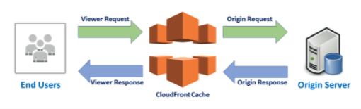
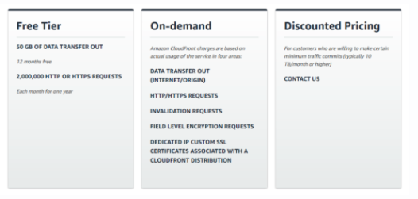

# `Cloud Front`

- CloudFront is the Content Delivery Network (CDN) of AWS

- It is a globally distributed network located on different geographical places.

- The aim of this service is to provide faster distribution to the dynamic or the static web contents.

- World-wide distributed data centers which are called `edge locations` are the backbone of CloudFront.

- AWS CloudFront has a world-wide `network of 225+ Points of Presence (PoP)` consisting of `215+ Edge Locations` and `12 Regional Mid-tier Caches`. These facilities are `spread over 89 cities across 46 countries (March 2021).`

## ` How Does Cloud Front work?`

- When a request is sent from an end user to the origin server, this request has to travel through the entire connecting network from the user's computer to the origin server. 

- Considering the last number of users in a region trying to fetch/send data from/to servers in different regions, this process inevitably causes latency and redundant traffic.

- CloudFront's world-wide `distributed edge locations cache requested data and deliver it to the end users without the necessity` of going back and forth between users and servers.

## `Accessing CloudFront`

- `AWS Management Console`
- `AWS Command Line Interface`
- `AWS Tools for Windows PowerShell`
- `AWS SDK`
- `CloudFront API`

## `CloudFront Pricing`

- Pricing varies depending on region and usage. Thus, to be more cost effective setup your configuration regarding your goal, methods, end users and geographic locations.

## ` Origins and Origin Groups Settings`

- CloudFront enables you to create more than one origin and make them groups. If you click the checkbox of the origin, you can `Edit and Delete `that origin. You can also create more origins by clicking `Create Origin.`

- If you encounter a failover event, you can `Create Origin Group` to provide rerouting. You must have two origins to create an origin group.

- `Note= You can only use GET, HEAD, and OPTIONS HTTP methods in your cache behavior within an origin group.`

## `Behaviors Settings`

- CloudFront evaluates a request for an object regarding the order of the cache behaviors in the distribution. You can create/delete/edit behaviors on this tab, and also arrange their precedences using `Move Up and Move Down` buttons.

## `Error Pages Settings`

- If you want CloudFront to respond to requests using a custom error page in case of an HTTP 4xx or 5xx status code from the origin, you can Create `Custom Error Response`

- You will see the Custom Error Response Settings, if you click to Create Custom Error Response. Select the HTTP Error Code, enter the time for Error Caching Minimum TTL, customize the error response if you want and click `Create` to create custom error response.

## `Restriction Settings`

- CloudFront enables you to restrict users to access your distribution depending on their geographic positions. This can be done in two different ways: `Whitelist and Blacklist.`

- `Whitelist:` Select the countries and add them to your `Whitelist` so that they can access your content.

- `Blacklist:` Select the countries and add them to your Blacklist so that `they can not access your content.`

## `Invalidations Settings`

- If you want any of your objects `(e.g. an unnecessary or unwanted image)` to be removed from CloudFront edge caches due to any reason, you can easily `Create Invalidation.`

- Just specify the path of the object/objects that you want to remove and click `Invalidate.` You can also remove multiple objects using wildcards.