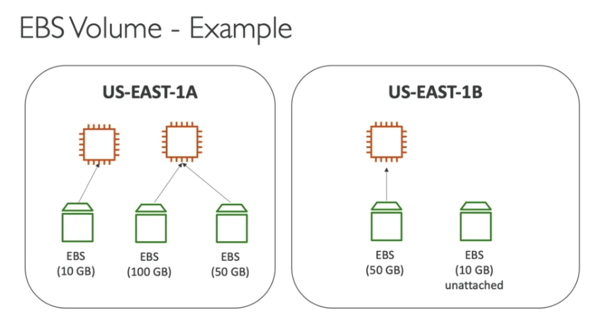
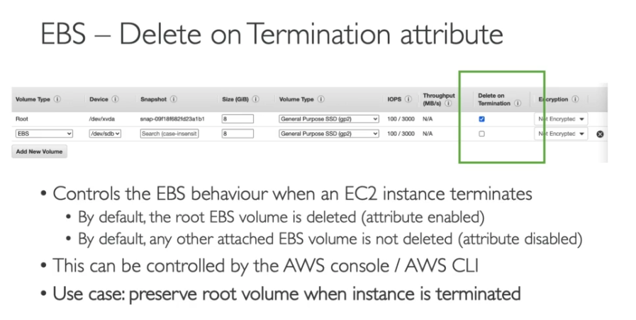

# EBS (Elastic Block Store)

It allows your instances to persist data, even aftr their termination

` EBS volume can only mounted to be one instance at a time`

- Think of them as a "Network USB stick"

## Advantage of EC2:

- Elasticity: Capacity needs can be arranged within minutes.

- Control: You can create, stop or terminate instances via EC2 console, CLI or SDKs easily.

- Reliability: EC2 Service Level Agreement (SLA) of 99.99% is committed by Amazon.

- EC2 is a virtual machine,

- We can adjust its capacity according to our needs,

- We pay as much as we use.

## EBS Volume

- It's network drive(not a physical drive)

- It's locked to an Availability Zone(AZ)

 * EBS volume in us-east-1a cannot be attached to us-east-1b

# EBS Hands On
* Go to EC2

    - Click to Instance

    - Click the Storage
    
    - You can see Root device details/type
    
    - Scrool down and can see Volume ID
    
    - Click the Volume ID/ You can see all EBS Volume ID's
     
    - There is a `Create Volume` on the top left

        - Choose the `Volume Type`

        - Availability zone should be same with EC2 Zone

    - Create Volume

## After create a volume assign to EC2

    - Right click to created volume and click the attach volume

    - Choose the Instance(EC2) same availability zone

    - Hit the attach

    - Come back to EC2 instances check the `Volume ID` 

[More Information](https://docs.aws.amazon.com/AWSEC2/latest/UserGuide/ebs-using-volumes.html)

*** If you terminate EC2, EBS volume will be available or deleted. When we create EC2 if we chose `Delete on Termination` EBS volume will be deleted. This settings Step 4 in Ec2 creatation.***

# EBS Snapshots 

* Make a back up(snapshot) of your EBS volume at a point

* Can copy snapshots acroos AZ or Region

   * Go to EC2 instances

   * Choose your instance

   * Hit the actions then `create snapshot` next to the create volume

    * Write description

# Verify the Snapshot

* On the left hand-side under the `Elastic Block Store` Snapshot

# Copy Snapshot

* Choose the Ec2 then hit to Actions menu on the tab

* Click the Copy 

- New Snapshot can be any `Region`
