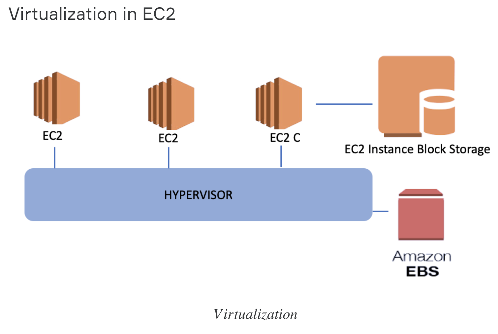
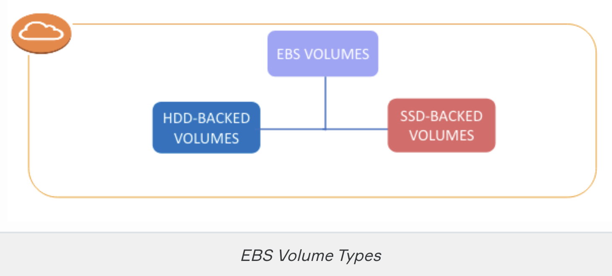
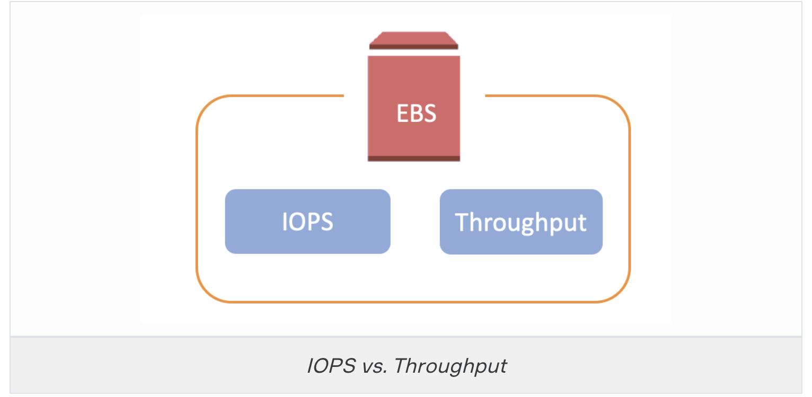

## EC2 Volumes

- AWS serves 2 basic volume options for costumers in the Block-Based Storage category. These are `Instance Store (Ephemeral) and Elastic Block Storage (EBS)`

- EC2 stands for Amazon Elastic Compute Cloud.

- EC2 is a web service that provides secure, resizable compute capacity in the cloud.

- It is a service that allows you to run application programs in the computing environment.

- It is designed to make web-scale cloud computing easier for developers.

## Virtualization in EC2

- Driver and software layer as a Hypervisor

- The hypervisor is a system that ensures that all information within its body can be accessed by all connected machines or storage devices.

- The systems connected directly to the hypervisor and accessible to each machine associated with hypervisor we mentioned above is called EBS, Elastic Block Storage,

- In the virtualization environment, we have one physical server and a virtualization software on it.

- Driver and software layer as a `Hypervisor`

## Instance Block Storage (Ephemeral)

- This is the name given to the storage method that uses disks. 

- It may have SSD or magnetic HDD hardisk.

`Advantage of this model is that it provides high access speed`

` Disadvantage is that if the virtual machine shuts down in some way, all data here is lost.`

## EC2 Features&Advantages

- Features of EC2:

    - EC2 provides you to pay only for the resources that you actually use.

    - If you use EC2 you don't have to buy physical servers.

- Advantage of EC2:
    
    - Elasticity: Capacity needs can be arranged within minutes.

    -  Control: You can create, stop or terminate instances via EC2 console, CLI or SDKs easily.

    - Reliability: EC2 Service Level Agreement (SLA) of 99.99% is committed by Amazon.

## EC2 Basic Components

- Virtual computing machines are known as `Instances` in AWS environment,

- Pre-configured templates for your instances, known as `Amazon Machine Images (AMIs)`, that package the bits you need for your server (including the operating system and additional software),

- Generally, storage components for EC2 are known as `Amazon EBS Volumes` and `Instance Block Storage`

# EBS (Elastic Block Storage)
- EBS is a virtual disk in a cloud.

- If you create a Windows or Linux EC2 instance EBS volume can be attached as Root device of volume automatically.

`Tips:` EBS allows multi attach, for the considerations and limitations.

## EBS Volume Types

`Solid state drives (SSD)`
       
- Optimized for transactional workloads involving frequent read/write operations with small I/O size.

`Hard disk drives (HDD)`

- Optimized for large streaming workloads where the dominant performance attribute is throughput.

## IOPS and Throughput

`IOPS`

- IOPS stands for Input/Output Operations Per Second.
- It is a common performance measurement used to test computer storage devices like HDD and SSD.
- IOPS is a value that specifies how many reads and writes can be made to a disk per second.

`Throughput`

- Throughput is the value that specifies how many MB of data transfer per second is allowed to a storage system.
- Throughput is related to processing capacity.

`Quiz`
- Which of the below is not the type of EBS volume?
    - Static Volume

- There are …… main volume types in AWS EBS.
    - `2` SSD and HDD