# Elastic Load Balancing (ELB)

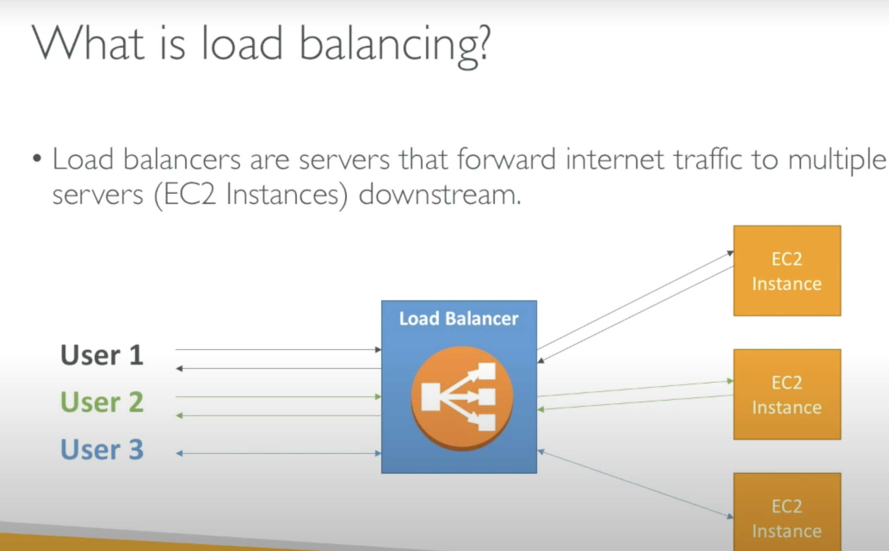
- Automatically distributes incoming application traffic across multiple targets, such as Amazon EC2 instances, containers.

# `Why use a load balancer?`
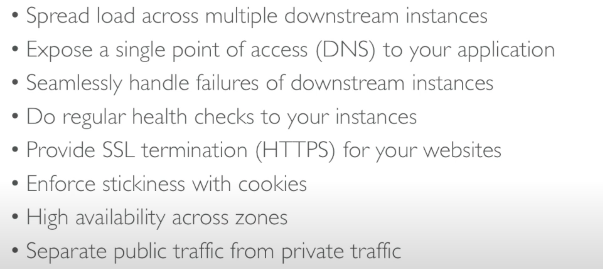

# `Why use an EC2 Load Balancer?`
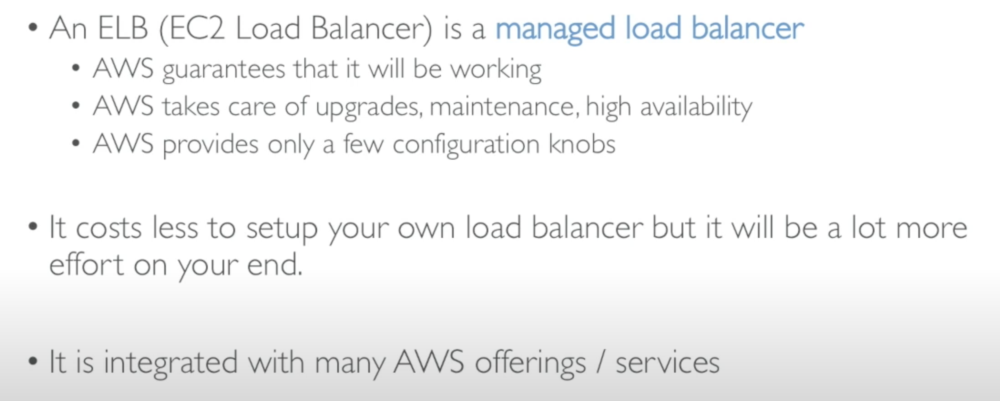

## Load balancer working process
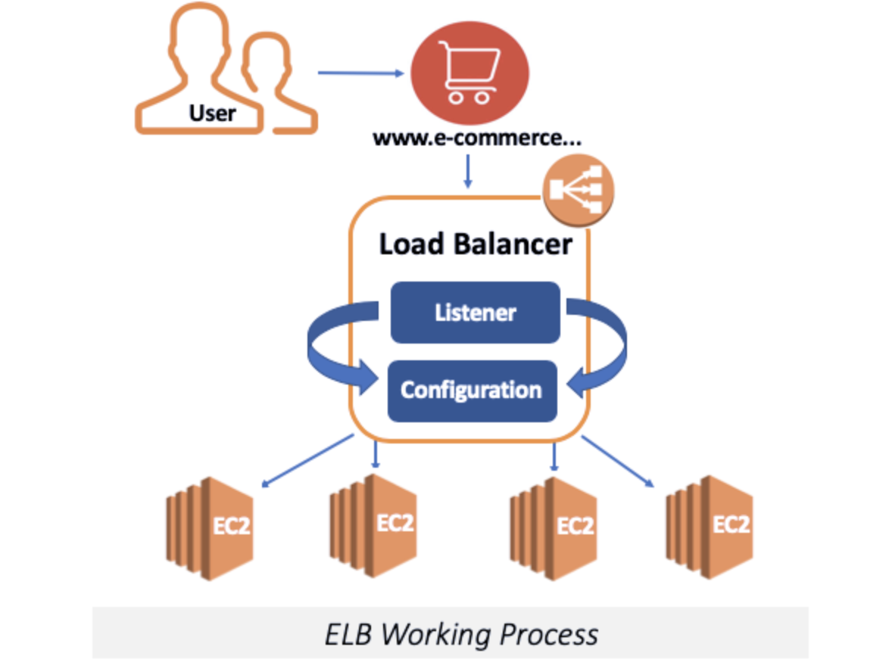

- ELB is a network service. We can direct the incoming traffic to `Load Balancer`
- Load Balancer consists of 2 components;
  - `Listener`
	- Listens to incoming traffic through a specific port.
  - `Configuration`
	- Set of rules that takes into account the Listener's analysis and provides to direct traffic.

## `Types of ELB`
- 1- Application Load Balancer (v2 - new generation) - 2016
- 2- Network Load Balancer (v2 - new generation) - 2017
- 3- Gateway Load Balancer 
- 4- Classic Load Balancer (v1- old generation) - 2009 
- ` It is recommended to use the newer/v2 generation load balancer as they provide more features`

## `1- Application Load Balancer(v2)`
- Layer 7 of the OSI Model
- It identifies the incoming traffic and forwards it to the right resources.
- It is best suited for the load balancing of HTTP and HTTPS traffic.
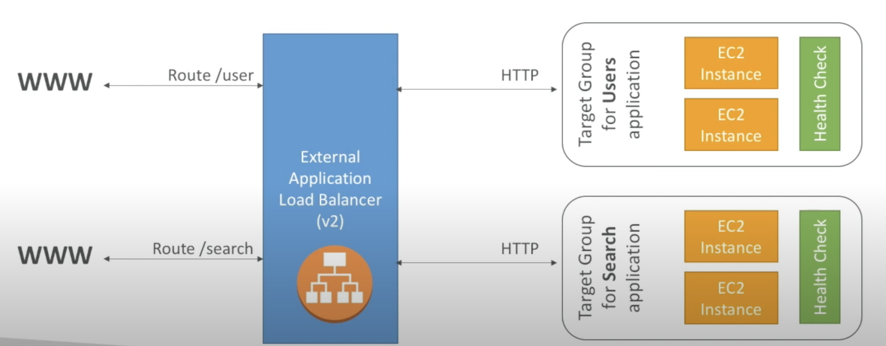

## ` Good to Know`
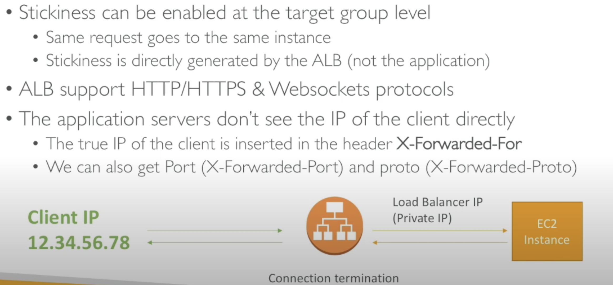

## `2- Network Load Balancer(v2)`
- Layer 4 of the OSI model
- It makes routing at the transport layer (TCP/SSL), and it can handle millions of requests per second.
- It is best suited for load balancing the TCP traffic when high performance is required.
- If we need a `simple and fast` load balancer over a basic TCP-based port, this is the Network Load Balancer.
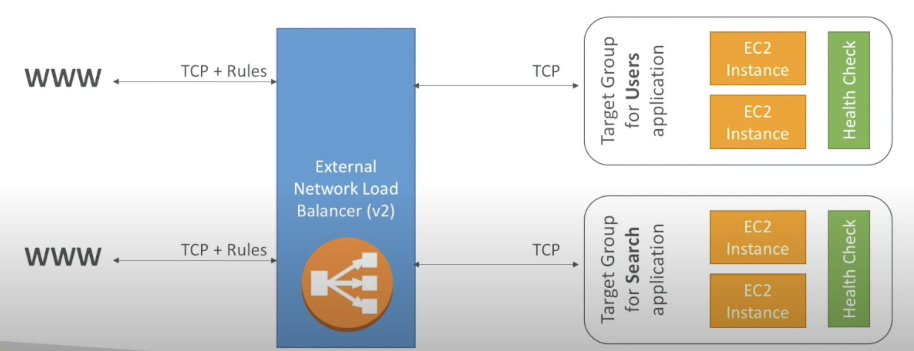

## `Good to Know`
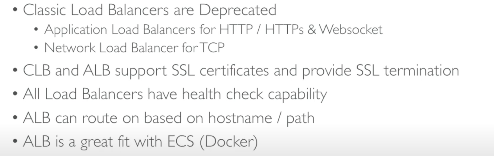

## `3- Gateway Load Balancer`
- Gateway Load Balancers enable you to deploy, scale, and manage virtual appliances, such as firewalls, intrusion detection and prevention systems, and deep packet inspection systems
- Traffic using the GENEVE protocol on port 6081.

## `4- Classic Load Balancer(v1)`
- Layer 4 of the OSI model
- Classic Load Balancer provides basic load balancing across multiple Amazon EC2 instances and operates
- AWS doesn't recommend you to use Classic Load Balancer anymore

# ` Creating an Application Load Balancer`
- AWS Management Console
	- EC2
	  - Load Balancer
	  - Create Load Balancer

## ` Select Load Balancer Type`
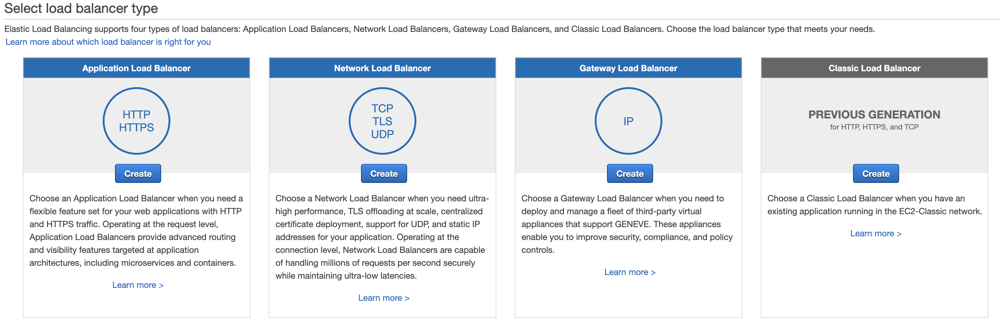

## `Step 1 - Configure Load Balancer`
- `Name:` give a name 
- `Scheme:` Internet Facing or Internal
	- If you select `internet facing`, the LB can handle traffic coming from the Internet
	- If you select `internal` the LB works only `VPC(Virtual Private Cloud)`
- `Ip address type:` Ipv4 or dualstack(IPv6)
- `Listener:` HTTP 80 for `internet facing`
- `Availability Zone:` You should specify subnets from at least `two` AZ.
- ` Tag:` Create your tag

## `Step 2 - Configure Security Settings`
- `We will encounter a warning. Because we have opened the HTTP protocol, and it is not a secure protocol exactly. So AWS suggests opening an HTTPS and using a certificate.`

## ` Step 3 - Configure Security Groups`
- You can use an existing security group or create a new one.

## ` Step 4 - Configure Routing`
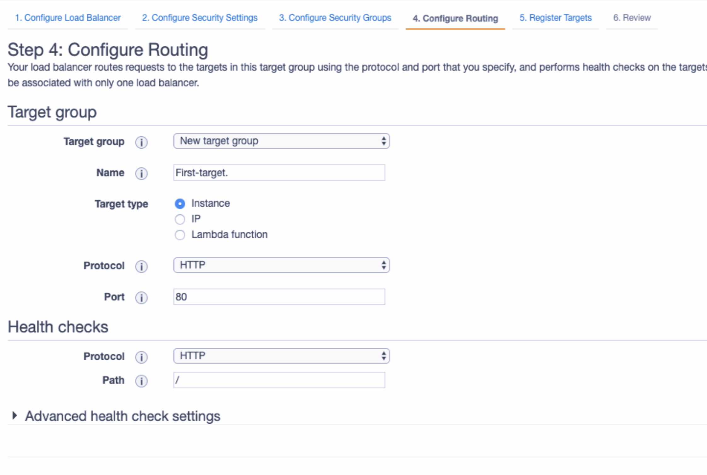
- ` Target Group:` Create a new target group
- ` Name:` Name of the targer group
- ` Target Type:` Instance - IP - Lambda function
- `Protocol and Port:` HTTP and 80

## ` Step 4 - Configure Routing (Health Checks & Advanced Health Check Settings)`
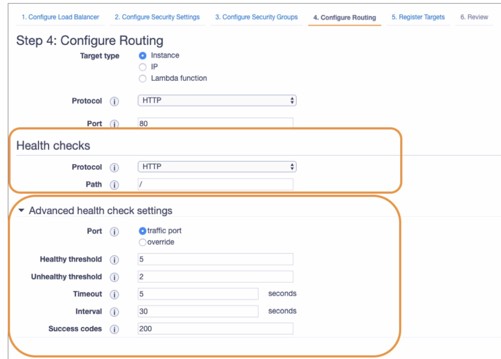

- `Protocol:` HTTP
- `Path:` Destination path for health check. defaul `./`

## Advanced Health Check Settings
- `Port:` Default is `Traffic Port`
- ` Healthy Threshold:`The default is `five`, if it gets positive results from five, this machine evaulate healthy.
- ` Unhealthy Threshold:`If LB get `two` fails from health check, it will decide unhealthy.
- ` Timeout:` The `five` is default, we write how many seconds wait for connection failure
- ` Interval:` The `30 second` is deafult.It shows how many seconds wait each experiment.
- ` Success Codes:` If it receives 200 of the HTTP protocol, it will evaulate healthy.

## ` Step 5 - Register Targets`
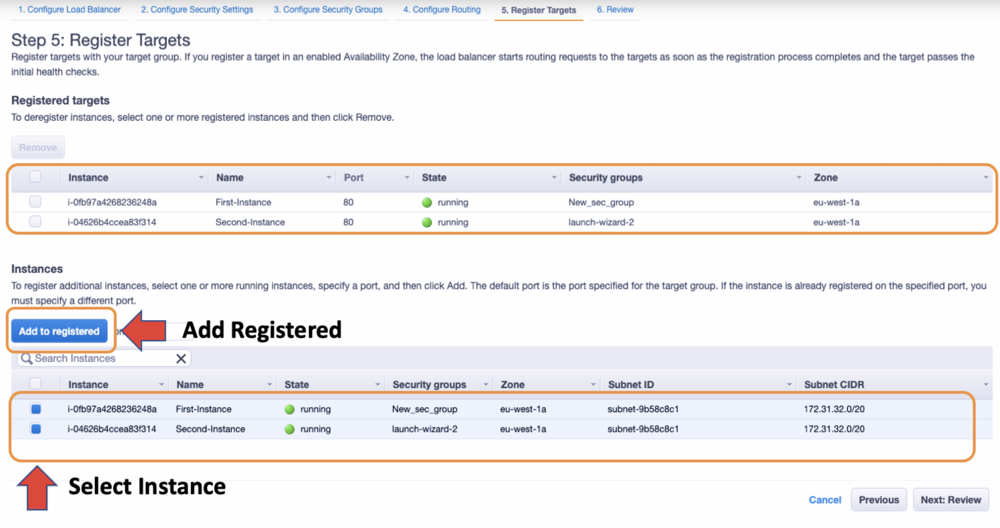

- Select both of them and clicking the `Add to registered` tab.

## ` Step 6 - Review`
- Review and click the create.