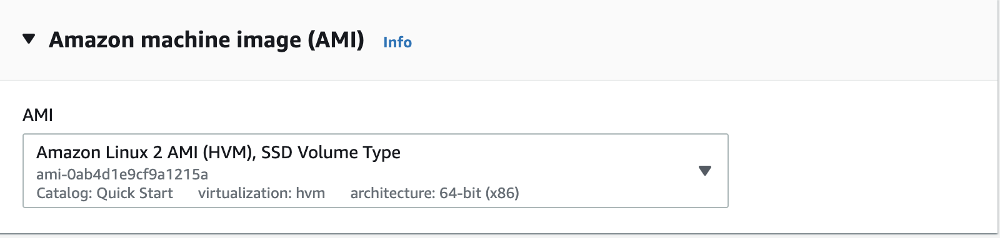
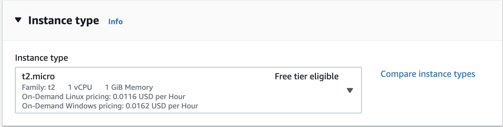
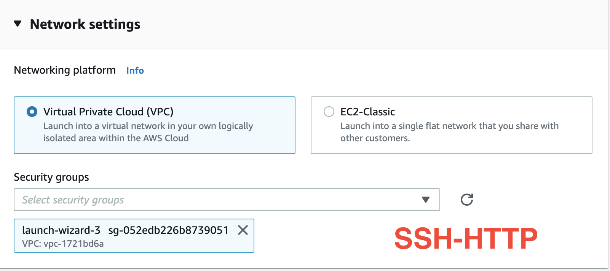
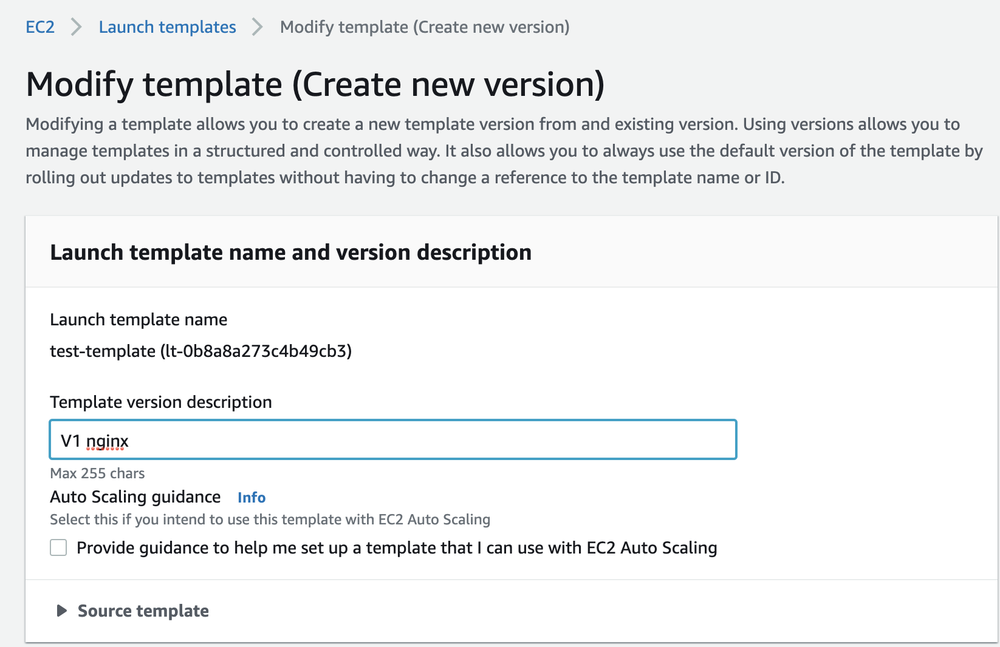
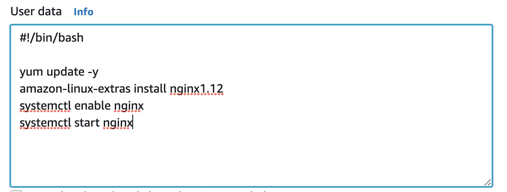

# Launch Template
## Part 1 - Creating Launch Templates
## Step-1
- You should use/create a security group like SSH,HTTP

## Step-2
- Open the AWS Ec2 Console
- Click the `INSTANCES`, choose `Launch Template`
- Click on `Create launch template`
- Enter a name and provide a description

`Name:test-template`

`Template version description: test-template`

- Autoscaling Guidance


`Keep it as default`


- Template Tags


`Keep it as is`


- Source Template :


`Keep it as is`


- Amazon machine image (AMI)


`Amazon Linux 2 AMI (HVM), SSD Volume Type`

`ami-02354e95b39ca8dec`

- Instance Type

`t2.micro`



- Key pair


`Please select your key pair (pem key) that is created before`

`Example: test.pem`


- Network settings


`Network Platform : Virtual Private Cloud (VPC)`


- Security groups


`Security Group Name: Launch_Temp_Sec_group`


- Storage (volumes)


`keep it as is  (Volume 1 (AMI Root) (8 GiB, EBS, General purpose SSD (gp2)))`


- Resource tags

```
Key             : Name
Value           : Webserver-Origin
Resource type   : Instance
```

- Network interfaces


`Keep it as is`


- Advance details


`Keep it as is`

``` - Hit the create `Create Launch Template` ```

## Step-3
```
> Go to `Launch Template` Menu
> Select `test-Template` ---> `Actions` ---> `Launch Instance from Template`
> Enter number of instance as `1`
> Keep the rest of settings as is and click the `Launch instance from template` at the bottom
> Go to EC2 Instance menu and show the created instance
```
## Step-4 - Modifying Launch Template - Launch Template Version 2

- Go to Launch Template menu on the left hand panel.
- Select template named `test-Template` ---> `Actions` ---> `Modify template (Create New Version)`
- Template version description

  - `V1 nginx`

- Key pair

  - ` Select your .pem file name`

- Resource Tags
  
  - ` Key: Name`
  - ` Value: Nginx-Webserver-v2`
  - ` Resource type: Instance` 

- Go to `Advanced Deatails` Menu and `User data` click on `test-template`

```
#!/bin/bash

yum update -y
amazon-linux-extras install nginx1.12
systemctl enable nginx
systemctl start nginx
```



- Go to `Launch Template` Menu and click on `test-Template`

- Select version `2` from the `Versions` tab

  - ` Version: 2`
  - ` Description: V2 nginx`
 
 - Select `Actions` ---> `Launch instance from template`
   
   - ` Number of Instance : 1`

-  Click the 'launch Instance from template' button at the bottom
- Go to `Instance Menu` and show recently created EC2 instance
- Copy EC2's 'Public IP`, paste it in a browser and show 'nginx' webpage

## Launch Template Version 3
- Go to `Launch Template` menu on the left hand pane.

- Select template named `test-Template` ---> `Actions` ---> 'Modify template (Create New Version)'.

- Template version description


  - `V3 nginx`


- Key pair


  -`Select your .pem file name`


- Resource tags


   - `Key             : Name`

   - `Value           : Webserver-V3`

   - `Resource type   : Instance`

- Go to `Advance Details` on the bottom and add the script given below into the `user data` field.

```
#! /bin/bash

yum update -y
amazon-linux-extras install nginx1.12
systemctl start nginx
cd /usr/share/nginx/html
chmod -R 777 /usr/share/nginx/html
rm index.html
wget https://raw.githubusercontent.com/awsdevopsteam/ngniex/master/index.html
wget https://raw.githubusercontent.com/awsdevopsteam/ngniex/master/ryu.jpg
systemctl restart nginx
systemctl enable nginx
```

- Go to `Launch Template` Menu and click on `MyClaruswayTemplate`
- Select Version `3` from `Versions` tab

  - `Version:3`
  - `Description:V3 nginx`

- Select `Actions` ---> `Launch instance from template`
  - ` Number of Instance : 1`


- Click the `launch Instance from template` button at the bottom

- Go to `Instance Menu` and show recently created EC2 instance

- Copy EC2's `Public IP`, paste it in a browser and show `nginx` webpage with `Ken` image