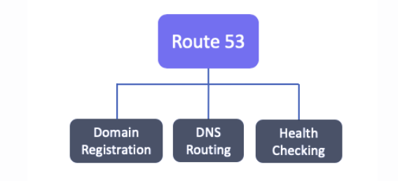
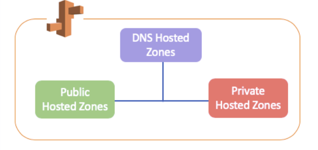
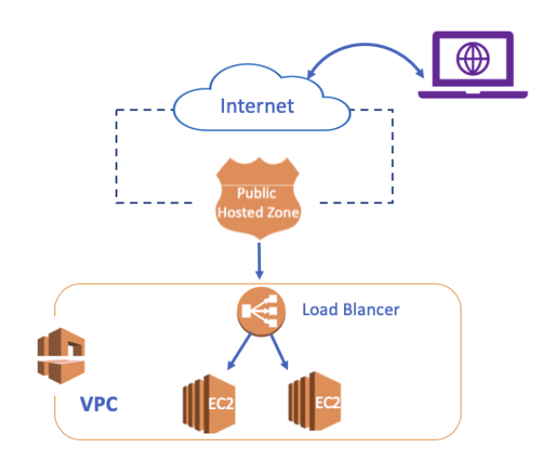
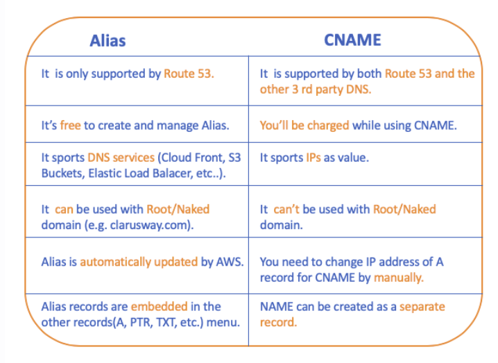
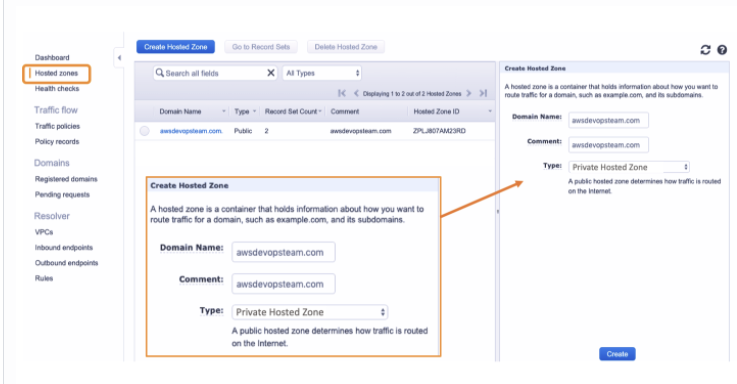
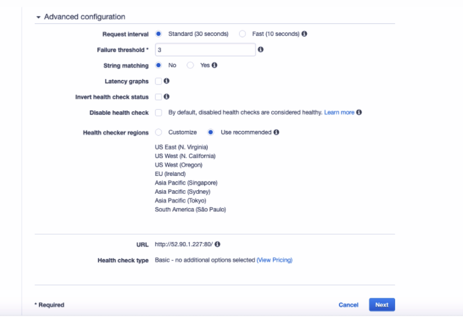

# ` Route 53`
- Amazon Route 53 is a highly available and scalable Domain Name System (DNS) web service.
- Highly reliable and cost-effective approach to routing end-users to internet applications.
- The name of Route 53 is a inspired by TCP or UDP port 53

## `What is AWS Route53 used for?`


- Amazon Route 53 effectively connects user requests to infrastructure running in AWS, such as `Amazon EC2 instances, Elastic Load Balancer or Amazon S3 buckets.`

- You can use Amazon Route 53 to configure DNS `health checks` to route traffic to healthy endpoints.

- Amazon Route 53 also offers Domain Name Registration.
- You can purchase and manage domain names

## `Domain Name System (DNS)`

- It is a system used for transferring human-readable domain names such as www.ucadressbook.com to a machine-readable IP address such as 1.2.3.45

- `Domain Name` is the phrase given to the naming that corresponds to the IP address to which a device in the internet environment is connected.

- Domain names consist of a set of `words, letters, or numbers` to describe a unique individual or company.

- we can say the `Domain Name System (DNS)` is the `phonebook of the Internet` like in your home.

## `Why do we need DNS?`

- Each device connected to the Internet has a unique IP address that other machines use to find the device.

- Computer communicates each other over IP addresses.

- We can say `DNS` is designed to make the connections easier for computer users.

## `Structure of DNS`


- `Root (dot) Name`
    - It represents the beginning of the DNS query, although `it is not visible.` 
    - The query for resolving the DNS depends on the Root (dot) Name.

- `gTLD`
    - Stands for `Generic Top-Level Domain` 
    - Designed to help classify a feature of a website, such as its purpose. 
    - Most common TLDs are `com`, `net` and `org`

- `Domain Names`
    - `A Domain Name` is your website name.
    - Domain Name are being sold and leased by `ICANN`

- `Sub-domains` 
    - Used to specify domains for communication purposes, device type, content type, or for other reasons.
    - `www`, `mobile` and `info` most commons

## `DNS Servers`


- `DNS Recursor (Resolver)`
- Clients typically do not make queries directly to authoritative DNS services. Instead, they generally connect to another type of DNS service known a resolver, or DNS Recursor.

- `Root(dat) Nameserver`

- The Root Nameserver is the first step in resolving the hostnames process. There are `13 different locations Root DNS server clusters` in the world.

- In this DNS server, there are IP addresses of authorized DNS servers where `all gTLD domains such as com, net, and org etc are kept.`

- `gTLD Nameserver`

- This nameserver is the next step in the search for a specific IP address, and it hosts the last portion of a hostname. It keeps the IP of all the Authoritative Nameserver.

- `Authoritative Nameserver`

- The final authority over a domain and is responsible for providing answers to recursive DNS servers with the `IP address information`

## `DNS Resolving`


## `Concepts of Route 53`

- Route 53 perform three key functions in any combination.



### `Domain Registration`

- Route 53 one of the domain-name-provider lets you register a name for your website or web application, known as a domain name.

- After purchasing or leasing, the domain name will be dedicated only you to globally.

### `DNS Routing`

- Route 53 route the internet to the `resources for your domain.`

- When user opens a browser and enters your domain name (austunkol.com) or (www.austunkol.com), Route 53 provides a connection between the browser and your website or web application.

- After you register your domain name, Route 53 routes the web traffic of your domain with the help of the `DNS Record Sets` and `DNS Policies`

### `DNS Health Checking`

- The function checks whether our servers running with Route 53 are working properly. Then it allows mapping the traffic according to the information.

- While Health Checking working, Route 53 send automated requests over the internet to a resource, such as a web server, to verify that it's reacheable , available.

- Also, you can choose receive notifications when a resource becomes unavailable.

- We can create three types of Route 53 Health Checks and use them while creating records.

## `1- Endpoint Health Checks`

- Monitors endpoint that you specify either by IP address or by the domain name.

## `2- Calculated Health Checks`

- We can create a health check that considers the other health checks that may be healthy or unhealthy.

## `3- CloudWatch Health Checks`

- We first create CloudWatch alarms that monitor and then create a health check that monitors the same data stream that CloudWatch monitors for the alarm.


## ` Hosted Zones`

- A hosted zone is a container for records, and records contain information about how you want to route traffic for a specific domain.

- For example, if your domain name austunkol.com, you can reach also the same website corresponding to your domain with the help of the records inside these hosted zones when your enter its subdomains such as info.austunkol.com or mobile.austunkol.com on the browser.

- There are two types of hosted zones: `Public Hosted Zones` and `Private Hosted Zones`




## `Public Hosted Zones`

- A public hosted zone is a container that holds information (DNS Records) about how you want to route traffic on the internet for a specific domain. 

- Public Hosted Zones are accessible from the `Public Internet.`



## `Private Hosted Zones`

- Private hosted zones contain records that specify how you want to route traffic in an `Amazon VPC.`

- Private hosted Zone can only be accessed by our resources in VPC.

- Unlike Public Hosted Zones, `Private Hosted Zones are not created automatically when the domain name is registered with Route 53. So we can create it manually.`

## `DNS Record Sets`

- A DNS record sets are an information record used to map the domain names to an IP address in AWS Route 53. They provide you to manage user queries to an alternative web site.

- For example, `wwww.austunkol.com` is the hostname of your website, you can provide access this web site both from `public.austunkol.com` and `wwww.austunkol.com` via `CNAME` record.

## `SOA and NS Records`

- When we register a domain name or create a hosted zone in AWS Route 53, 2 records are created by default. These records are SOA (Start Of Authority) and NS (Name Server)

## `SOA (Start of Authoruty)`

- Contains `administrative basic information` about the associated domain.

- It is the `ID card of domain name`

## `NS (Name Server)`
- NS, as the name suggests, is a record that contains a list of `servers authorized to host Name Server.`

## `A Records`

- It is the most basic DNS record.

- We can match with the domain or subdomain to IPs

- A record can only take an `IP address as a Value.`

- You can assign `multiple IPs` to the same domain/subdomain.

## `CNAME (Canonical Name) Records`

- CNAME records are used to point a domain or subdomain to another hostname. It's a kind of alias for any hostname

- When it is necessary to update the IP address record, instead of updating all the addresses one by one, we can only solve the problem with a change in the A Record.

## `Alias Records`

- This is a DNS feature of Route 53 only. It is basically the same as the CNAME record, but instead of the IP address, we do DNS name mapping to the `AWS resources like AWS Elastic Load Balancers, Amazon Cloud Front, AWS Elastic Beanstalk, or Amazon S3 Buckets.`

## `Alias vs CNAME`



## `Other DNS Records`

- MX Record (Mail Exchange Record): Specifies the IP addresses of the servers that provide mail services related to the domain name.

- TXT Record(Text Record): As the name of the TXT record indicates, it allows you to keep the Text values ​​records.

- PTR Records (Pointer Record): These are records defined in reverse zone files for reverse DNS records. It is used to analyze the hostname against IP address. For example, to find the name of the server with the IP address 10.61.2.116, the DNS server responds by looking at the PTR records.

- SRV Registration Record (Service Locator Record): It is the type of registration we use when we want to send port information besides IP addresses.

- SPF Record (Sender Policy Framework Record): It is a record about sending spam and spoofing related to sending mail.

- AAAA (IPv6 address record): It is the IPv6 version of A Record designed for IPv4.

- CAA Record (Certification Authority Authorization): A CAA record specifies which certificate authorities (CAs) are allowed to issue certificates for a domain or subdomain.

- If there is no CAA record, any CA is allowed to issue a certificate for the domain. If a CAA record is present, only the CAs existing in the record (s) are allowed to issue certificates for that hostname.

- NAPTR Record (A Name Authority Pointer Record): NAPTR Record Type is a type of record that is used by Dynamic Delegation Discovery System (DDDS) applications to convert one value to another or to replace one value with another. For example, one common use is to convert phone numbers into SIP URIs.

## `TTL (Time To Live)`

- TTL(Time to Live) is a parameter that determines how long IPS (Internet Service Provider) will cache (store) the values for a record before submitting another request to Route 53 to get the current values for that record.

- `If the DNS resolver receives another request for the same domain before the TTL expires, the resolver returns the cached value.`

- `A longer TTL reduces your Route 53 charges, which are based in part on the number of DNS queries that Route 53 responds to. So this provides great convenience in a static environment where IP addresses do not change.`

## `Routing Policies` 

- Routing Policy is a parameter that provides you to configure your traffic for different types of scenarios.

- `Simple Routing Policy:`
- Used for a single resource that performs a given function for your domain, for example, a web server that serves content for the example.com website.

- `Failover Routing Policy:`
- Use when you want to configure active-passive failover.

- `Weighted Routing Policy:`
- Used for routing traffic to multiple resources in proportions that you specify(e.g proportions of 8/2, 10/90 or 1/5).

- `Latency Routing Policy:`
- Use when you have resources in multiple AWS Regions and you want to route traffic to the region that provides the best latency.

- `Geolocation Routing Policy:`
- Use when you want to route traffic based on the location of your users.

- `Geoproximity Routing Policy`
- Use when you want to route traffic based on the location of your resources and, optionally, shift traffic from resources in one location to resources in another.

- `Multivalue Answer Routing Policy:`
- Use when you want Route 53 to respond to DNS queries with up to eight healthy records selected at random.

## `Creating Private Hosted Zones`



- if you want your web site to be accessed by your resources in VPC you need to cerate Private Hosted Zone.

- `Private Hosted Zones` are not created automatically when the domain name registered. We should create it manually.

- `Domain Name=` 
    - Enter your domain name or any name you want.

- `Comment=`
    - Leave as default

- `Type=`
    - Select the `Private Hosted Zone`

- `Note= No domain name registration is required to create a Private Hosted Zone.`


# `Creating Health Checks`

- Firstly we should launch two EC2 instance with user data

- First Ec2 user data
```
#!/bin/bash

yum update -y
yum install -y httpd
yum install -y wget
chkconfig httpd on
cd /var/www/html
wget https://raw.githubusercontent.com/awsdevopsteam/route-53/master/index.html
wget https://raw.githubusercontent.com/awsdevopsteam/route-53/master/ken.jpg
service httpd start
```

- Second EC2 user data
```
#!/bin/bash

yum update -y
yum install -y httpd
yum install -y wget
chkconfig httpd on
cd /var/www/html
wget https://raw.githubusercontent.com/awsdevopsteam/route-53-2/master/index.html
wget https://raw.githubusercontent.com/awsdevopsteam/route-53-2/master/ryu.jpg
service httpd start
```

- Go to `Route 53`
- Select `Health Checks` sections
- Click `Create Heath Checks`
- `Name=` Enter the name as `awsdevopsteam`
- `What to monitor=`
    - We'll select `End Point` option since we want the status of this health check to be` based` on the `health of the server`


- `Specify Endpoint by=`

    - We have two options `IP Address` or `Domain Name` The best practice is using `IP Address` but if your IP is not static you may choose `Domain Name` option. Let's chooce `IP Address`


- `Protocol=`
    - We select the protocol that Route 53 will communicate with rhe endpoint. We choose `HTTP` protocol

- `IP Addres=`
    - Enter theIP address of your EC2 instance `Public IP address`

- `Hostname=`
    - it's optional, but we ebter the hostnmae of our web site as `www.awsdevopsteam.com`

- `Port and Path=`
    - Leave them as default `80` and `/`

## `Advanced Configuration`



- `Request Interval=`

- This is the number of a second between healthy checks response. The deafult is 30 seconds but if you want to check more frequent like 10 seconds option. `But it causes extra charge`

- `Failure Threshold=`
- Failure Threshold is the number of consecutive health checks that an endpoint must pass or fail for Route 53 to change the status from healthy to unhealthy or vice versa

- `String Matching=`
- You can do matching strings, which allows you to specify strings to be expected when completing this check

- `Latency Graphs=`
- You can provide Route 53 to display Latency Graphs via this option. We leave it as default for now.

- `Invert Health Check Status=`
- If you choose this option, Route 53 considers health checks to be unhealthy when the status is healthy

- `Disable Health Check=`
- If you disable a health check, Route 53 considers the status of the health check to always be healthy.

- `Health Checker Regions=`
- You can select customized regions and specify which you want the checks to be carried out. But generally, leave it as default.

- Click `Create`

- When you create health checks, first it appears `unhealty`. After a while status will change from unhealthy to healthy.

# `Interview Question`

- `What is AWS Route 53?`
- Amazon Route 53 is a highly available and scalable Domain Name System (DNS) web service. 

- `What is DNS used for?`
- It is a system used for transferring human-readable domain names such as www.austunkol.com to a machine-readable IP address such as 1.2.3.45.

- `What is Domain Name? `
 
- A Domain Name is your website name. For example, "austunkol" is the domain name of our company where internet users can access our website. It represents to name of the firm, organization or foundation, etc.

- `What is the type of the DNS Servers?`
- DNS Recursor (Resolver)
- Root(dat) Nameserver
- gTLD Nameserver
- Authoritative Nameserver

- `Which record s are created by default, when you register a domain name or create a hosted zone in AWS Route 53?`
- When we register a domain name or create a hosted zone in AWS Route 53, 2 records are created by default. These records are SOA (Start Of Authority) and NS (Name Server)

- `How many name servers does Name Server(NS) record hold by default for your hosted zone?`
- By default, it holds the `four` name servers that are the authoritative name servers for your hosted zone.

- `What is CNAME record used for and what is the advantage of it ?`
- CNAME records are used to point a domain or subdomain to another hostname. It's a kind of alias for any hostname. When it is necessary to update the IP address record, instead of updating all the addresses one by one, we can only solve the problem with a change in the A Record.`

- `What is an Alias Records and what is the difference between Alias Record and CNAME Record.`

- This is a DNS feature of Route 53 only. It is basically the same as the CNAME record, but instead of the IP address, we do DNS name mapping of AWS resources like AWS Elastic Load Balancers, Amazon Cloud Front, AWS Elastic Beanstalk, or Amazon S3 Buckets. While CNAME records cannot be used for a root or naked domain, we can use Alias record for root or naked domain.

- `What is TTL?`

- TTL is a parameter that determines how long IPS (Internet Service Provider) will cache (store) the values for a record before submitting another request to Route 53 to get the current values for that record.

- `What are the Routing Policies that Route 53 offers?`

- Simple Routing Policy
- Failover Routing Policy
- Weighted Routing Policy
- Latency Routing Policy
- Geolocation Routing Policy
- Geoproximity Routing Policy
- Multivalue Answer Routing Policy
