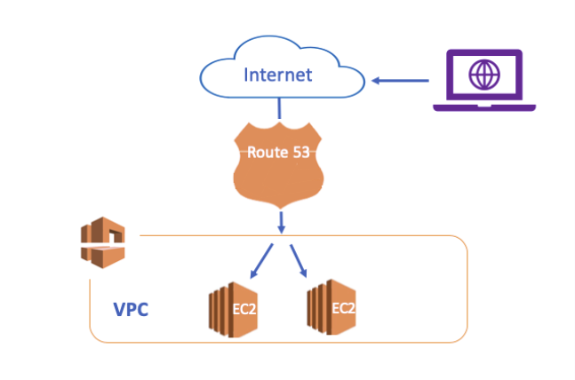
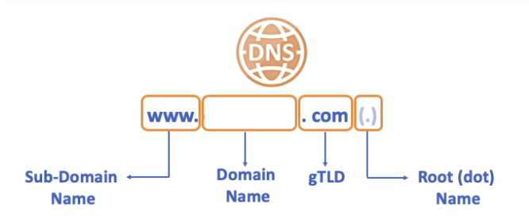
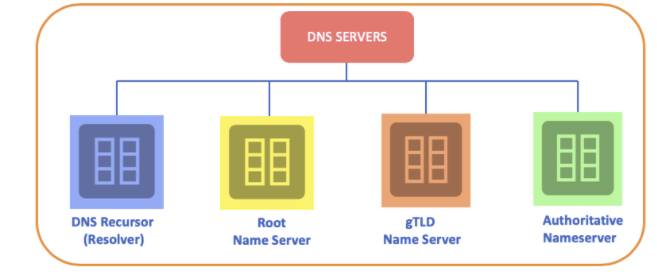
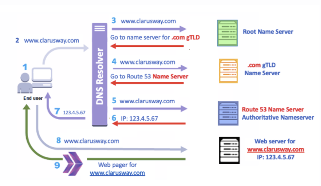

# ` Route 53`
- Amazon Route 53 is a highly available and scalable Domain Name System (DNS) web service.
- Highly reliable and cost-effective approach to routing end-users to internet applications.
- The name of Route 53 is a inspired by TCP or UDP port 53

## `What is AWS Route53 used for?`

- Amazon Route 53 effectively connects user requests to infrastructure running in AWS, such as `Amazon EC2 instances, Elastic Load Balancer or Amazon S3 buckets.`

- You can use Amazon Route 53 to configure DNS `health checks` to route traffic to healthy endpoints.

- Amazon Route 53 also offers Domain Name Registration.
- You can purchase and manage domain names

## `Domain Name System (DNS)`

- It is a system used for transferring human-readable domain names such as www.ucadressbook.com to a machine-readable IP address such as 1.2.3.45

- `Domain Name` is the phrase given to the naming that corresponds to the IP address to which a device in the internet environment is connected.

- Domain names consist of a set of `words, letters, or numbers` to describe a unique individual or company.

- we can say the `Domain Name System (DNS)` is the `phonebook of the Internet` like in your home.

## `Why do we need DNS?`

- Each device connected to the Internet has a unique IP address that other machnes use to find the device.

- Computer communicates each other over IP addresses.

- We can say `DNS` is designed to make the connections easier for computer users.

## `Structure of DNS`

- `Root (dot) Name`
    - It represents the beginning of the DNS query, although `it is not visible.` 
    - The query for resolving the DNS depends on the Root (dot) Name.

- `gTLD`
    - Stands for `Generic Top-Level Domain` 
    - Designed to help classify a feature of a website, such as its purpose. 
    - Most common TLDs are `com`, `net` and `org`

- `Domain Names`
    - `A Domain Name` is your website name.
    - Domain Name are being sold and leased by `ICANN`

- `Sub-domains` 
    - Used to specify domains for communication purposes, device type, content type, or for other reasons.
    - `www`, `mobile` and `info` most commons

## `DNS Servers`

- `DNS Recursor (Resolver)`
- Clients typically do not make queries directly to authoritative DNS services. Instead, they generally connect to another type of DNS service known a resolver, or DNS Recursor.

- `Root(dat) Nameserver`

- The Root Nameserver is the first step in resolving the hostnames process. There are `13 different locations Root DNS server clusters` in the world.

- In this DNS server, there are IP addresses of authorized DNS servers where `all gTLD domains such as com, net, and org etc are kept.`

- `gTLD Nameserver`

- This nameserver is the next step in the search for a specific IP address, and it hosts the last portion of a hostname. It keeps the IP of all the Authoritative Nameserver.

- `Authoritative Nameserver`

- The final authority over a domain and is responsible for providing answers to recursive DNS servers with the `IP address information`

## `DNS Resolving`

## `Concepts of Route 53`
