# ` Amazon Simple Storage Service (S3)`

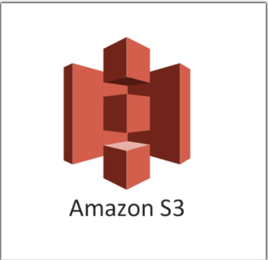

- Amazon S3 is an object-based storage service
- Amazon S3 stores data in buckets as objects
- An object consists of a file or metadata that optionally identifies this file
- `Amazon S3's 11 9's of Data Durability`
- `S3's Global Resiliency`

# ` S3 - Bucket`

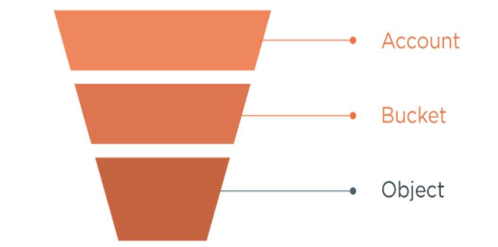

- A bucket is a logical storage used to store objects
- Stored objects any files such as text, image, movie, video, etc.
- Objects are consist of keys and values.
	- The key is the name of the object, and the value is the data that the object stores. 
- S3 bucket should be first created in one of the AWS Regions then objects can be added into bucket.
- Folders like objects can also be created in a bucket. 
- `Each AWS account can only have 100 buckets at once`
- `S3 is a global service`
	- `When you store anything in S3, it's replicated across AZs in that region.`
- S3 also saves `HTML files` in buckets and lets us `host static web pages`
- ` S3 is not a blocked-based`
	- Buckets are not available for mounting into a server as a drive or a disk.

# `Creating a Bucket`

- Open the S3 page using the Services tab from the menu bar.
- Click the Buckets link from the menu on the left.

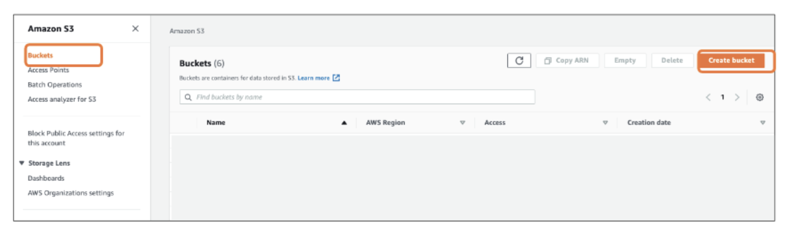

- Click `Create bucket` tab.

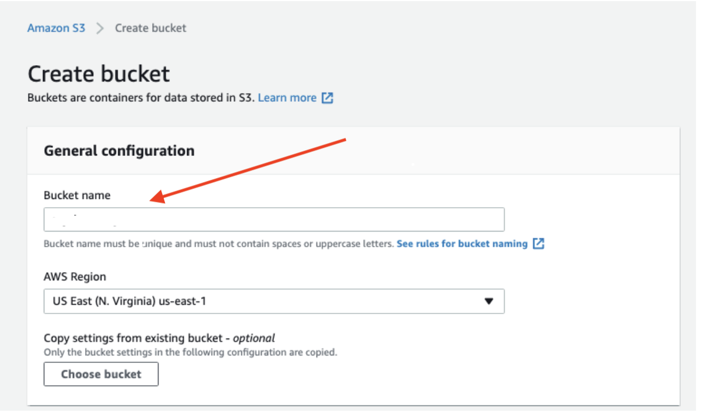

- `Bucket name`
	- This name must be `unique.`

	- If you type a bucket name created by someone else before, you will receive a warning that this name exists. 
	- For example, if you want to create a bucket named test, you cannot create it since it has been used before.

- `Region`
	- S3 is a region-based service, a bucket can be created only in a specific region.
	- `Multiple buckets can be created in different regions and synchronized with each other, but a bucket can only be held in one region.`
	- Example `US East (N. Virginia)`

- ` Block Public Access`

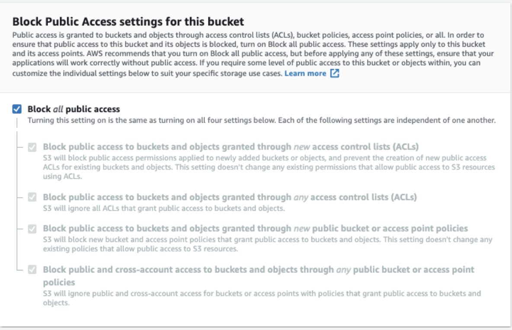

- By default, new buckets, access points, and objects don't allow public access.

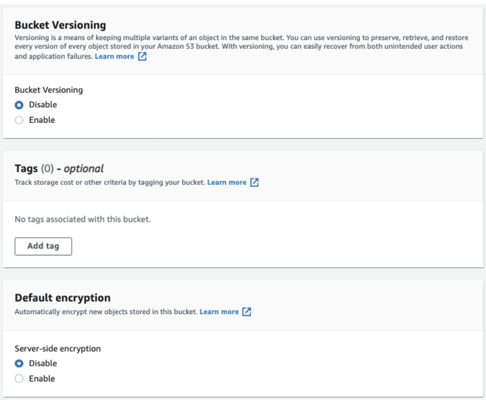

`Versioning`

- Keeping multiple variants of an object in the same bucket
- You can use the `S3 Versioning` feature to preserve, retrieve, and restore every `version` of every object stored in your buckets.

`Tags`

- You can make label for tracking.

`Encryption`

- The objects are encrypted using server-side encryption with either Amazon S3-managed keys (SSE-S3) or customer master keys (CMKs) stored in AWS Key Management Service (AWS KMS) (SSE-KMS). For now

# `S3 Object`

- An object can be any kind of file; a text file, a photo, a video, etc. 
- Consist of keys and values.
- Objects never leave that region unless you explicitly transfer them to a different region.
- Max 5 TB size is a limit for a single file
- The max. size of an object you can upload via AWS Management Console is `160 GB.`
	- File greater than `160 GB, the AWS CLI, AWS SDK, or Amazon S3 REST API` is needed to be used.

# `Storage Class in AWS`

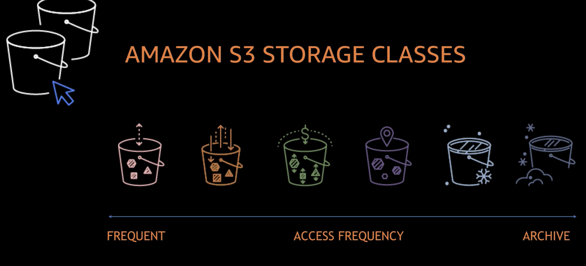

- There are 7 types of storage class in AWS
	- Standard
	- Reduced Redundancy
	- Intelligent-Tiering
	- Standart-IA
	- One Zone-IA
	- Glacier
	- Glacier Deep Archive

## `Standart Storage`

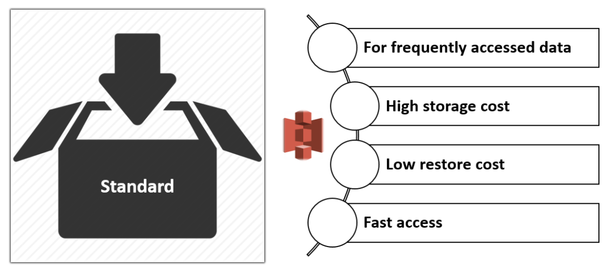

- Standard is the default storage class.
- High capacity and low latency.
- Reliability at 99,999999999% level `(Customers run the risk of losing only one of 100 billion objects per year)`
- Availability at 99,99% level `(For 10 thousand hours, the data will not be available only within one hour).`

## ` Reduced Redundancy Storage RRS`

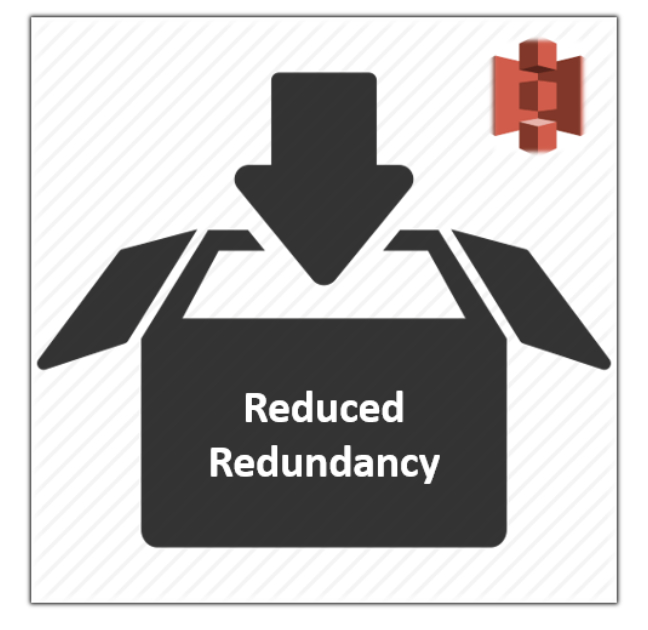

- Designed for noncritical, reproducible data that can be stored with less redundancy than the STANDARD storage class
- The main difference between RRS and S3 Standard is reliability at 99,99%.
- If you store 10,000 items, you run the risk of losing just one of them within a year
- If an RRS object is lost, when requests are made to that object, `Amazon S3 returns a 405 error`
- `AWS recommends not to use this storage class because the Standard storage class is more cost-effective`

## `Standard IA (Infrequently Access)`

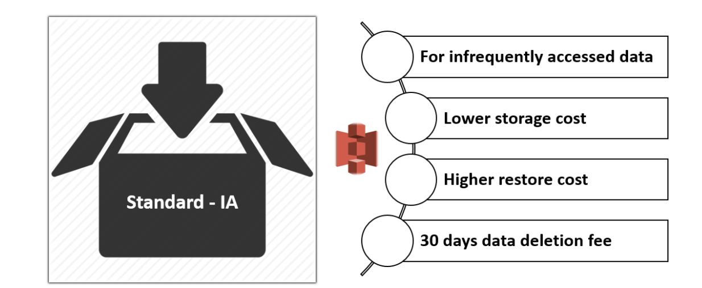

- Files that are not frequently accessed but need to be accessed quickly when needed
- Designed for the data which requires less frequent access
- `Longer storage time than in case of Standard.`
- Lower storage cost
- Higher restore cost
- Availability at 99.9% level within a year (For 10 thousand hours, the data will not be available within 10 hours).
- Data retrieval charge

## `One Zone IA`
- `20 percent less expensive than Standard IA due to less availability.`
- Instead of three available zones such as the other storage classes, `One Zone IA only stores data in one.`

## `Intelligent Tier`

- The `Intelligent Tier` storage class is designed to optimize storage costs by automatically moving data to the most cost-effective storage access tier

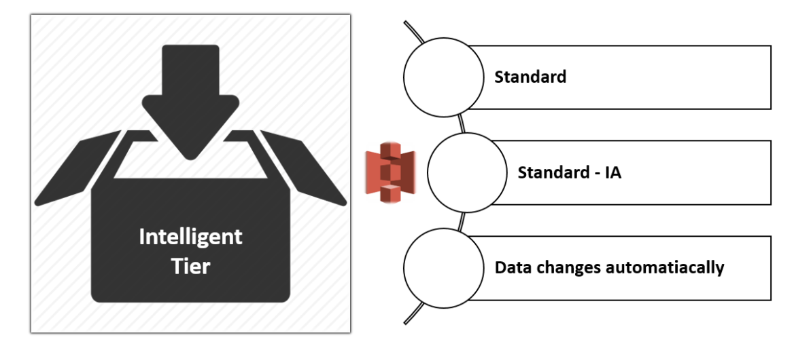

- if an object has not been accessed in 30 days, AWS will move it to the infrequent access.
- When the object is then accessed after being transferred to infrequent access, AWS can move it back for cheaper subsequent accesses to the frequent access storage class.

## `Amazon Glacier`

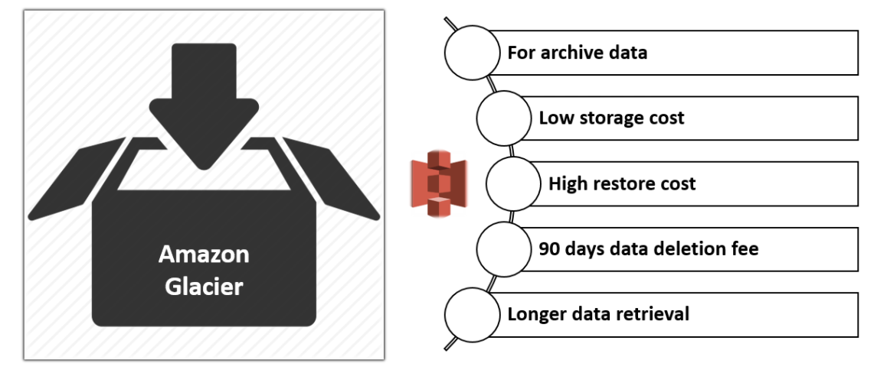

- `Amazon Glacier is an independent service from S3`
- It is a perfect solution for long-term storage and data archiving that doesn't require instant access.
- For example, you have backups you need once a year. These are not urgent, you don't have to access them in milliseconds when you need them.
- Here you can store such files at a very affordable price in Glacier service.
- Data stored in the GLACIER storage class has a minimum storage the duration period of 90 days and can be accessed in as little as 1-5 minutes using expedited retrieval.
- `If you have deleted, overwritten, or transitioned to a different storage class an object before the 90-day minimum, you are charged for 90 days.`

```
Media resources archives
Backup copies of databases with long storage.
Archives of organizations working in the different businesses such as health, sport, insurance, etc.
```

## `Amazon Glacier Deep Archieve`

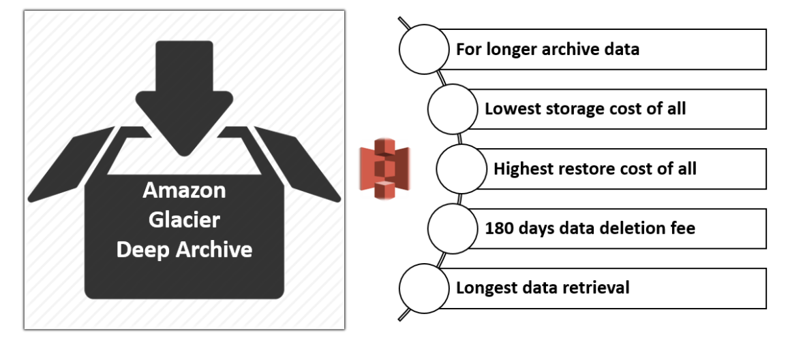

- `Amazon Glacier Deep Archive is the lowest cost storage`
- `Storage costs for DEEP_ARCHIVE is less expensive than using the Glacier storage class.`
- The fastest retrieval time is up to 12 hours
- `If you have deleted, overwritten, or transitioned to a different storage class an object before the 180-day minimum, you are charged for 180 days`

# `S3 Versioning`

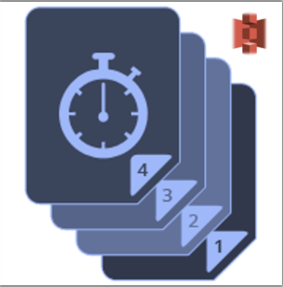

- `Versioning` is a way to keep multiple versions of an object in a bucket.
- It is used to `manage,` `delete,` and `restore any version of any object` saved in an S3 bucket.
- By versioning, all unwanted user behavior and program errors can be quickly recovered.
- `If you delete an object, instead of removing it permanently, Amazon S3 inserts a delete marker, which becomes the current object version. You can always restore the previous version.`
- If you overwrite an object, it results in a new object version in the bucket

## `States of Versioning`

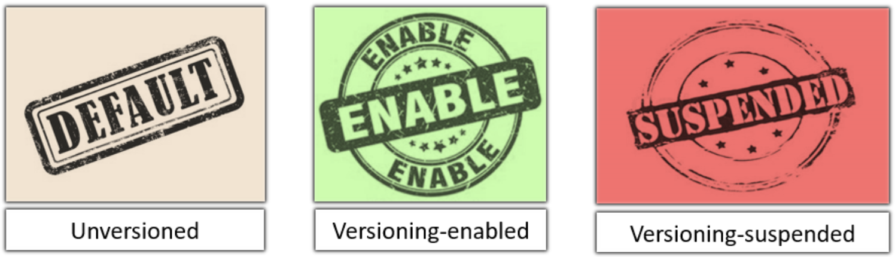

- Unversioned (the default),
- Versioning-enabled,
- Versioning-suspended

- Objects stored in your bucket before you set the versioning state have a version ID of null.
- When you enable versioning, existing objects in your bucket do not change.
- The bucket owner (or any user with appropriate permissions) can suspend versioning to stop accruing object versions.

⚠️ ` Note = Once you enable versioning on a bucket, it can never return to an unversioned state.
You can, however, suspend versioning on that bucket.`

## `Enable or Suspend Versioning`

- Select the bucket on which versioning will be enabled.
- Click Properties tab of that bucket.

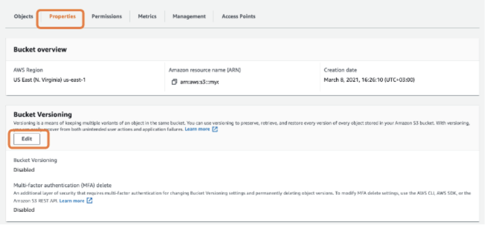

- Click `Edit` under `Bucket Versioning` tab

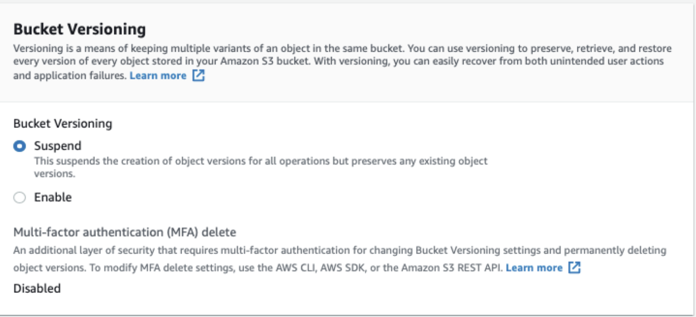

# `S3 Lifecycle Management`

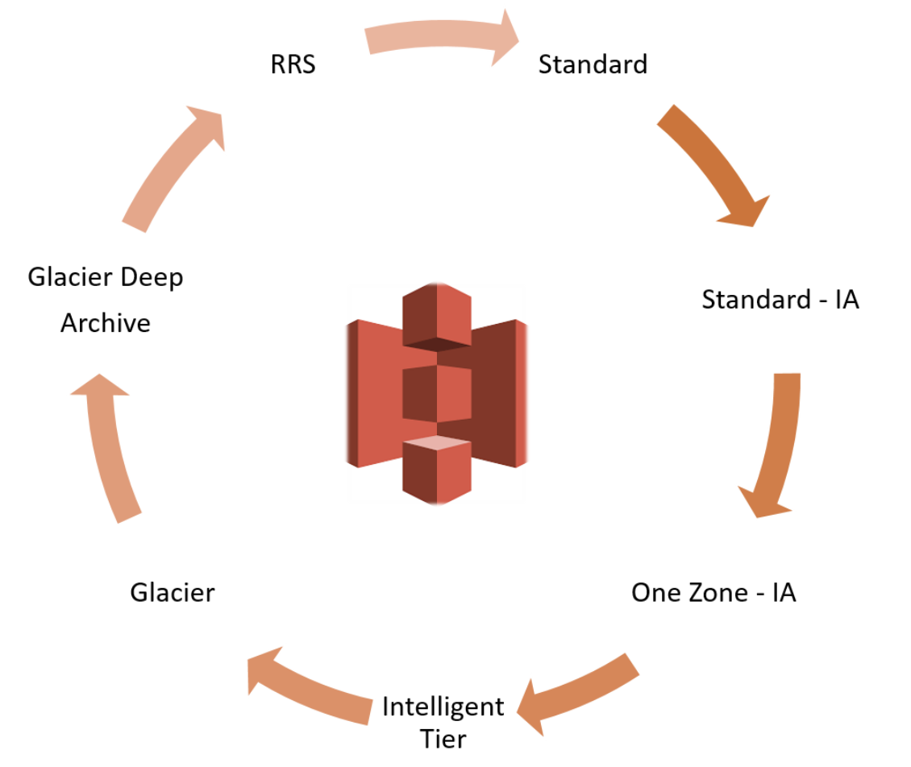

- Transition objects to another storage class,
- Archive objects,
- Delete objects after a specified period of time.

# `S3 Bucket Replication`

- Replication is making a copy of the objects in the same AWS Region or different AWS Regions
- When enabled, each object uploaded to a specific S3 bucket will be replicated automatically to a specified destination bucket located in a given AWS Regions
- `Objects in S3 buckets can be replicated between different AWS Regions or within the same AWS Region`


- `Cross-Region Replication (CRR)` is used to copy objects in `different AWS Regions` across Amazon S3 buckets.
- `Same-Region Replication (SRR)` is used to copy objects in the `same AWS Region`across Amazon S3 buckets.

## `Why Replication?`
- Replicate objects while retaining metadata
- Replicate objects into different storage classes 
- Maintain object copies under different ownership
- Replicate objects within 15 minutes 

# `S3 Static Website Hosting`

- Static Website Hosting is an exhibiting website that contains simple and static web components (e.g. HTML, CSS, images) without any server or database needs.
- `Static websites contain only static resources such as HTML, CSS, images, javascript, etc.`

## `Static Website Hosting - Steps`

- `Create` an S3 `bucket`.
- Grant `Public Access` to the bucket while creating
- `Upload content` for hosting as a website. 
- Don't forget to grant Public Access to the content of the website.
- Enable `Static website hosting` on S3 Bucket.


## Questions
```
What is an object metadata? Types?
Users can define object metadata either when uploading an object or after the object created. Following are the two kinds of object metadata in AWS:

System metadata
User-defined metadata.

>>>

What is S3 Versioning?

Versioning is a way to keep multiple versions of an object in a bucket. It is used to manage, delete, and restore any version of any object saved in an S3 bucket. Each time an object in a bucket changed, a new version of the object would be created and act as a new current version.

>>>

What is the lifecycle policy in S3?

Lifecycle policies can be used to define actions that you want Amazon S3 to take during an object's lifetime such as:

Transition objects to another storage class,
Archive objects,
Delete objects after a specified period of time

```