# Snapshot
- Take a current copy of an EBS disk
- In fact, it is a point-in-time copy of your Amazon EBS volume.
- AWS stores the snapshots in the `S3.`
- Snapshots option is located just below the Volumes section on the left-hand menu of the EC2 console.

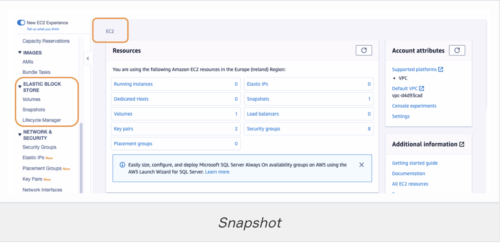

`Avoid= Delete unused Snapshots and Volumes to avoid unwanted charging.`

## Purpose of Snapshot

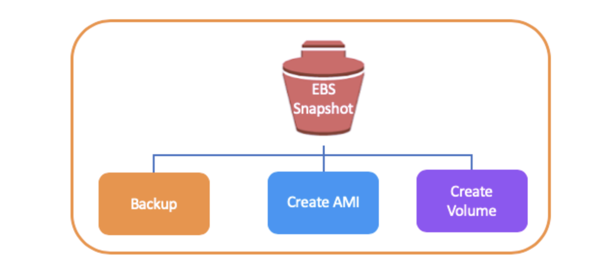

- The snapshots are used for the purpose of `Backup` because it allows you to save the current copy of that disk to a location.
- We can take a snapshot and then `Create AMI.` So we can create a server and make all the settings on it, take a snapshot of it, then create an AMI and make a copy of the same machine.
- We can `Create Volume` from snapshots and connect it to other systems for use.

## Options of Creating a Snapshot
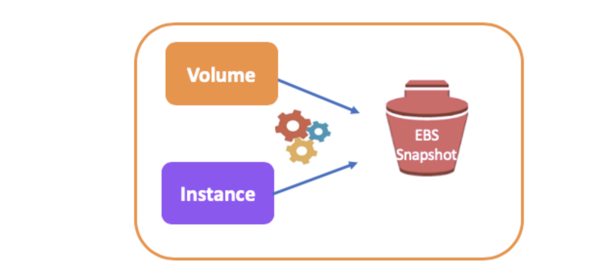
- We have 2 options to use as a source `Volume - Instance`
- You can also select the instance that you created before to image.

`Avoid = The most important thing to do before creating a snapshot is shutting down the related instance.`

## Creating a Snapshot for a new AMI
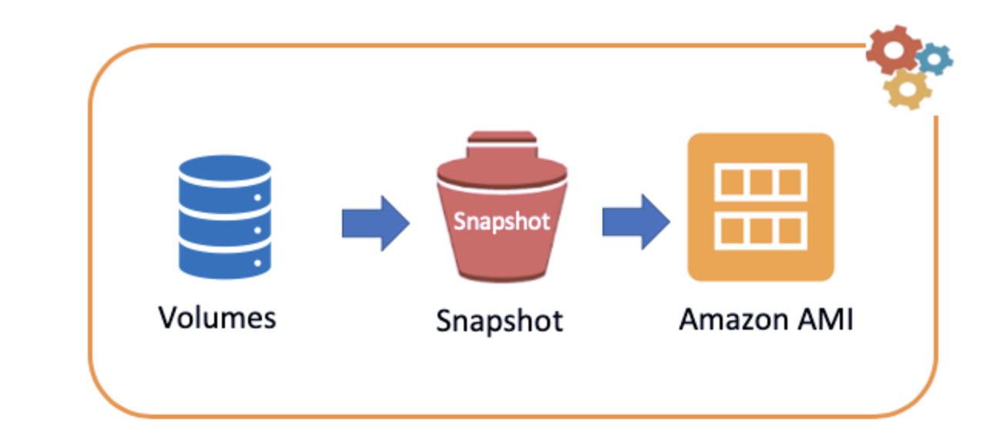

- We will take a snapshot of the volume of the Linux system 
- We created before
- We will then create a new AMI from this snapshot
- First thing to do for this is to shut down the virtual machine
- Then go to the `Snapshots Menu` in AWS console and click `Create Snapshot.` 

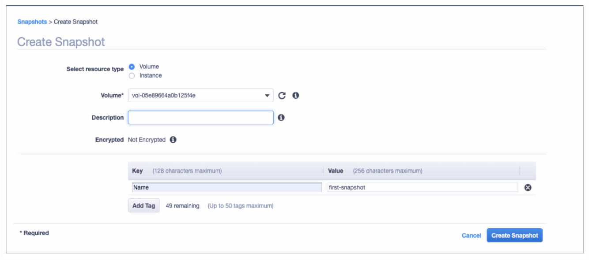

- Select Resource Type:
	- We have two options here either `volume` or `instance.`
	- Then slect the `Root Volume`
- Description:
	- You can write your description
- Add Tags

## Creating a new AMI
- For creating an AMI from a snapshot, first, we select `Create Image` from the Snapshot `Actions` menu.

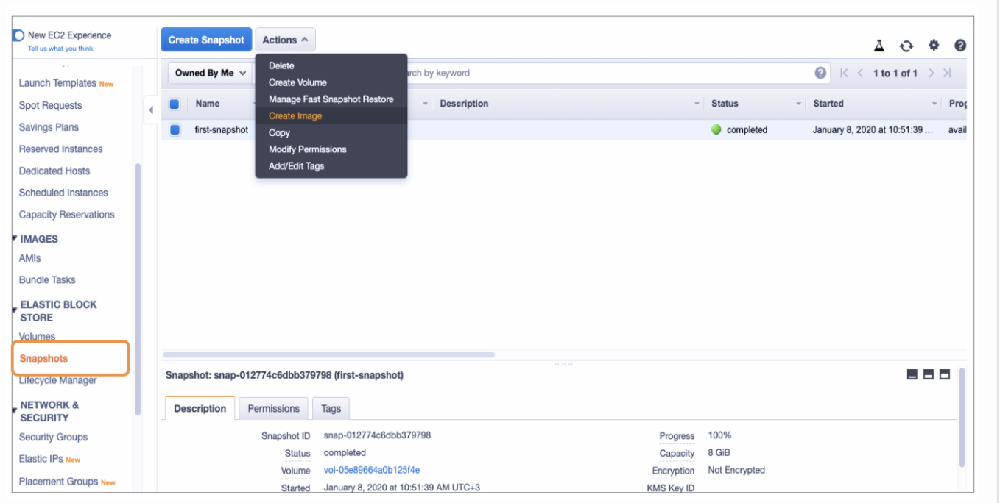

- Let's customize our `AMI`

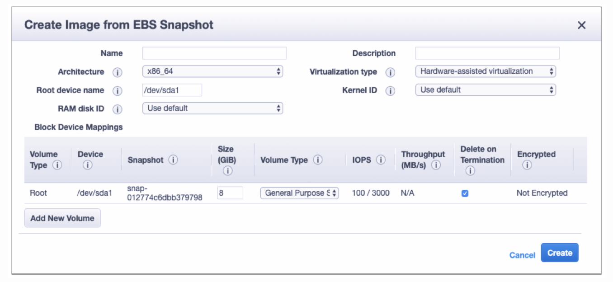

- Name:
	- Let's name the AMI as BasicAMI, we will use it for the next lessons also.

- Architecture:
	- The default value is x86_64. This is the basic architecture of Intel, all of the processor families that we all use today. So, we select the default.

- Root Device Name:
	- The default value is available for now.

- RAM Disk ID:
	- If you select a specific kernel, you may need to select a specific RAM disk with the drivers to support it. So, for now, leave it as default.

- Description:
	- Let's write AMI Created First for Linux as a description

- Virtualization Type:
	- There are two options, Paravirtual, and Hardware-Assisted Virtualization. Paravirtual is no longer available and AWS no longer creates a Paravirtual server. So, let's choose Hardware-Assisted Virtualization and go on.

- Kernel ID:
	- If you're using a snapshot of the root device volume of an instance, you should select the same kernel ID as the original instance. If you're unsure, use the default kernel. So, default is okay for us.

- Size and Volume Type:
	- You can change them if desired. But let's not change them for this example.

Finally, click Create and it's done. We have a new AMI derived from a snapshot

- `Go to the AMI's menu from the left-hand side`

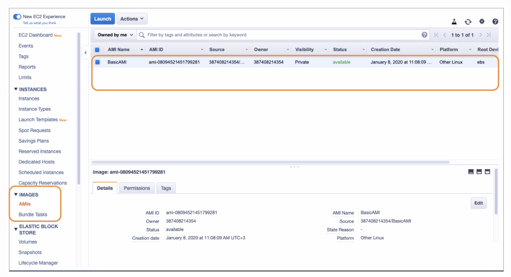

## Creating a New Instance from AMI derived from Snapshot

- Go to the Instances tab and click `Launch Instances.`

- Step 1: Choose an Amazon Machine Image (AMI)
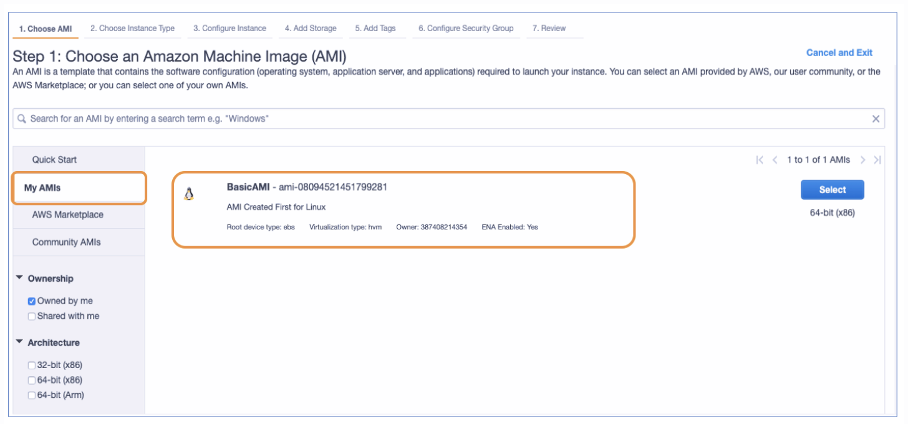

- Step 2: Choose an Instance Type
	- t2.micro

- Step 3: Configure Instance Details
	- We will create 1 virtual machine, and then, assign the role of IAM as `ec2-s3-full-access.`

- Step 4: Add Storage
- Step 5: Add Tags
- Step 6: Configure Security Group
- Step 7: Review and Launch

## Creating a Volume from Snapshot

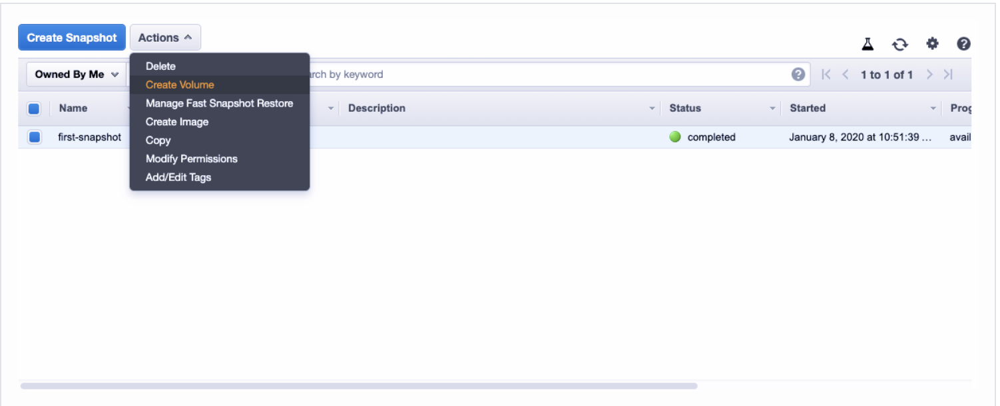

- We select the volume type first

- We determine the dimension and AZ(Availability Zone) and Tag, etc.

- Leave the others as default

- Finally, click Create and your volume is ready.

## Copying a Snapshot (A Way to Encrypt Unencrypted Root Device)

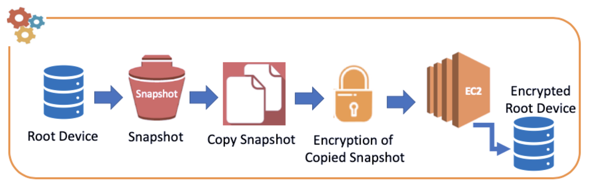

- `Root device (volume) cannot be encrypted after creation.` Exam Question

- You can encrypt the root device (root volume) which is unencrypted via a `Copied Snapshot:`

	- First, create a snapshot of the root device.

	- Then copy this snapshot and now you are able to encrypt the created copy snapshot.

	- And finally, assign this copied volume to an instance.


# `SNAPSHOT HANDSON`

Part 1 - Creating an Image from the Snapshot of the Nginx Server and Launching a new Instance

#### 1. Launch an instance with following configurations.

  #### a. Security Group: Allow SSH and HTTP ports from anywhere with named "SSH and HTTP"

  #### b. User data (paste it for Nginx)

  ```text
  #!/bin/bash

  yum update -y
  amazon-linux-extras install nginx1.12
  yum install wget -y
  cd /usr/share/nginx/html
  chmod o+w /usr/share/nginx/html
  rm index.html
  wget https://raw.githubusercontent.com/awsdevopsteam/route-53/master/index.html
  wget https://raw.githubusercontent.com/awsdevopsteam/route-53/master/ken.jpg
  systemctl start nginx
  systemctl enable nginx
  ```

  c. Tag: Since "Data Lifecycle Manager" work based on tags, we use tag to customize Instance!!!!!!!! 

  ```text
  Key: Name 
  Value: SampleInstance  
```
#### 2. First copy the Instance ID and then go to EC2 dashboard and click "Snapshot" section from left-hand menu.


#### 3. Click `create snapshot` button.

Select resource type : Instance
Instance ID          : Select the instance ID of Nginx
Name(manually)       : Instance-Snapshot_First

#### 4. Click create snapshot.

#### 5. Click snapshot `Action` menu and select `create image`

```text
Name        : TestAMI_1
Description : TestAMI_1
```


#### 6. Click the `launch instance` tab.

#### 7. Click `myAMI` from left-hand menu.

#### 8. Select `TestAMI_1' AS AMI
`
#### 9. Show that security group rules (SSH, HTTP) and `user data` same as original EC2 Nginx instance.

#### 10. Launch instance named "Instance_1_from_Sample_Instance"

#### 11. Copy the public IP of the newly created instance and paste it to the browser.

#### 13. Show that the Nginx Web Server is working.

Part 2 - Creating an Image and Launching an Instance from the same Image with "Action Menu"

#### 14. Go to `SampleInstance`

#### 15. Click the actions menu.

#### 16. Select image >> create image.
```text
Name        : TestAMI_2
Description : TestAMI_2
```

#### 17. Click AMI section from left hand menu and show `TestAMI_2`

#### 18. After TestAMI creation process is completed, click snapshot section from left-hand menu.

#### 19. Show that AWS has created a new snapshot for newly created `TestAMI_2` image.

#### 20. Click the `launch instance` tab.

#### 21. Click `myAMI` from left-hand menu.

#### 22. Select `TestAMI_2`.

#### 23. Show that security group rules (SSH, HTTP) and `user data` same as original EC2 Nginx instance.

#### 24. Launch instance as named "Instance_2_from_Sample_Instance_"

#### 25. Copy the public IP of the newly created instance and paste it to the browser.

#### 26. Show that the Nginx Web Server is working.

#### 26. Check the "Snapshot Menu" ıf there is an extra snapshot or not. If yes, then  name it. Explain the reason.

```text
Name : Snapshot_Second_Auto 
```
Part 3 - Creating an Image from the Snapshot of the Root Volume and Launching a new Instance

----TALK ABOUT THE ROOT VOLUME AND ADDITIONAL VOLUME.---GOT HE SLIDE OF LOCAL----

#### 27. Go to EC2 menu and click snapshot section from left-hand menu.

#### 28. Click `create snapshot` button.
```text
Select resource type : ****Volume
Instance ID : select the root volume of the SampleInstance
Name(manually)       : Snapshot_Third 
```

#### 29. Go to the AMI menu and Click create AMI.

```text
Name        : TestAMI_3
Description : TestAMI_3
```
#### 30. Click the `launch instance` tab.

#### 31. Click `myAMI` from left-hand menu.

#### 32. Select `TestAMI_3`.

#### 33. Show that security group rules (SSH, HTTP) and `user data` same as original EC2 Nginx instance.

#### 34. Launch instance as named "Instance_3_from_Sample_Instance_"

#### 35. Copy the public IP of the newly created instance and paste it to the browser.

#### 36. Show that the Nginx Web Server is working.

Part 4 - Creating an Image from Customized Instance and Launching an instance from the same AMI


#### 37. Connect to `SampleInstance` with SSH.

#### 38. Create a file named `i_am_here.txt`

```text
touch i_am_here.txt
ls
```

#### 39. Exit from the instance.

#### 40. Go to EC2 console.

#### 41. Select the instance named `SampleInstance`.

#### 42. Click the actions menu.

#### 43. Select image >> create image.

```text
Name        : TestAMI_4
Description : TestAMI_4
```

#### 44. Click the `launch instance` tab.

#### 45. Click `myAMI` from left-hand menu

#### 46. Select `TestAMI_4`

#### 47. Launch instance as named "Instance_4_Customized_from_Sample_Instance_"

#### 48. Connect to `Instance_4_from_Sample_Instance` with SSH. Don't forget to connect with "ec2-user" ıf you copy from the connect tab you'll see "root@...."

#### 49. Show `i_am_here.txt` with `ls`.

ls


Part 5 - Make AMI public.

### 45. First go to the AMI section  from left-hand menu and say students to not to do together.

#### 46. Select the TestAMI_4

#### 47. Click on permission and Click on  "Make public "

#### 48. After a while it will be public. Send the AMI ID from slack

#### 49. Tell the student to  go Launch Instance-----> Choose AMI------> Community AMI, and paste the "ID of AMI" to the search bar 

Part 6 - Using Data Lifecycle Manager :


#### 50. In the Amazon EC2 Console, under Elastic Block Store——>Lifecycle Manager——>Create Snapshot Lifecycle Policy. 

#### 51. You can select the policy type depending on your target component to snapshot. 

```text
Policy type: EBS snapshot policy
```

#### 52. You can select the resource type as volume or instance depending on whether you want to schedule snapshots. We will be selecting "Instance" as the resource type.

Select resource type: Instance

#### 53. Enter a description:

```text
Description: "Test policy"
```
#### 54. Now select the tags associated with the EBS volumes or EC2 instance, it will depend on the option chosen above. We are  including all the instances with tag name : 


```text
  Key: Name 
  Value: SampleInstance  
```
#### 55.Tis policy must be associated with an IAM role that has the appropriate permissions. If you choose to create a new role, you must grant relevant role permissions and setup trust relationships correctly. If you are unsure of what role to use, choose Default role. 
```text
  Default Role 
```

#### 55. Schedules define how often the policy is triggered, and the specific actions that are to be performed. The policy must have at least one schedule. This schedule is mandatory, while schedules 2, 3, and 4 are optional.

```text
Policy Schedule 1
Schedule name : My_schedule
Frequency     : Daily
Every         : 24H
Starting at   : 03:00 UTC
Retention Type: Count 
Retain        : 5
```
#### 56. Copy the "Copy tags from source" option. Thanks to this option, tags from the source volume are automatically assigned to snapshots created by the schedule.

#### 57. Cross region copy

```text
Uncheck "Enable cross region copy"
```
#### 58. Cross-account sharing

```text
Check "Enable cross-account sharing"
```
#### 59. Cross-account sharing
Confirm the Policy Summary to be sure that the rules are specified correctly, as per your requirement. Choose Enable policy to start the policy, runs at the next scheduled  time.

```text
Enable Policy
```
#### 60. Finally, choose Create Policy. 

#### 61. That's it, you're DLM policy is created. Check ıt from console. 

#### 62. Delete the policy. 