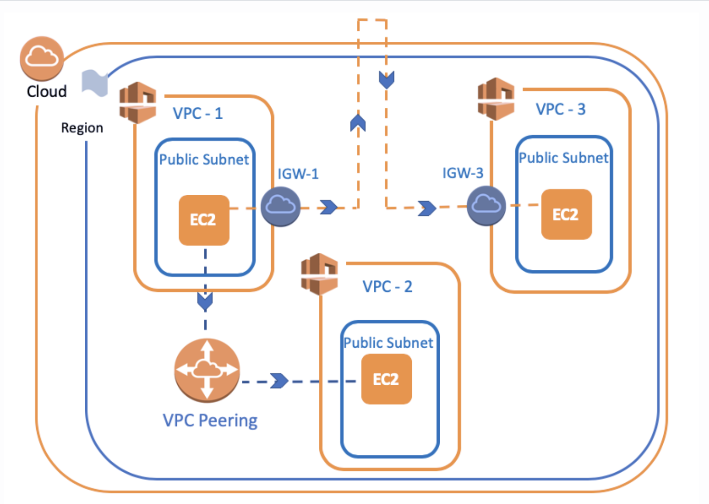

# `AWS Peering`

- We will create peering with `VPC-1` to `VPC-3`
- There are peering connection between `VPC-1` to `VPC-2`

- Go to `VPC Dashboard`
- Click `Peering Connection`
- Click `Create Peering Connection` to create a new peering

- `Peering Connection Name Tag =` Give a name like `First-Peering`
- `VPC Requester =` We want to connection from Deafult VPC to First-VPC so, we choose `Default VPC` as requester
- `Account =` Asked us which account peering `our own account` or `in another account` we choose `my account`
- `Region = ` There are two options `This Region` and `Another Region` let's choose `This Region`

- `Tips = Thanks to account and region options, we also understand that peering can be established between VPCs in different accounts and different regions`

- `VPC (Accepter) = ` Here, let's choose our VPC named First-VPC. An important point here is that the IP addresses of the VPCs do not overlap.
- Click `Create Peering`

# `Setting Peering - Accept Request`

- This peering process is also a kind of `Request,` we would have to wait for it to be confirmed if we made it to another account.

- We accept the request by clicking on the `Action Menu` and selecting `Accept Request`

- Then click on the `Modify My Route Tables Now` option on the window will pop up on the screen or you can reach `Route Tables` from VPC Dashboard.

- Let's copy the `CIDR` block of First-VPC
- Choose the Default Route table
- Select `Routes` section and click `Edit Route`

- `Destination =` We want to connect via Peering with First-VPC. So here we enter the CIDR block of First-VPC that we just copied.

- `Target = ` Choose `Peering Connection` option and then click the `First-Peering`

