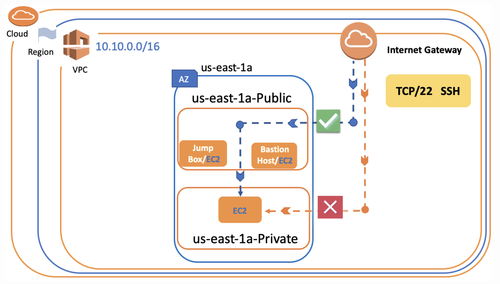

## `Bastion Host & Jump Box`

- The purpose of Jump Box is to act as a bridge for the virtual machine in the private subnet and convey the connection to this machine. That's why it's called the Jump Box.

- We create Bastion Host instance in the `public subnet`

- `Configure Instance Details`
	- We choose created before `public 1-a` as subnet
- Create new security group
	- SSH
	- HTTP
	- All ICMP IPv4
- Launch

- Public instance is ready, create a private instance

- `Configure Instance Details`
	- We choose created before `private 1-a` as subnet 
- Security Group
	- Use existing security group

- Launch

- `Ping Test`

- Connect to Public Instance (Bastion Host)
- After the connect public instance get the root priviliges
	- sudo su
- Write the `IP of Private Instance` after `ping`
	- ping 10.0.0.5
- After command you will see ping is successful


## `SSH Connection to The Private Instance via Bastion Host`

- First open `BASH` and go to the directory of the key file.

```
user$ cd desktop/key

eval $(ssh-agent -s)  or  eval "$(ssh-agent)"
ssh-add -K key.pem
ssh -A ec2-user@(ec2 ip address)
```
- After this command you are in the instance of `Bastion Host`

- Jump here to `private instance`
- Copy the `IP of Private Instance`
- Use this command
	- ssh ec2-user@`Ip of Private Instance`



