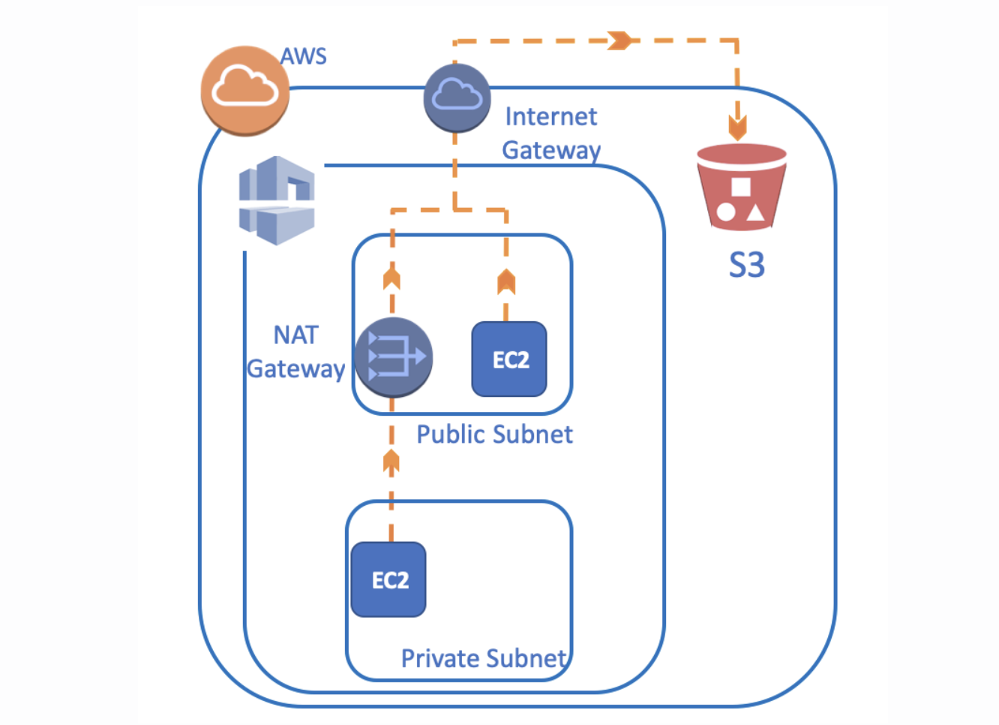
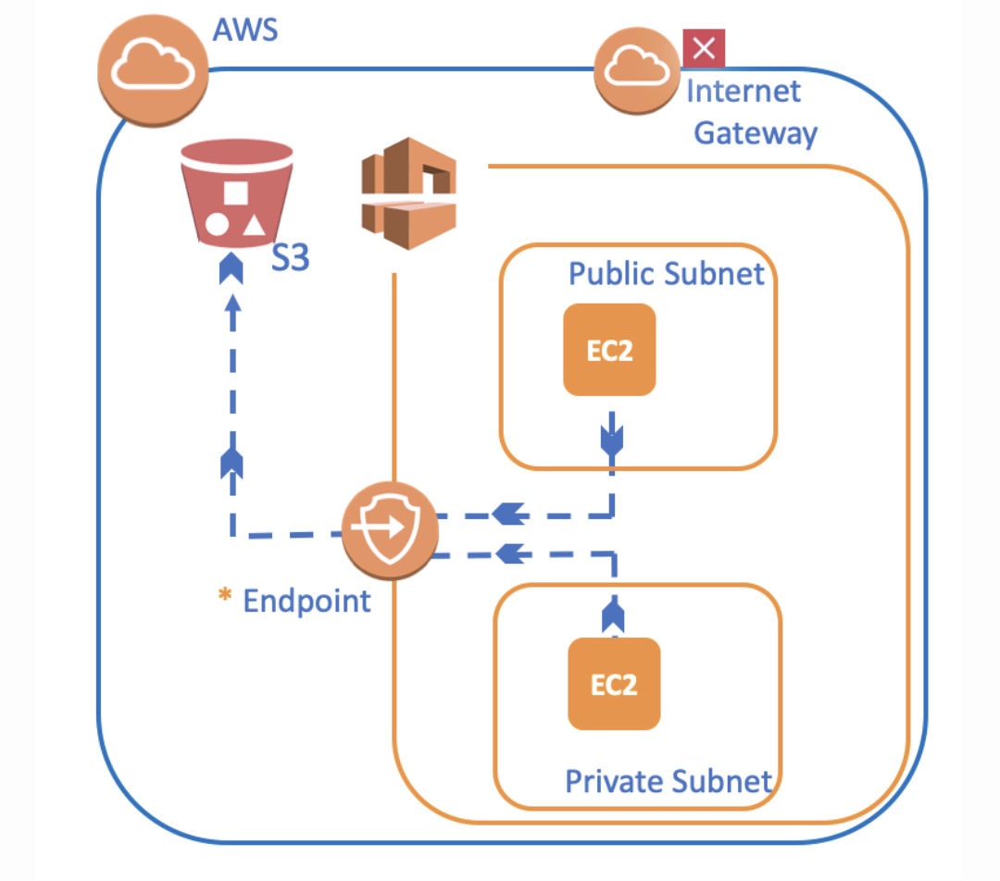
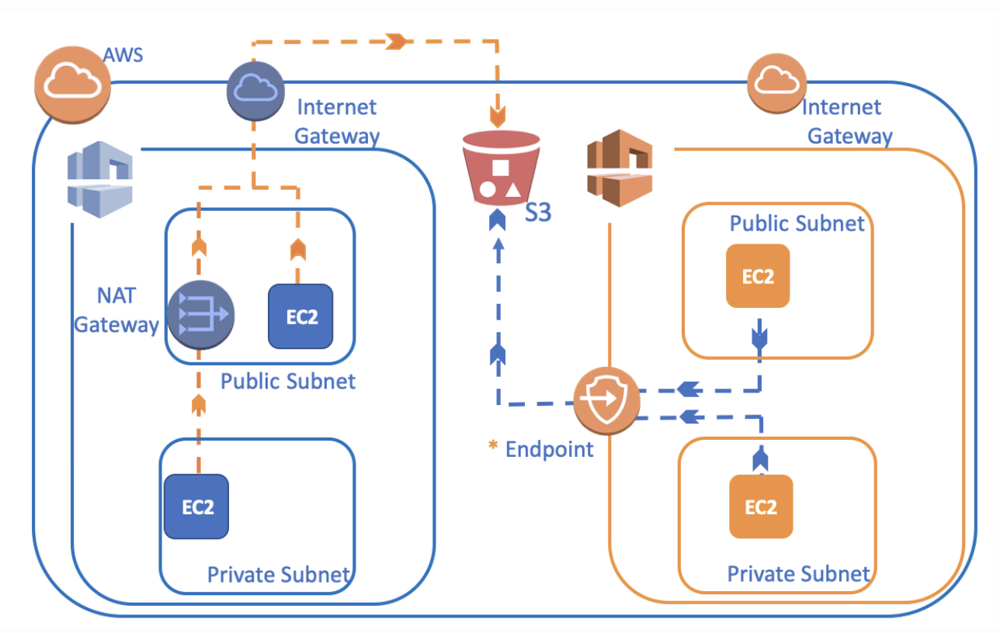

# ` Creating Endpoint`

- As shown picture the figure below, when our instances in VPC need to connect to any AWS service
- For `Public Subnet` first reaches the `Internet Gateway` and then reaches S3

- For `Private Subnet` first connect to `NAT Gateway/Instance` in the Public Subnet from there to the Internet, and back to S3

## `Connecting from Instance to AWS services via Endpoint`

- Thanks to Endpoint, an instance in AWS can no longer be required to use Internet Gateway or NAT Instance

- It allows us to make the connection `via the network of AWS` not through the Internet
- In this way, `both Public Instance and Private Instance` can directly connect to the S3 via Endpoint
- It is faster, more easy and secure

- Go to `VPC Dashboard` and click `Endpoint`
- Click `Create Endpoint`

- `Service Category =` There are 3 options
	- `AWS Services =` AWSs own services like S3

	- `Find Service by Name =` If you want to connect the services from `another AWS account` choose this option
	- `Your AWS Marketplace Services =` You can select third-party applications

- `Service Name =` We'll select the AWS service that endpoint will connect to. Since we will use AWS services for S3, we select com.amazonaws.us-east-1.s3 as a gateway from the list.

- `VPC =` We select `First-VPC` as target a VPC that Endpoint will connect
- `Configure Route Table =` We want our private and public instances to access S3, we choose Route Tables of `both public and private subnets.`

- `Policy =` We can allow `Full Access` or create a `Custom` policy here.
- `Add Tags =` Add tags
- Click `Create Endpoint`

- Click the `Route Tables` section from the `VPC Dashboard`
- You will se `New route` has been created in the Routes section
- We created new route like;
	- `IP blocks of S3` are seen as `Destination`

	- `Endpoint` that we created is seen as a `Target`
- `This means that packages that will go to S3 will be delivered to Endpoint, not to the Intenet gateway anymore.`

