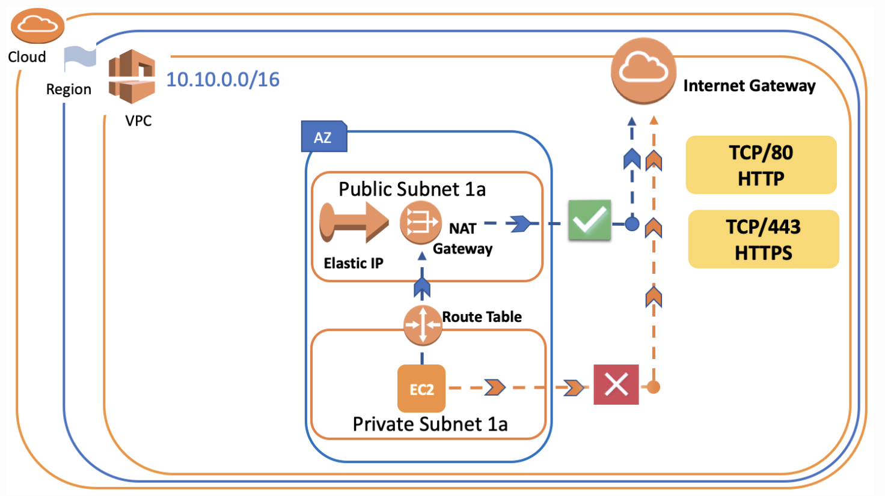

# ` NAT Gateway & NAT Instance`

- How can we solve the problem of accessing from Private instance to outside?
- In some cases, we might want the virtual machines in Private Subnets to access the internet

	- We want to perform a `software update on the virtual machines,` we put in Private Subnets

	- We want this virtual machine to `pull a package from the internet or download a file,` etc.

- In such cases, `NAT Gateway or NAT Instance` is what we will use to do it.

## `Creating NAT Gateway`

- First Allocate Elastic IP
- Create a `NAT Gateway` and put it in one of the `Public Subnet`
- Go to `Route Table of Private Subnets` and set the rule to ensure that packages are delivered via `NAT Gateway`

- `Note= A NAT gateway allows instances within a private subnet access to the Internet, but the NAT gateway itself will block all incoming initiations from the Internet.`

- Go to `VPC`
- Click the `Elastic IPs`
- Then `Allocate new address`
- Then pick the `Amazon Pool` because we don't have `own IP address`

- `Reminder =  Elastic IPs are totally free as long as they are being used by an instance. However, Amazon will charge you $0.01/hr for each EIP that you reserve and do not use. So don't forget to terminate the Elastic IP or associated component such as NAT Gateway if you'll not use anymore in the short term.`

- Click the `NAT Gateway` under the `VPC`
- Then `Create NAT Gateway`
- Choose `Public Subnet` existing

- Then select `Elastic IP` created one
- Click `Create NAT Gateway`

- Move on to `Route Tables`
- Select the `Route Tables` private routes
- Click `Edit Routes` 
- Write `0.0.0.0/0` to `Destination` section
- In the `Target` section choose `NAT Gateway`
- Save routes

# `NAT Instance`
