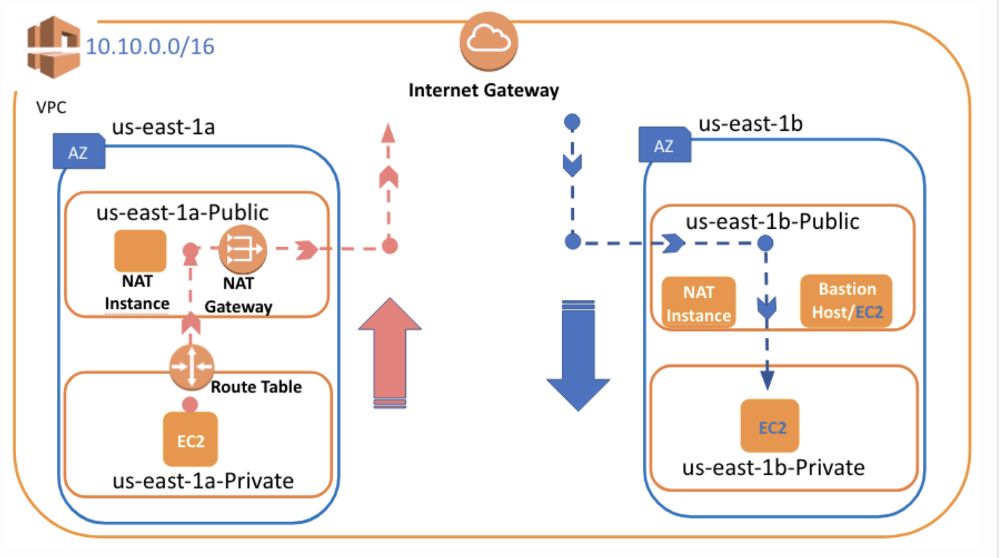

# ` NAT Gateway & NAT Instance`

- How can we solve the problem of accessing from Private instance to outside?
- In some cases, we might want the virtual machines in Private Subnets to access the internet

	- We want to perform a `software update on the virtual machines,` we put in Private Subnets

	- We want this virtual machine to `pull a package from the internet or download a file,` etc.

- In such cases, `NAT Gateway or NAT Instance` is what we will use to do it.

## `Creating NAT Gateway`

- First Allocate Elastic IP
- Create a `NAT Gateway` and put it in one of the `Public Subnet`
- Go to `Route Table of Private Subnets` and set the rule to ensure that packages are delivered via `NAT Gateway`

- `Note= A NAT gateway allows instances within a private subnet access to the Internet, but the NAT gateway itself will block all incoming initiations from the Internet.`

- Go to `VPC`
- Click the `Elastic IPs`
- Then `Allocate new address`
- Then pick the `Amazon Pool` because we don't have `own IP address`

- `Reminder =  Elastic IPs are totally free as long as they are being used by an instance. However, Amazon will charge you $0.01/hr for each EIP that you reserve and do not use. So don't forget to terminate the Elastic IP or associated component such as NAT Gateway if you'll not use anymore in the short term.`

- Click the `NAT Gateway` under the `VPC`
- Then `Create NAT Gateway`
- Choose `Public Subnet` existing

- Then select `Elastic IP` created one
- Click `Create NAT Gateway`

- Move on to `Route Tables`
- Select the `Route Tables` private routes
- Click `Edit Routes` 
- Write `0.0.0.0/0` to `Destination` section
- In the `Target` section choose `NAT Gateway`
- Save routes

# `NAT Instance`

- We prefer NAT Gateway because it manages by AWS and we don't get involved anything. 
- If your system consists of hundreds of machines and you need some `TCP-based adjustment,` NAT Gateway may not support your needs.
- `NAT ınstance can be used for Bastion Host`. So, thanks to the NAT instance, you can provide both inbound and outbound connectivity.
- Another reason is price,  `NAT instance` cheaper than `NAT Gateway`

## `Crating NAT Insance`

- Create EC2 Instance on Public Subnet
- Set the EC2 Instance via `Route Table` and `Action Menu`
- Finally, we use this NAT Instance for accessing the internet

- Launch instance from `Community AMI`
- Then search `NAT`
- Choose created `VPC` and `public 1-a` subnet
- Launch
- Go to EC2 menu
- Choose created instance then click `Actions`
- Click `Networking` and `Change Source/Destination Check`
- Then `Disable` option from the windows that opens

- ` why do we change this settings?`
- Virtual machines control which source the package comes from and which source it goes to. This is called the `Source/ Destination Check function.` If it detects that package does not match its address, it drops the package.

- Go to `VPC Dashboard`
- Select `Route Tables`
- Click the route table we created for `Private Routes`
- Select `Routes` anc click `Edit Routes`
- Enter `0.0.0.0/0` `Destination` 
- Target select the `Instance` then click `NAT Instance`

