# `VPC = Amzon Virtual Private Cloud`

- Amazon Virtual Private Cloud (Amazon VPC) is a logically isolated area of the AWS cloud where you can launch AWS resources in a virtual network that you define. So, VPC provides much better security control over your AWS resources.

## `Architecture of VPC`

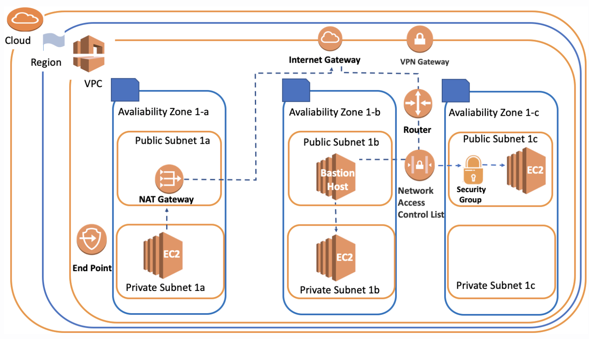

## `VPC Components`

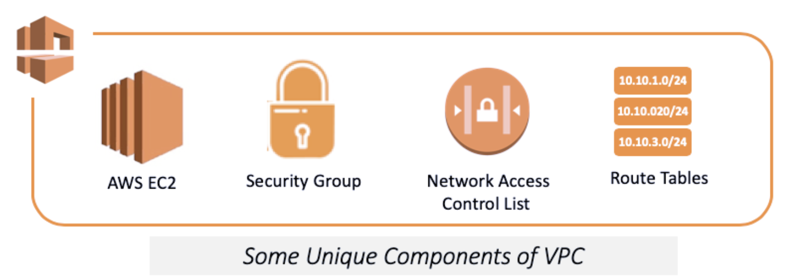

- VPC allows full control over your virtual network environment, including choosing your own IP address range, creating subnets, configuring route tables and gateways.
- `VPC is a unique area`
- You create or set something associated with VPC, it means these things can only work harmoniously in this environment.

## `VPC Region&AZ`

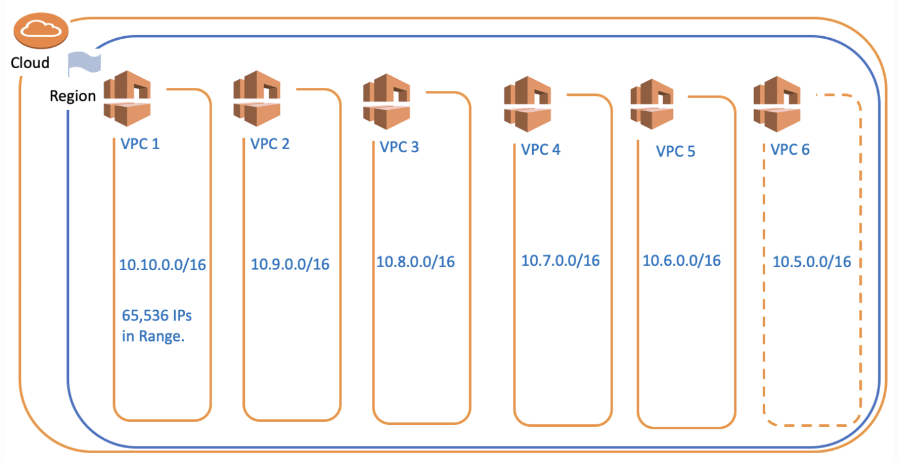

- Each AWS Region consists of multiple, isolated, and physically separate AZ's within a geographic area.
- Each region; it comes with one default VPC and we can also `create 5 more VPCs for each region.` This is a soft limit of 5 and if `we need more than 5 VPCs, we can request it from AWS`
- `VPCs are associated with a single region.` You cannot span a VPC across regions.

## `VPC Subnets`

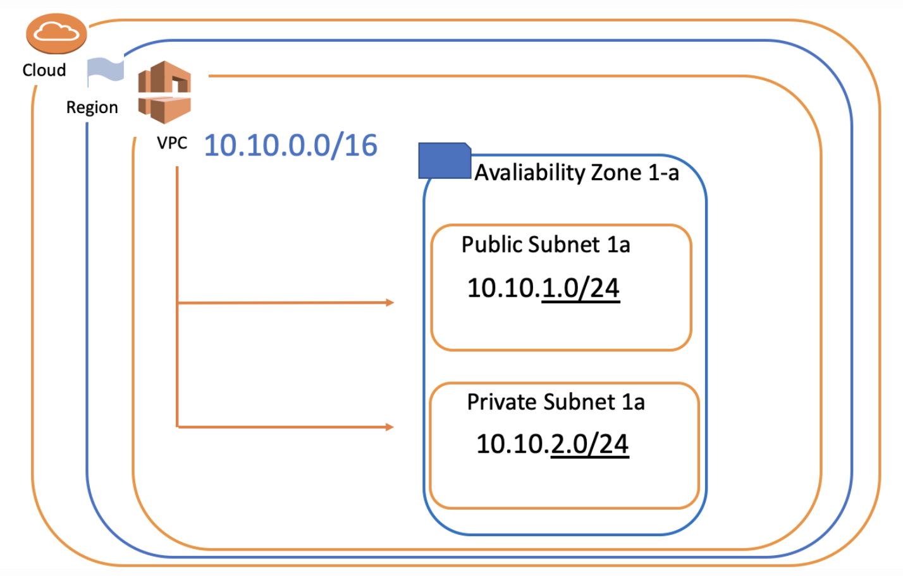

- We divide the main IP block that we define in VPC into sub-logical networks called a subnet. 
- Subnets can be 2 types : `Public Subnet` and `Private Subnet`
	- `Public Subnet`, the virtual machines that we place in the subnets can be accessed from the outside of the VPC (Public internet).
	- `Private Subnet` have the opportunity to communicate only through VPC. In this way, we protect our resources against unauthorized access and ensure network security.

- `Note = Each subnet can be created only in a specific AZ (Availability Zone). A subnet cannot be associated with more than one AZ.`

## `Internet Gateway&VPN Gateway`

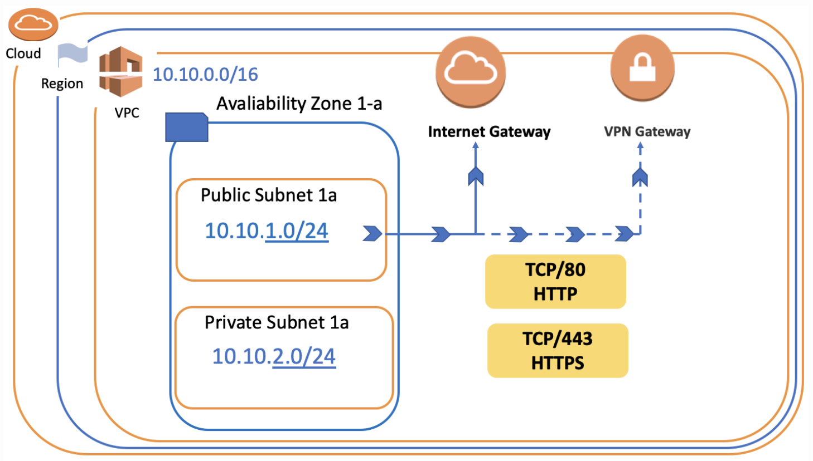

- An `Internet Gateway` is a horizontally scaled, redundant, and highly available VPC component that allows communication between instances in your VPC and the internet.
- Internet gateways as basic internet providers with our ADSL or fiber routers.
- Internet connection can be made as a direct connection between its own company network infrastructure and this VPC. This system is also called a `VPN Gateway.`

- `Note = VPC can connect to the outside world in two basic ways, either VPN Gateway or Internet Gateway.`

## `Route Table and Router`

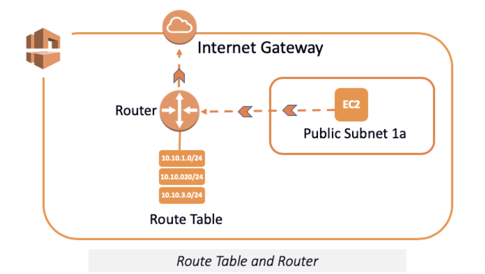

- `Route Table` is a set of rules, that is used to determine where network traffic is directed.
- Route Table is roughly configuration files that explain how to go from destination X to destination Y or to the internet and which way to use.
- `Routers` are components that manage the Route Tables and they act as `intersections` within the network.
- Each AWS VPC has a VPC router.
- We consider Route Table as a set of rules, then Router is executive of these rules.

## `Network ACLs`

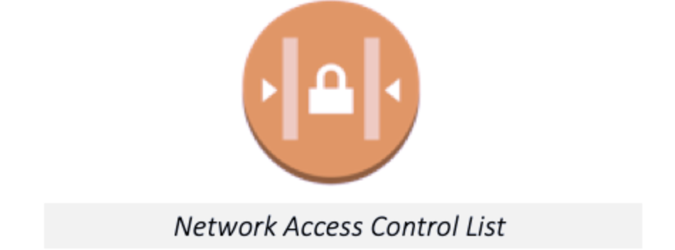

- Network ACL stands for Network Access Control Lists.
- Subnet Network ACLs are `firewall of subnets`
- Network ACLs are `subnet-based `security components.
- VPC automatically comes with a modifiable default Network ACL. `By default, it allows all inbound and outbound IPv4 traffic.`

- `Avoid= Unlike default Network ACL, If you want to create a new one, it denies all the inbound and outbound traffic until you add rules`

- Each subnet in your VPC must be associated with a Network ACL.
- Can associate multiple subnets with a Network ACLs. However, a subnet can be associated with the single Network ACL.

## `Security Groups`

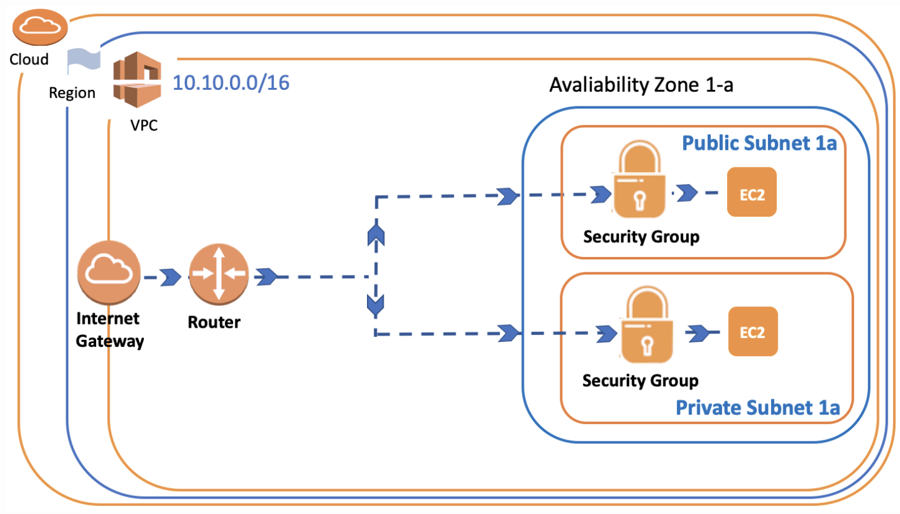

- In addition to the Network ACLs, we can also create Security Groups in VPC for security precautions
- Security Group is a virtual `Firewall of Instance.`

- `Security Groups are instance-based`components, while `Network ACLs are the subnet-based.` So, you need to consider both Security Groups and Network ACLs about the inbound and outbound traffic for instance in any subnet.

## `Bastion Host/Jump Boxes`

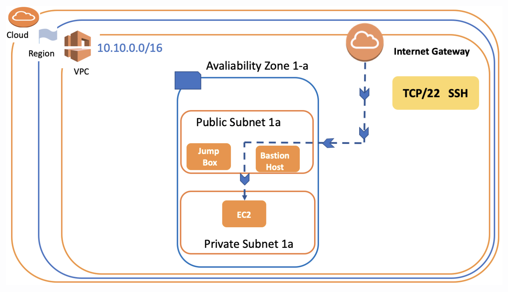

- A Bastion Host is a server/instance that is used to ensure `access to a Private subnet from the Internet.`
- Bastion Host is launched in `Public Subnets` and acts as a proxy for the instances in a `Private Subnet.`
- A Bastion Host is used to administer EC2 instances using SSH or RDP securely. It is also known as `Jump Box.`

- Bastion Host/Jump Boxes are used for `Inbound traffic` to the instance in Private Subnet.

## `VPC NAT Gateway & NAT Instance`

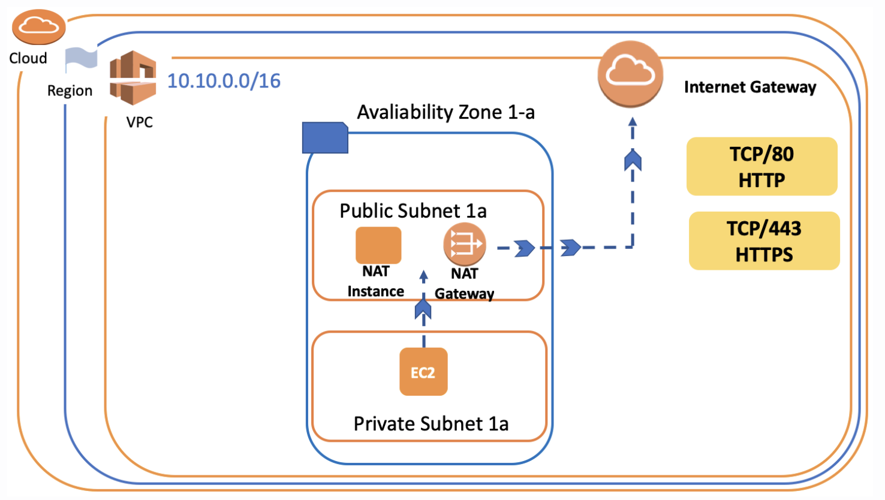

- `NAT` stands for Network Address Translation in AWS
- You can't directly connect to the internet if your instance is in a Private Subnet
- We can use `NAT Gateways or NAT Instance,` which is created in the Public Subnet as a proxy to tackle this problem
- If you want to connect from the EC2 instance in the private subnet to the internet, you need to create NAT Gateways or NAT Instance in Public Subnet.

- `But it is important that a NAT instance and NAT Gateways allow your private instances to outbound internet connectivity while blocking internet inbound traffic.`

### `NAT Instance`

- NAT Gateway is an AWS managed NAT service, but `NAT Instance is specified and managed by the customer.`
- NAT Gateways are widely used in real-time than NAT instances, and NAT Gateways are highly accessible across multiple availability zones.

- `Avoid = You cannot use NAT Gateway as a Bastion host. If you connect with SSH or RDP to an instance in a private subnet, you need to configure a Bastion Host. You cannot use NAT Gateway.`

- `Tips = While Bastion Host/Jump Boxes are used for Inbound traffic, NAT Gateway/NAT Instances are used for Outbound traffic.`

## `VPC Endpoint`

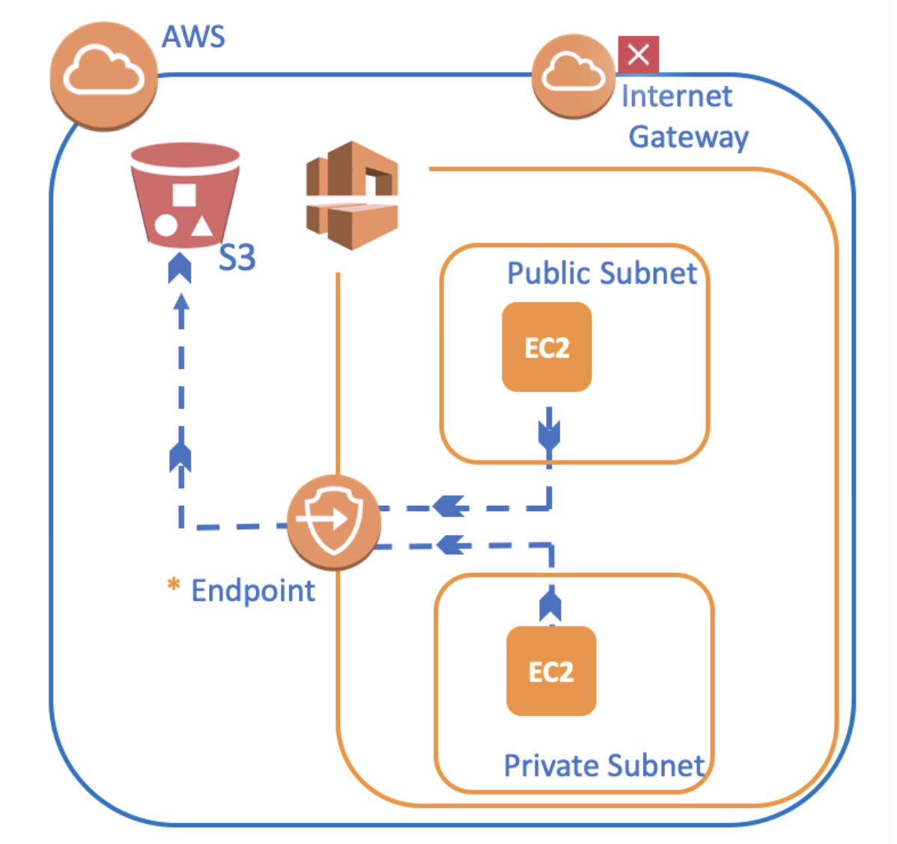

- The VPC Endpoint is a component that allows you to privately connect your VPC to supported AWS services such as S3
- Traffic between your VPC and the other service does not leave the Amazon network.
- It allows communication between instances in your VPC and services without imposing availability risks or bandwidth constraints on your network traffic.

- `Thanks to VPC Endpoint, Instances in your VPC do not require public addresses to communicate with the resources in the service. Because, VPC Endpoint services powered by PrivateLink without requiring an internet gateway, VPN Connection, etc.`

## `VPC Peering`

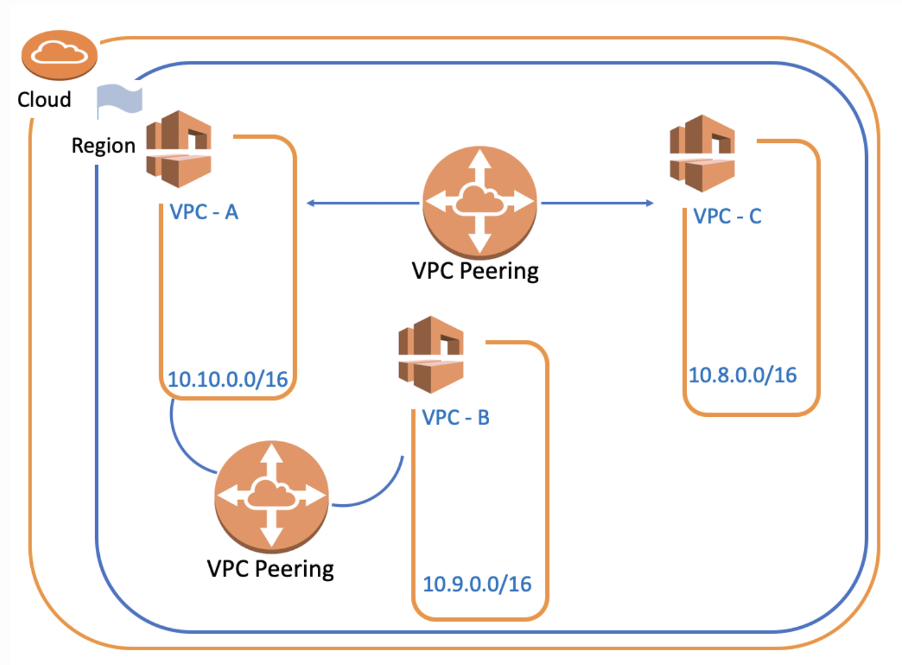

- A VPC peering is a networking connection between two VPCs.
- It enables you to route traffic between them using private IPv4 addresses or IPv6 addresses.
- Instances in different VPC can communicate with each other as if they are within the same network.

- If you create new VPC peering between VPC-A and VPC-C, connectivity between `VPC-B and VPC-C does not occur automatically.` `You need to create another VPC peering between VPC-B and VPC-C for their connectivity.`

## `Elastic IP`

- An Elastic IP address is a `Static IPv4 Address` designed for dynamic cloud computing.
- We use Elastic IPs for various reasons, especially because of its advantages or situations where it is compulsory to use.

- Some AWS components such as `NAT Gateway and Route 53 may need Elastic IP` while the process of creating, operating or setting up.

- `Avoid = Elastic IPs are totally free as long as they are being used by an instance. However, Amazon will charge you $0.01/hr for each EIP that you reserve and do not use. So don't forget to terminate the Elastic IP or associated component such as NAT Gateway if you'll not use anymore in the short term.`

## `Creating VPC Notes`

- `Route Table`
	- Destination = Where you want your package to be delivered.
	- Target = AWS asks you, by which component (Target) you'll deliver the package to the determined destination.

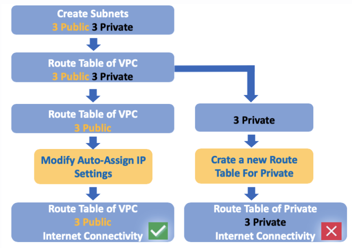
