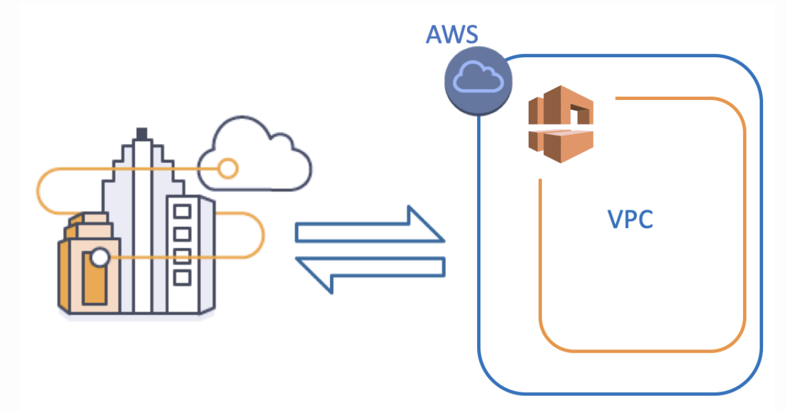
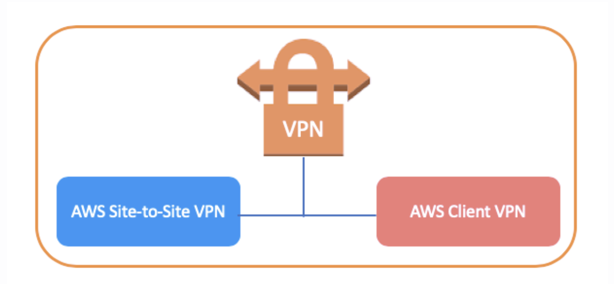
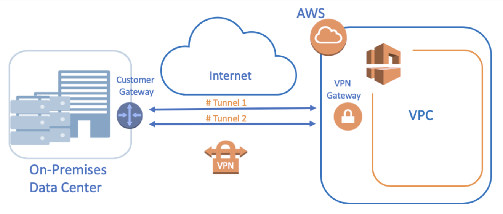
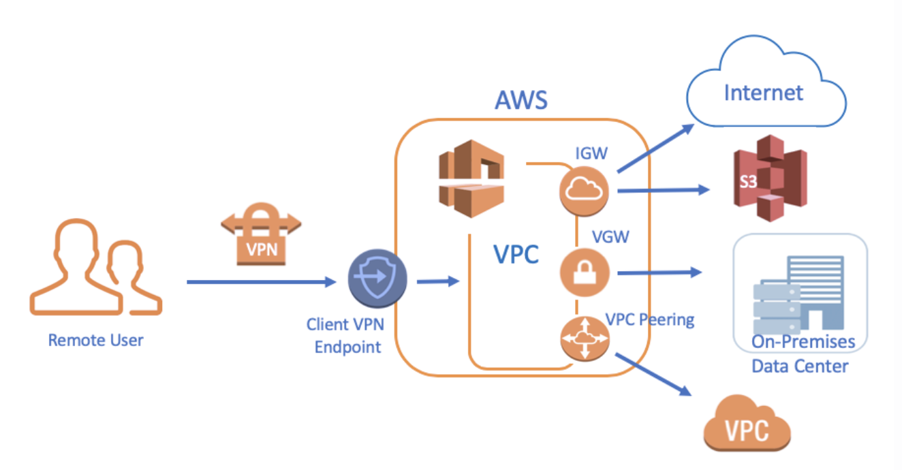
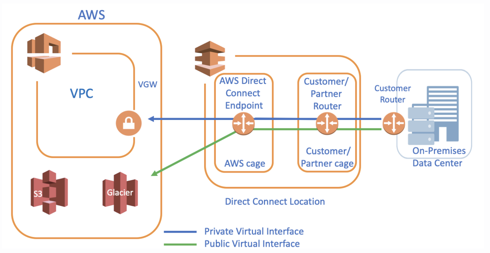

# `VPN & Direct Connect`

- VPN stands for Virtual Private Network
- AWS VPN lets you establish a secure and private tunnel from your network or device to the AWS Cloud
- You can extend your existing on-premises network into a VPC, or connect to other AWS resources from a client.
- AWS VPN offers two types of private connectivity that feature the high availability and robust security necessary for your data.

## `VPN Categories`

- `AWS Site-to-Site VPN =` enables you to securely connect your `on-premises network` or `branch office` site from your Amazon VPC

- `AWS Client VPN =` enables you to securely connect AWS or on-premises networks from `remote users.` AWS Client VPN includes a free client-side application, which provides access to AWS services from `remote networks.`

## `AWS Site-to-Site VPN`

- AWS Site-to-Site VPN is one of the most common ways that customers connect securely to the AWS Cloud from on-premises or data center environments.

- We have the chance to establish `encrypted communication networks` that establish a connection between the company and AWS over the `Internet.`

- Its virtual edge on the AWS side is called `Virtual Private Gateway` and the end on the firm side is called `Customer Gateway.`

- It uses internet protocol security (IPSec) communications to create encrypted VPN tunnels between two locations. Each VPN connection has `2 VPN Tunnels` which you can use for high availability.

## `AWS Client VPN`

- With Client VPN, you can access your resources from any location using an OpenVPN-based VPN client.
- Unlike on-premises VPN services, with AWS Client VPN, users can connect from anywhere to your AWS and on-premises networks.

## ` For connecting with AWS Client VPN`

 	- First, you need to get a VPN Client Application,

	- Then create a new Client VPN Endpoint,

	- Configure the route tables for Client VPN Endpoint,

	- After that, associate a new Client VPN Endpoint to VPC and subnets

	- Get the Client VPN Endpoint Configuration File from AWS Management Console

	- The last, connect to the VPN.

- After you connecting to VPC, thanks to AWS Client VPN;
	- You can reach AWS resources in this VPC such as S3 and also Internet via Internet Gateway,

	- You can reach On-Premises Data Center via Virtual Private Gateway,

	- You can also reach the other VPC via VPC Peering.

## `Direct Connect`

- Although the VPN Site to Site and Client VPN methods are secured by using strong encryption techniques, communication flows over the internet

- AWS has developed the Direct Connect service as a solution. Direct Connect is a service that establishes a `dedicated` network from your On-Premises Data Center to AWS.

- The architecture of Direct Connect consists of 3 main components. These are `AWS Region, Direct Connect (DX) Location` and `Customer On-Premises Data Center.`

- `AWS Region = ` In AWS Region, we have AWS Public services such as S3, AWS Glacier, DynamoDB, etc. and also we have VPC which could be private.

- `Direct Connect (DX) Location =` 
	- Direct Connect (DX) Locations are created by bilateral agreements with global networking partners. Direct Connect Locations are spread across the world. There are more than 100 DX locations available globally across major cities.

	- We have two cages, i.e., `AWS cage` and `Customer/Partner cage` inside Direct Connect Location,

	- AWS cage consists of `Direct Connect routers,` and the Customer/Partner cage consists of `Customer/Partner Routers.`

- `Customer On-Premises Data Center =`
- `A Public Virtual interface` enables access to public services, such as Amazon S3.
- `A Private Virtual Interface` enables access to your VPC.